# 3. Creative Builds

## 3.1 Color Scanner

### 3.1.1 Introduction

This Color Scanner features both color sensing and visual display capabilities. Upon identifying the color of an object, the onboard RGB LED synchronously illuminates in the corresponding red, green, or blue color to provide a direct visual demonstration of the detection results, serving as a precise color judge.

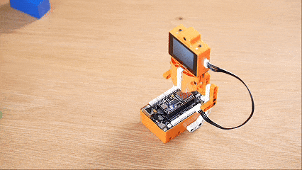

### 3.1.2 Learning Objectives

1. Master the color recognition function of the WonderLLM vision module and become familiar with the calling method for coordinating with the ESP32 controller.
2. Learn to trigger corresponding lighting feedback based on visual recognition results to complete the smart color recognition project.

### 3.1.3 Assembly Guide

 <iframe
    src="../_static/pdf/01_Color_Scanner.pdf#view=FitH"
    title="Assembly Guide PDF"
    width="100%"
    height="850"
    style="border: 1px solid #ddd;"
    loading="lazy">
 </iframe>

### 3.1.4 Mode Switching

This build requires the **offline vision function**. Skip this step and proceed directly to the wiring guide if the offline vision mode is already active. Otherwise, refer to the [4.5.1 Firmware Update](https://wiki.hiwonder.com/projects/DaDablock-AI/en/standard-kit/docs/4_Software_and_Hardware_Guide.html#id21) section in Chapter 4 to re-flash the corresponding firmware.

### 3.1.5 Wiring Guide

Plug the WonderLLM module cable into port 1 of the ESP32 controller, as shown in the diagram:

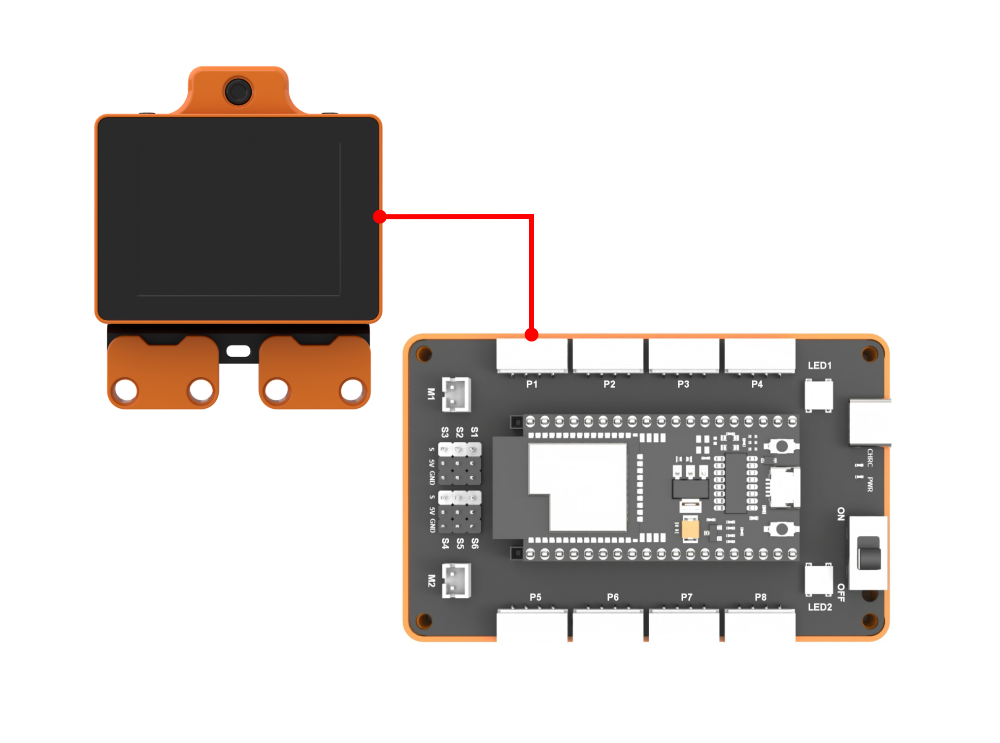

### 3.1.6 Programming

#### (1) Program Concept Diagram

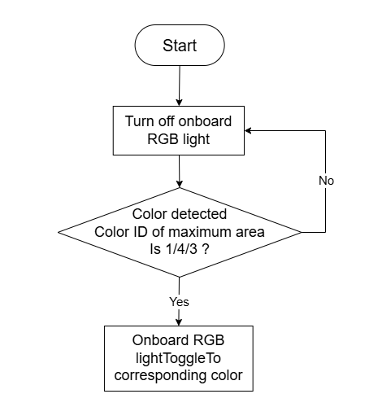

#### (2) Add Extension Libraries

Select **Sensor** in the **Choose an Extension** interface to add **WonderLLM-offline**.

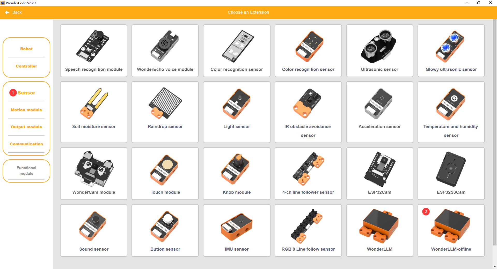

#### (3) Core Blocks Analysis

|                        Command Block                         |                           Category                           |                     Function Description                     |
| :----------------------------------------------------------: | :----------------------------------------------------------: | :----------------------------------------------------------: |
| 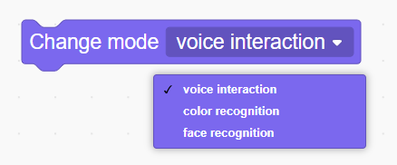 |  | Switch the working recognition mode of the WonderLLM module, with options for voice interaction, color recognition, and face recognition. |
| 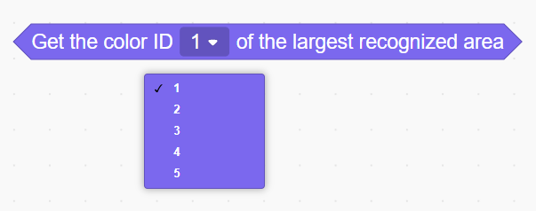 |  | Read the id of the color occupying the largest area on the screen in color recognition mode. |
|  |  | Control specific or all RGB lights to light up in the selected color. |
|  |  | Turn off specific or all RGB lights to cut off light output. |

#### (4) Complete Program

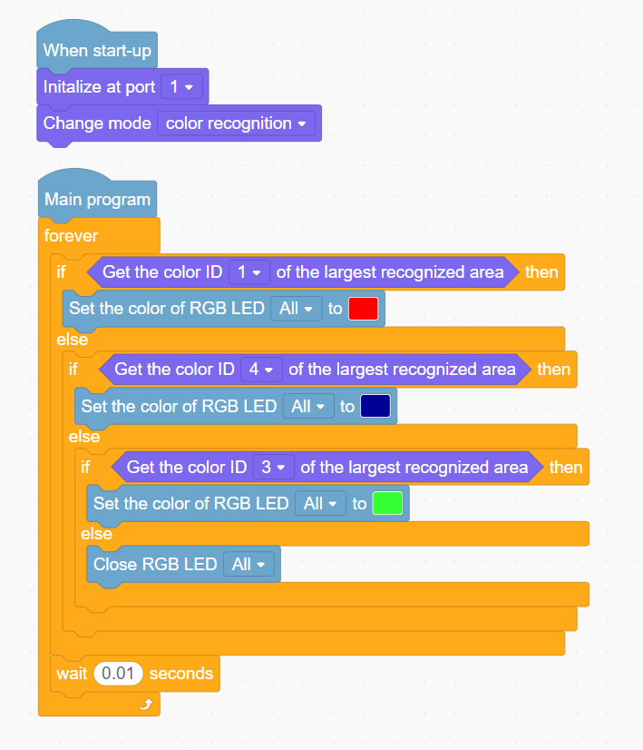

The source files are available for download as a zip archive under [1. Source Code / 02 Program Files for Builds](https://drive.google.com/drive/folders/1guTJsuFCa0f3ZVMcZNNWJ6NruvY7gsUd?usp=sharing).

### 3.1.7 Downloading Programs

### 3.1.8 Project Extensions

After successfully identifying the same color three consecutive times, the controller RGB lights will automatically set to the breathing light mode of that color. The lights will remain in the current mode for five seconds before turning off after the identified object is removed.

### 3.1.9 Technical Support and Discussion

Join the forum for sharing questions, ideas, or suggestions, and answers will be provided promptly. Click the hyperlink [Hiwonder Forum](http://forum.hiwonder.com) or enter the URL in a browser: http://forum.hiwonder.com

## 3.2 Smart Desk Lamp

### 3.2.1 Introduction

This smart desk lamp features voice-controlled dimming capabilities. Vocal commands enable turning the light on and off, and the system also switches between four distinct lighting colors including red, green, and blue. A single spoken phrase effortlessly alters the lighting ambiance of the room.

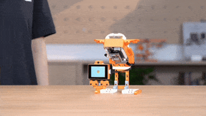

### 3.2.2 Learning Objectives

1. Develop proficiency in using WonderLLM voice interaction features and master the basic logic of controlling lights via voice commands.
2. Learn to receive voice commands via the ESP32 to implement desk lamp switching and lighting mode adjustments.

### 3.2.3 Assembly Guide

 <iframe
    src="../_static/pdf/02_Smart_Desk_Lamp.pdf#view=FitH"
    title="Assembly Guide PDF"
    width="100%"
    height="850"
    style="border: 1px solid #ddd;"
    loading="lazy">
 </iframe>

### 3.2.4 Mode Switching

This build requires the **offline voice interaction function**. Skip this step and proceed directly to the wiring guide if the offline voice interaction mode is already active. Otherwise, refer to the [4.5.1 Firmware Update](https://wiki.hiwonder.com/projects/DaDablock-AI/en/standard-kit/docs/4_Software_and_Hardware_Guide.html#id21) section in Chapter 4 to re-flash the corresponding firmware.

### 3.2.5 Wiring Guide

Plug the WonderLLM module cable into port 1 of the ESP32 controller, as shown in the diagram:

### 3.2.6 Programming

#### (1) Program Concept Diagram

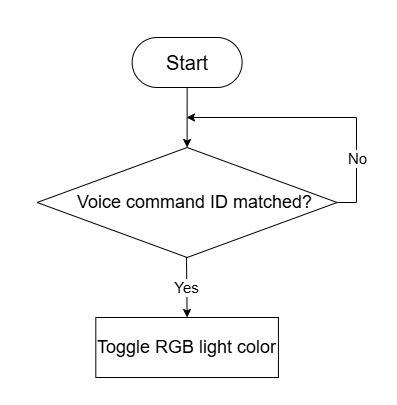

#### (2) Add Extension Libraries

Select **Sensor** in the **Choose an Extension** interface to add **WonderLLM-offline**.

#### (3) Core Blocks Analysis

|                        Command Block                         |                           Category                           |                     Function Description                     |
| :----------------------------------------------------------: | :----------------------------------------------------------: | :----------------------------------------------------------: |
|  |  | Switch the working recognition mode of the WonderLLM module, with options for voice interaction, color recognition, and face recognition. |
|  |  | Read the voice text content recognized by the module in voice interaction mode for subsequent decision-making and interaction logic. |
|  |  | Control specific or all RGB lights to light up in the selected color. |
|  |  | Turn off specific or all RGB lights to cut off light output. |

#### (4) Complete Program

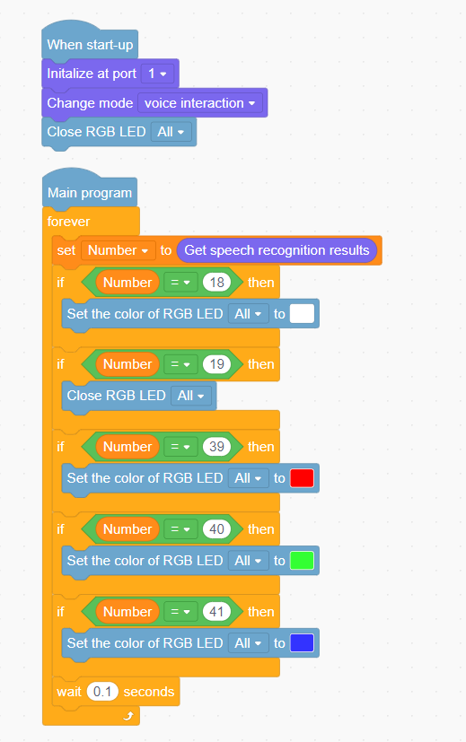

The source files are available for download as a zip archive under [1. Source Code / 02 Program Files for Builds](https://drive.google.com/drive/folders/1guTJsuFCa0f3ZVMcZNNWJ6NruvY7gsUd?usp=sharing).

### 3.2.7 Downloading Programs

### 3.2.8 Project Extensions

Issue a voice command to turn on the light, and the RGB lights will turn on a soft white light by default while the buzzer emits a low-pitched tone. When switching to a red light, the red light turns on and triggers a short, high-pitched buzzer beep. When switching to a green light, the green light turns on with a medium-pitched, long beep. When switching to a blue light, the blue light turns on with a short, crisp beep. Issue a command to turn off the light, and the lights turn off while the buzzer plays a low, ending sound effect. Each lighting state corresponds to a dedicated tone, distinguishing lighting modes through combinations of sound and light.

### 3.2.9 Technical Support and Discussion

Join the forum for sharing questions, ideas, or suggestions, and answers will be provided promptly. Click the hyperlink [Hiwonder Forum](http://forum.hiwonder.com) or enter the URL in a browser: http://forum.hiwonder.com

## 3.3 Smart Desk Clock

### 3.3.1 Introduction

This smart clock features countdown alert capabilities. After configuring the duration, the dot matrix display dynamically updates the remaining time in real-time, and the buzzer automatically sounds upon countdown completion, serving as an ideal alarm clock for learning timekeeping.

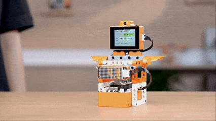

### 3.3.2 Learning Objectives

1. Understand the operational logic of a countdown timer and master programming methods involving data reception, variable control, and conditional statements.
2. Learn to utilize a dot matrix display to display numbers and a buzzer to play alert tones, achieving a complete timing feedback effect.

### 3.3.3 Assembly Guide

 <iframe
    src="../_static/pdf/03_Smart_Desk_Clock.pdf#view=FitH"
    title="Assembly Guide PDF"
    width="100%"
    height="850"
    style="border: 1px solid #ddd;"
    loading="lazy">
 </iframe>

### 3.3.4 Mode Switching

This build requires the online large model. Skip this step and proceed directly to the wiring guide if the **online large model mode** is already active. Otherwise, refer to the [4.5.1 Firmware Update](https://wiki.hiwonder.com/projects/DaDablock-AI/en/standard-kit/docs/4_Software_and_Hardware_Guide.html#id21) section in Chapter 4 to re-flash the corresponding firmware.

### 3.3.5 Wiring Guide

1. Insert the dot matrix module cable into port 7 of the ESP32 controller.

2. Plug the WonderLLM module cable into port 3 of the ESP32 controller.

The connections are shown in the diagram:

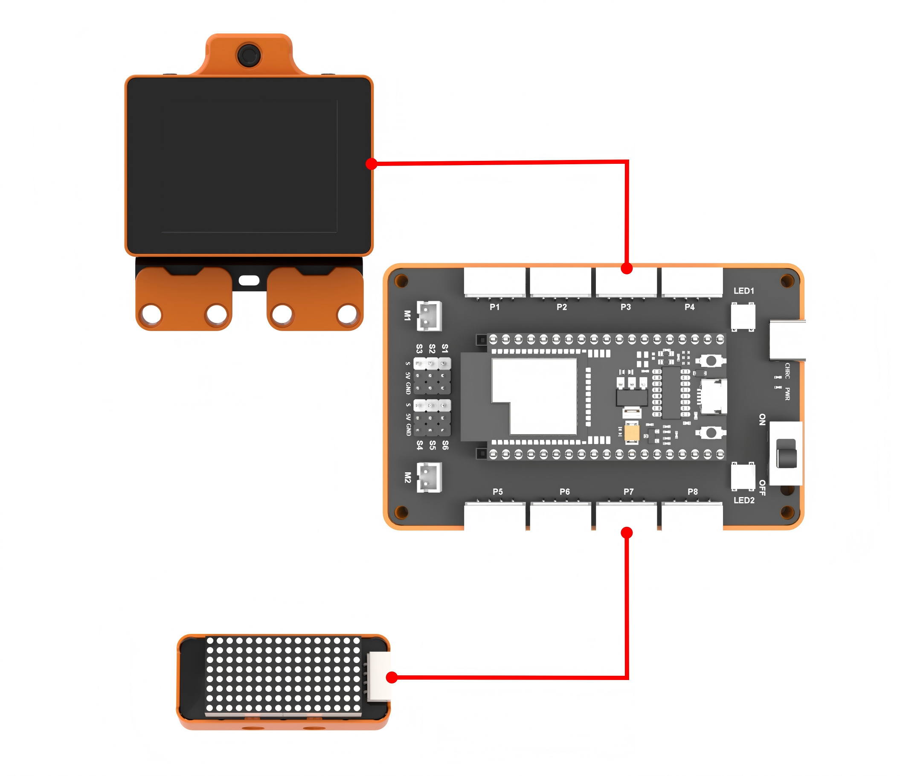

### 3.3.6 Programming

#### (1) Program Concept Diagram

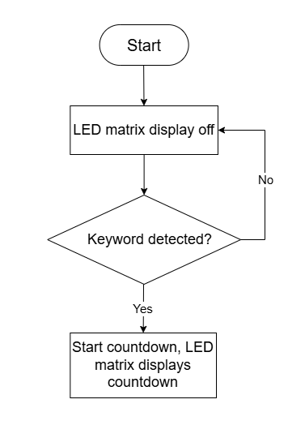

#### (2) Add Extension Libraries

- Select **Sensor** in the **Choose an Extension** interface to add **WonderLLM**.

- Select **Output module** in the **Choose an Extension** interface to add **Dot matrix module**.

#### (3) Core Blocks Analysis

|                        Command Block                         |                           Category                           |                     Function Description                     |
| :----------------------------------------------------------: | :----------------------------------------------------------: | :----------------------------------------------------------: |
|  |  |   Send custom text messages to the WonderLLM large model.    |
|  |  | Configure mcp tool invocation parameters, customize the tool name, description, execution commands, and return parameters, and set invocation blocking and data return rules. |
|  |  | Turn the mcp switch on or off to control whether WonderLLM enables custom tool invocation capabilities. |
|  |  | Read the result data returned after the execution of the mcp tool is completed. |
| 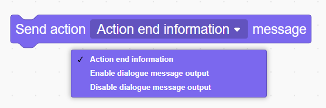 |  | Control the dialogue message output mode, with capabilities to send an action end flag and enable or disable dialogue content print output. |
|  |  | Control the dot matrix screen to output and display the specified number, enabling real-time refreshing of the displayed value. |
|  |  | Control the dot matrix screen to load and display preset patterns, enabling custom switching of various graphics and symbol screens. |
|  |  | Drive the buzzer to play music of the specified pitch and tempo, running in the background without blocking subsequent program execution. |
|  |  | Stop the buzzer from emitting sound immediately, terminating the currently playing tone or music. |
|  |  | Perform boolean logic judgment, determining whether the input condition is true or false, or performing negation operations. |
|  |  | Manually enter or invoke text content to generate string data that can participate in splicing, judgment, and display. |
|  |  | Judge whether a specified element exists within an array, tuple, or dictionary, returning a boolean result. |
|  |  | Extract the corresponding stored value or text content from a dictionary according to the specified key name. |

#### MCP Parameter Configuration

**Tool Name: self.robot.setTime**

1. Tool Description: You are an intelligent alarm clock with a countdown function that can be set. Parameter: 1 Countdown time: in seconds.

2. Command Name: `setTime`

3. Return Parameters: `[["time","int","0","0","10"]]` **Note that the first 0 is the default value, the second 0 is the minimum value, and 10 is the maximum value**.

4. Block until call complete: Yes

5. Return data: No

6. Function: This MCP configuration defines a countdown tool for the WonderLLM module, allowing WonderLLM to issue commands with a duration of 0 to 10 seconds to control the robot starting or stopping the countdown. During the call, the program blocks and waits for the countdown execution to complete fully, without needing to return running data back to WonderLLM.

#### (4) Complete Program

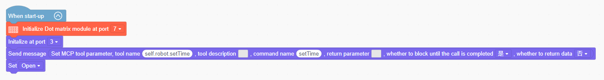

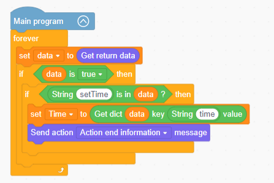

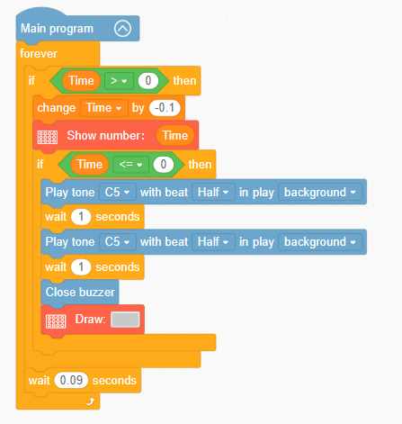

The source files are available for download as a zip archive under [1. Source Code / 02 Program Files for Builds](https://drive.google.com/drive/folders/1guTJsuFCa0f3ZVMcZNNWJ6NruvY7gsUd?usp=sharing).

### 3.3.7 Downloading Programs

### 3.3.8 Project Extensions

Voice commands enable the configuration of two separate countdown groups for short and long durations. Upon countdown completion, the dot matrix display shows **END,** and the buzzer emits distinct patterns of long and short tones to differentiate between the different countdown tasks.

### 3.3.9 Technical Support and Discussion

Join the forum for sharing questions, ideas, or suggestions, and answers will be provided promptly. Click the hyperlink [Hiwonder Forum](http://forum.hiwonder.com) or enter the URL in a browser: http://forum.hiwonder.com

## 3.4 Adjustable Mixer

### 3.4.1 Introduction

This adjustable mixer features voice-controlled speed regulation. Vocal commands activate the stirring mechanism, which offers three distinct speed levels to easily simulate mixing materials at different intensities, serving as an engaging mechanical device.

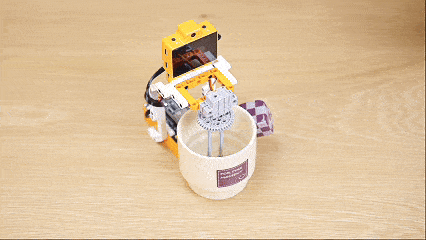

### 3.4.2 Learning Objectives

1. Master the voice command recognition function of WonderLLM, and implement start-stop and multi-gear speed adjustment control for the 270° block servo.
2. Learn to output PWM signals with different duty cycles from the ESP32 to control the speed variation of the 270° block servo, simulating the different working modes of the blender.

### 3.4.3 Assembly Guide

 <iframe
    src="../_static/pdf/04_Adjustable_Mixer.pdf#view=FitH"
    title="Assembly Guide PDF"
    width="100%"
    height="850"
    style="border: 1px solid #ddd;"
    loading="lazy">
 </iframe>

### 3.4.4 Mode Switching

This build requires the **online large model**. Skip this step and proceed directly to the wiring guide if the online large model mode is already active. Otherwise, refer to the [4.5.1 Firmware Update](https://wiki.hiwonder.com/projects/DaDablock-AI/en/standard-kit/docs/4_Software_and_Hardware_Guide.html#id21) section in Chapter 4 to re-flash the corresponding firmware.

### 3.4.5 Wiring Guide

Plug the WonderLLM module cable into port 4 of the ESP32 controller.

Insert the 270° block servo cable into port S1 of the ESP32 controller, and insert the orange wire of the servo into the white pin of S1.

The connections are shown in the diagram:

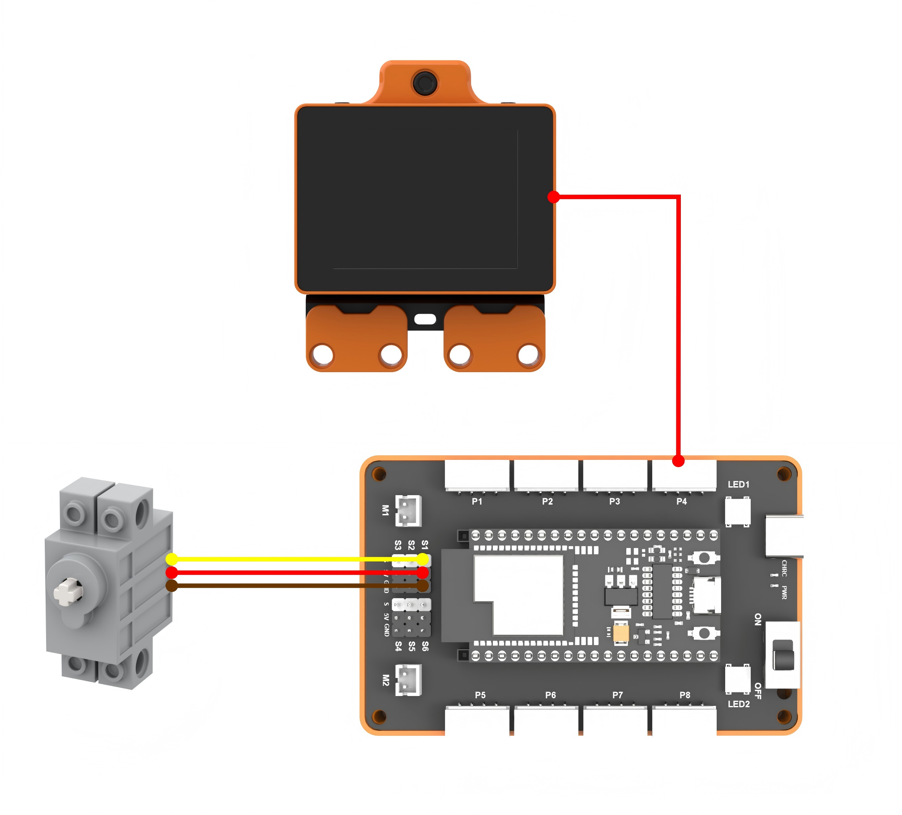

> [!NOTE]
>
> **For the initial setup of the 270° block servo, first remove the gear on the servo along with the attached building blocks, and upload the following 270° servo reset program to the ESP32. Next, reattach the removed building blocks, upload the program for this section to the ESP32, and wait for the 270° block servo to rotate to the initial position of 135°. This step can be skipped if the servo reset program has been executed previously.**

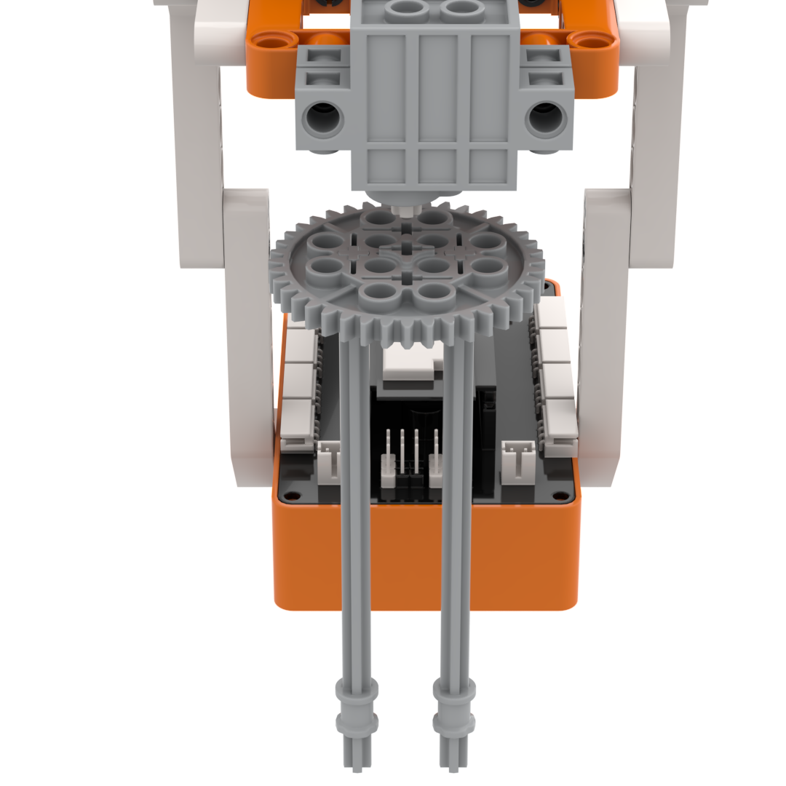

### 3.4.6 Programming

#### (1) Program Concept Diagram

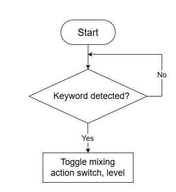

#### (2) Add Extension Libraries

Select **Sensor** in the **Choose an Extension** interface to add **WonderLLM**.

#### (3) Core Blocks Analysis

|                        Command Block                         |                           Category                           |                     Function Description                     |
| :----------------------------------------------------------: | :----------------------------------------------------------: | :----------------------------------------------------------: |
|  |  |   Send custom text messages to the WonderLLM large model.    |
|  |  | Configure mcp tool invocation parameters, customize the tool name, description, execution commands, and return parameters, and set invocation blocking and data return rules. |
|  |  | Turn the mcp switch on or off to control whether WonderLLM enables custom tool invocation capabilities. |
|  |  | Read the result data returned after the execution of the mcp tool is completed. |
|  |  | Control the dialogue message output mode, with capabilities to send an action end flag and enable or disable dialogue content print output. |
|  |  | Control the 270° servo on the specified port to rotate smoothly to the target angle within a set duration, automatically delaying to wait for the servo to complete the action. |
|  |  | Perform boolean logic judgment, determining whether the input condition is true or false, or performing negation operations. |
|  |  | Manually enter or invoke text content to generate string data that can participate in splicing, judgment, and display. |
|  |  | Judge whether a specified element exists within an array, tuple, or dictionary, returning a boolean result. |
|  |  | Extract the corresponding stored value or text content from a dictionary according to the specified key name. |

#### MCP Parameter Configuration

**Tool Name: `self.robot.setMode`**

1. Tool Description: You are a blender with three modes to choose from. Parameter description: Gear range: 0 to 3, returns 0 when stopping, returns 1 for first gear, returns 2 for second gear, and returns 3 for third gear.

2. Command Name: `setMode`

3. Return Parameters: `[["mode","int","0","0","3"]]` **Note that the first 0 is the default value, the second 0 is the minimum value, and 3 is the maximum value**.

4. Block until call complete: Yes

5. Return data: No

6. Function: This MCP configuration defines a gear switching tool for the WonderLLM module, allowing WonderLLM to issue gear commands from 0 to 3 to control the blender to switch running modes. During the call, the program blocks and waits for the mode switch execution to complete, and there is no need to return running data back to WonderLLM.

#### (4) Complete Program

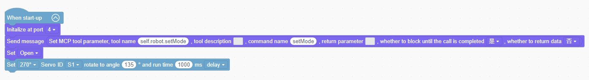

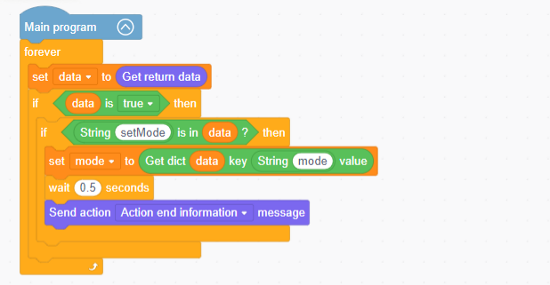

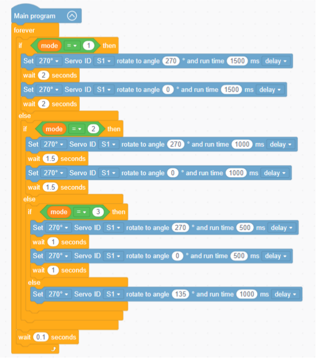

The source files are available for download as a zip archive under [1. Source Code / 02 Program Files for Builds](https://drive.google.com/drive/folders/1guTJsuFCa0f3ZVMcZNNWJ6NruvY7gsUd?usp=sharing).

### 3.4.7 Downloading Programs

### 3.4.8 Project Extensions

Issuing the voice command "Auto Mode" causes the mixer to automatically cycle through low, medium, and high speed levels. A stop command delivered at any time immediately interrupts this cycle, and a single voice command can lock the system into a specific speed level for continuous mixing.

### 3.4.9 Technical Support and Discussion

Join the forum for sharing questions, ideas, or suggestions, and answers will be provided promptly. Click the hyperlink [Hiwonder Forum](http://forum.hiwonder.com) or enter the URL in a browser: http://forum.hiwonder.com

## 3.5 Smart Windmill

### 3.5.1 Introduction

This interactive smart windmill responds directly to vocal cues. Simple voice commands engage the motor to spin the blades, meaning a single spoken phrase can instantly set a miniature windmill scene into gentle motion.

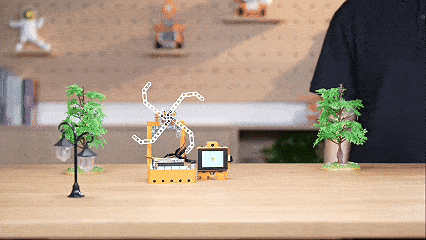

### 3.5.2 Learning Objectives

1. Learn to control the 360° block motor via the ESP32, and master the basic programming methods for start-stop and speed adjustment of the 360° block motor.
2. Enhance hands-on skills in integrating mechanical and electronic systems by implementing smart windmill control through voice commands.

### 3.5.3 Assembly Guide

 <iframe
    src="../_static/pdf/05_Smart_Windmill.pdf#view=FitH"
    title="Assembly Guide PDF"
    width="100%"
    height="850"
    style="border: 1px solid #ddd;"
    loading="lazy">
 </iframe>

### 3.5.4 Mode Switching

This build requires the **offline voice interaction function**. Skip this step and proceed directly to the wiring guide if the offline voice interaction mode is already active. Otherwise, refer to the [4.5.1 Firmware Update](https://wiki.hiwonder.com/projects/DaDablock-AI/en/standard-kit/docs/4_Software_and_Hardware_Guide.html#id21) section in Chapter 4 to re-flash the corresponding firmware.

### 3.5.5 Wiring Guide

Plug the WonderLLM module cable into port 1 of the ESP32 controller.

Insert the 360° block motor cable into port S1 of the ESP32 controller, and insert the orange wire of the motor into the white pin of S1.

The connections are shown in the diagram:

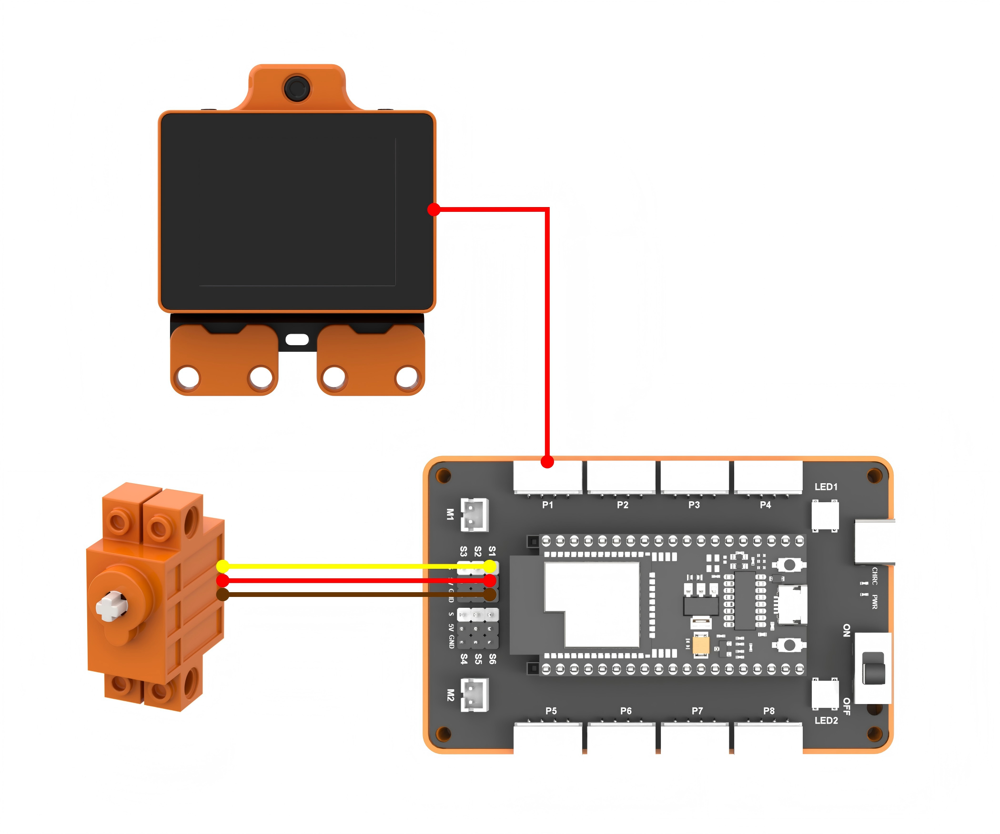

### 3.5.6 Programming

#### (1) Program Concept Diagram

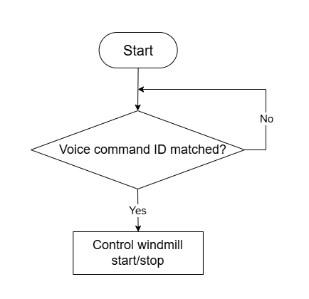

#### (2) Add Extension Libraries

Select **Sensor** in the **Choose an Extension** interface to add **WonderLLM-offline**.

#### (3) Core Blocks Analysis

|                        Command Block                         |                           Category                           |                     Function Description                     |
| :----------------------------------------------------------: | :----------------------------------------------------------: | :----------------------------------------------------------: |
|  |  | Switch the working recognition mode of the WonderLLM module, with options for voice interaction, color recognition, and face recognition. |
|  |  | Read the voice text content recognized by the module in voice interaction mode for subsequent decision-making and interaction logic. |
|  |  | Control the 360° block motor on the specified port to continue rotating at the set custom speed. |

#### (4) Complete Program

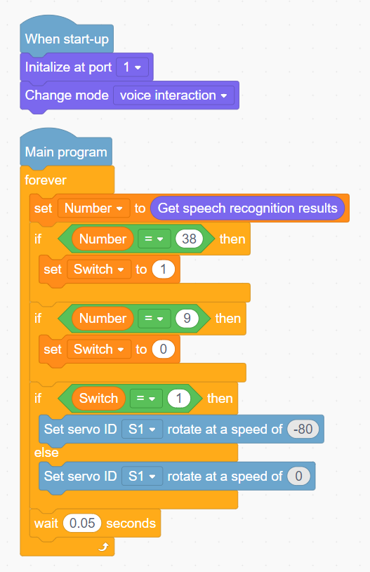

The source files are available for download as a zip archive under [1. Source Code / 02 Program Files for Builds](https://drive.google.com/drive/folders/1guTJsuFCa0f3ZVMcZNNWJ6NruvY7gsUd?usp=sharing).

### 3.5.7 Downloading Programs

### 3.5.8 Project Extensions

Issuing the voice command "Rotate Servo" initiates medium-speed rotation. The commands "Speed Up" and "Slow Down" trigger high-speed and low-speed rotation, respectively, enabling complete three-level speed regulation entirely through voice interaction.

### 3.5.9 Technical Support and Discussion

Join the forum for sharing questions, ideas, or suggestions, and answers will be provided promptly. Click the hyperlink [Hiwonder Forum](http://forum.hiwonder.com) or enter the URL in a browser: http://forum.hiwonder.com

## 3.6 Greeter Bot

### 3.6.1 Introduction

This interactive greeting robot features face recognition capabilities designed to welcome guests. Upon detecting an approaching individual, the system automatically broadcasts a welcoming voice message while the dot matrix display simultaneously shows **Hi**, ensuring a warm and engaging reception for every visitor.

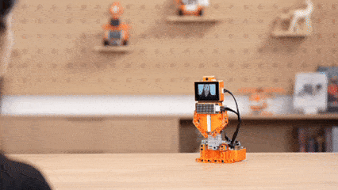

### 3.6.2 Learning Objectives

1. Understand the WonderLLM facial recognition feature and master the control methods for triggering mechanical actions via facial detection.
2. Learn to integrate the ESP32 controller with the 270° block servo to construct an interactive, humanoid greeting project.

### 3.6.3 Assembly Guide

 <iframe
    src="../_static/pdf/06_Greeter_Bot.pdf#view=FitH"
    title="Assembly Guide PDF"
    width="100%"
    height="850"
    style="border: 1px solid #ddd;"
    loading="lazy">
 </iframe>

### 3.6.4 Mode Switching

This build requires the **offline vision function**. Skip this step and proceed directly to the wiring guide if the offline vision mode is already active. Otherwise, refer to the [4.5.1 Firmware Update](https://wiki.hiwonder.com/projects/DaDablock-AI/en/standard-kit/docs/4_Software_and_Hardware_Guide.html#id21) section in Chapter 4 to re-flash the corresponding firmware.

### 3.6.5 Wiring Guide

Insert the dot matrix module cable into port 6 of the ESP32 controller.

Plug the WonderLLM module cable into port 1 of the ESP32 controller.

Insert the 270° block servo cable into port S1 of the ESP32 controller, and insert the orange wire of the servo into the white pin of S1.

The connections are shown in the diagram:

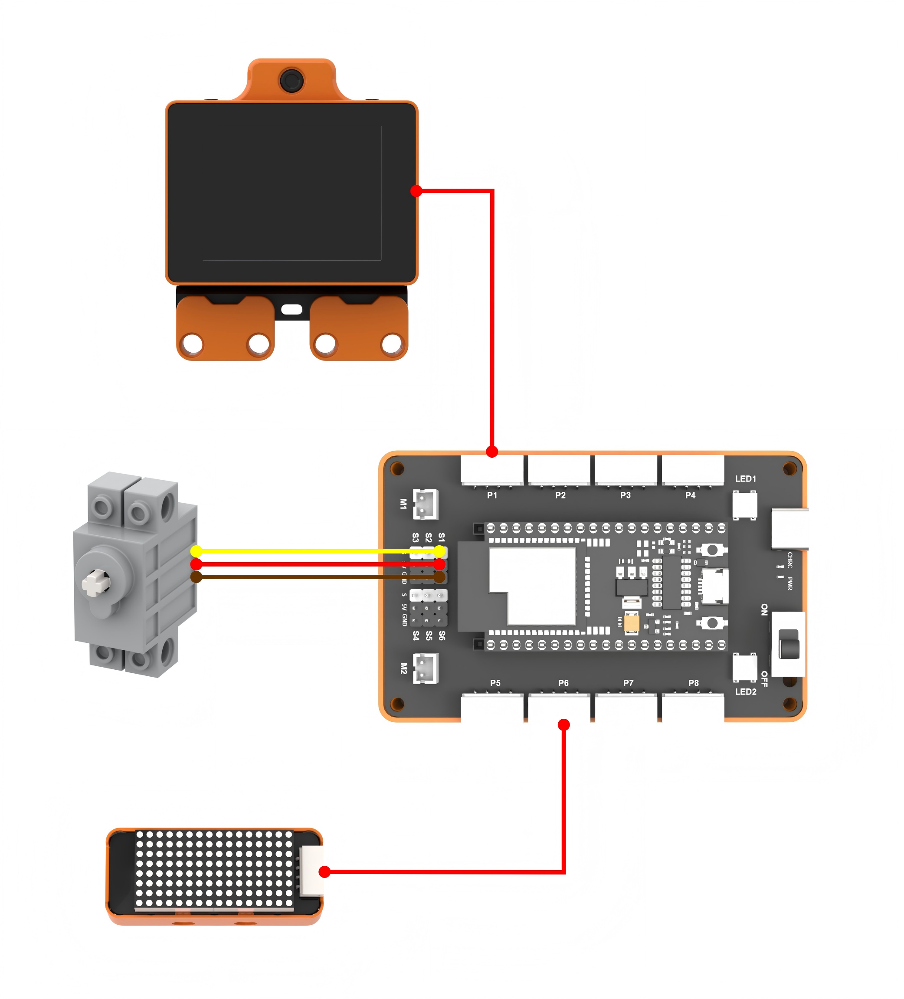

**For the initial setup of the 270° block servo, first remove the gear on the servo along with the attached building blocks, and upload the following servo reset program to the ESP32 controller. Next, reattach the removed components, upload the program for this section to the ESP32 controller, and wait for the 270° block servo to rotate to the initial position of 135°. At this point, the robot figure faces directly forward in an upright, unbowed posture. This step can be skipped if the servo reset program has been executed previously.**

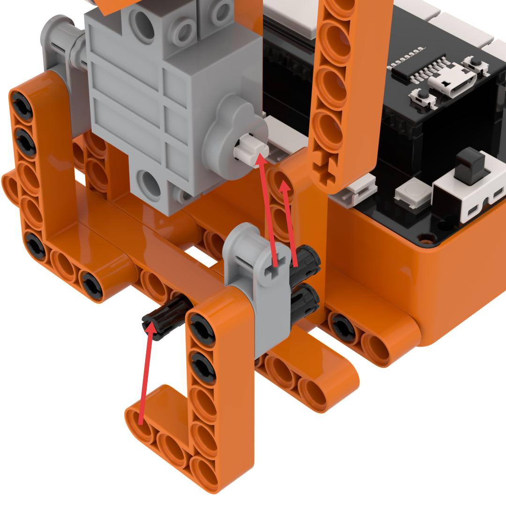

### 3.6.6 Programming

#### (1) Program Concept Diagram

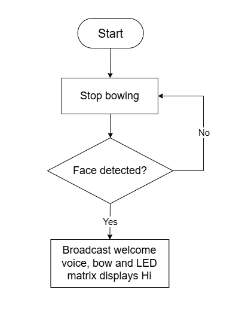

#### (2) Add Extension Libraries

- Select **Sensor** in the **Choose an Extension** interface to add **WonderLLM-offline**.

- Select **Output module** in the **Choose an Extension** interface to add **Dot matrix module**.

#### (3) Core Blocks Analysis

|                        Command Block                         |                           Category                           |                     Function Description                     |
| :----------------------------------------------------------: | :----------------------------------------------------------: | :----------------------------------------------------------: |
|  |  | Switch the working recognition mode of the WonderLLM module, with options for voice interaction, color recognition, and face recognition. |
|  |  | Detect whether a face exists in the screen in face recognition mode, returning a boolean value for face detection logic. |
| 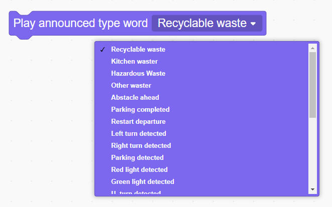 |  | Select the desired broadcast voice entry and control the module to play the content of the entry. |
|  |  | Output and display custom text content at the specified x and y coordinates on the dot matrix screen. |
|  |  | Control the dot matrix screen to load and display preset patterns, enabling custom switching of various graphics and symbol screens. |
|  |  | Control the 270° servo on the specified port to rotate smoothly to the target angle within a set duration, automatically delaying to wait for the servo to complete the action. |

#### (4) Complete Program

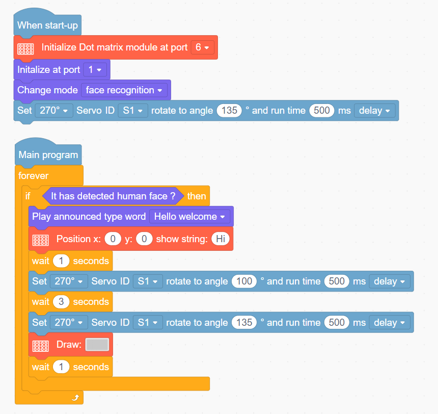

The source files are available for download as a zip archive under [1. Source Code / 02 Program Files for Builds](https://drive.google.com/drive/folders/1guTJsuFCa0f3ZVMcZNNWJ6NruvY7gsUd?usp=sharing).

### 3.6.7 Downloading Programs

### 3.6.8 Project Extensions

Upon facial detection, the robot figure executes two consecutive bows, and the dot matrix display switches to a cheering expression. Once the face exits the detection range, the display clears automatically.

### 3.6.9 Technical Support and Discussion

Join the forum for sharing questions, ideas, or suggestions, and answers will be provided promptly. Click the hyperlink [Hiwonder Forum](http://forum.hiwonder.com) or enter the URL in a browser: http://forum.hiwonder.com

## 3.7 Welcome Barrier Gate

### 3.7.1 Introduction

This automated barrier gate features facial recognition capabilities for smart access control. Upon detecting a face, the system raises the barrier arm to grant entry while simultaneously broadcasting a welcoming audio message, effectively simulating a real-world automated store entrance and reception scenario.

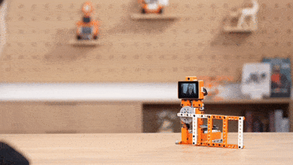

### 3.7.2 Learning Objectives

1. Apply the WonderLLM facial recognition feature to automate the opening and closing operations of the smart barrier gate.
2. Master precise angle control of the 270° block servo and understand the operational logic of the automated access control simulation project.

### 3.7.3 Assembly Guide

 <iframe
    src="../_static/pdf/07_Welcome_Barrier_Gate.pdf#view=FitH"
    title="Assembly Guide PDF"
    width="100%"
    height="850"
    style="border: 1px solid #ddd;"
    loading="lazy">
 </iframe>

### 3.7.4 Mode Switching

This build requires the **offline vision function**. Skip this step and proceed directly to the wiring guide if the offline vision mode is already active. Otherwise, refer to the [4.5.1 Firmware Update](https://wiki.hiwonder.com/projects/DaDablock-AI/en/standard-kit/docs/4_Software_and_Hardware_Guide.html#id21) section in Chapter 4 to re-flash the corresponding firmware.

### 3.7.5 Wiring Guide

Plug the WonderLLM module cable into port 1 of the ESP32 controller.

Insert the 270° block servo cable into port S1 of the ESP32 controller, and insert the orange wire of the servo into the white pin of S1.

The connections are shown in the diagram:

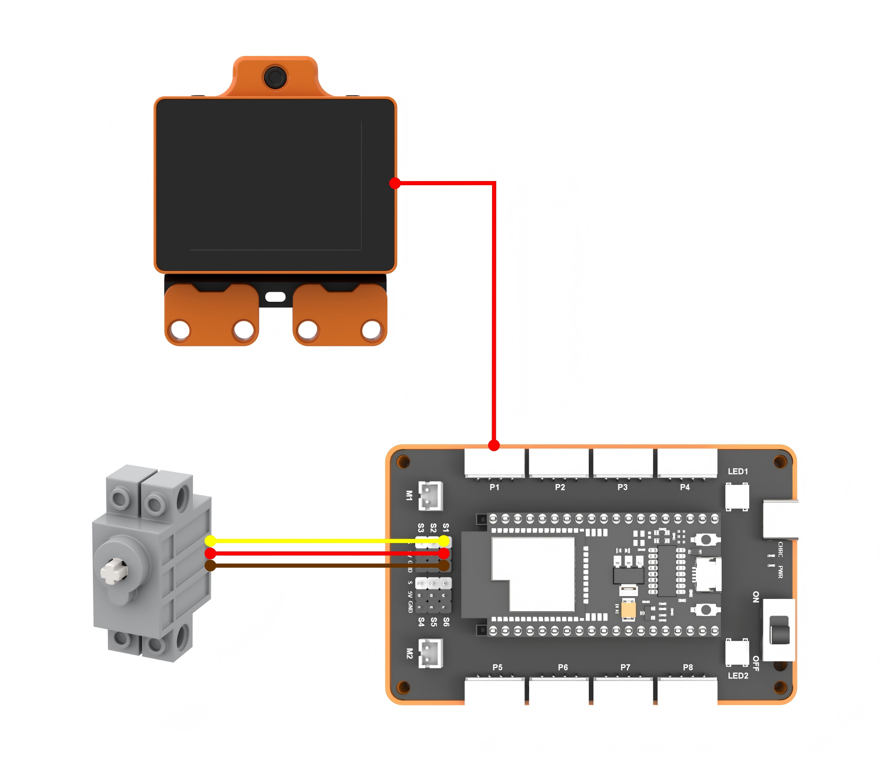

> [!NOTE]
>
> **For the initial setup of the 270° block servo, first remove the gear along with the attached building blocks, and upload the following servo reset program to the ESP32 controller. Next, reattach the removed components, upload the program for this lesson to the ESP32 controller, and wait for the 270° block servo to rotate to the initial position of 50°. At this point, the barrier arm is in the lowered position. This step can be skipped if the servo reset program has been executed previously.**

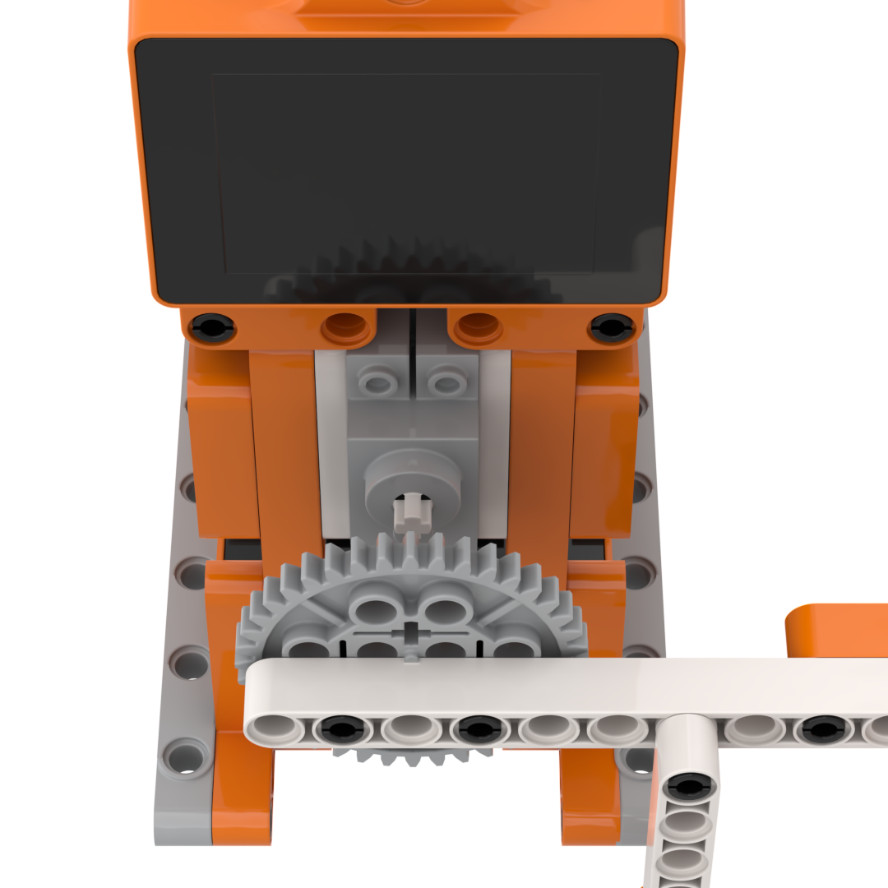

### 3.7.6 Programming

#### (1) Program Concept Diagram

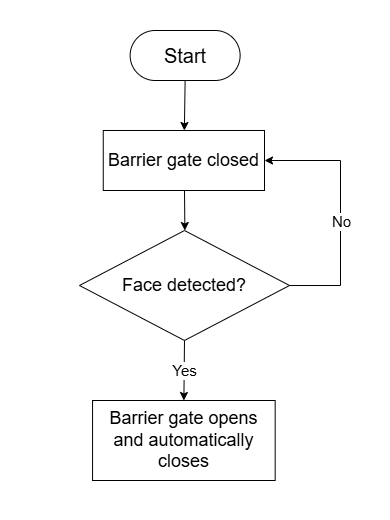

#### (2) Add Extension Libraries

Select **Sensor** in the **Choose an Extension** interface to add **WonderLLM-offline**.

#### (3) Core Blocks Analysis

|                        Command Block                         |                           Category                           |                     Function Description                     |
| :----------------------------------------------------------: | :----------------------------------------------------------: | :----------------------------------------------------------: |
|  |  | Switch the working recognition mode of the WonderLLM module, with options for voice interaction, color recognition, and face recognition. |
|  |  | Detect whether a face exists in the screen in face recognition mode, returning a boolean value for face detection logic. |
|  |  | Select the custom broadcast voice entry number and control the module to play the voice content corresponding to that entry number. |
|  |  | Control the 270° servo on the specified port to rotate smoothly to the target angle within a set duration, automatically delaying to wait for the servo to complete the action. |

#### (4) Complete Program

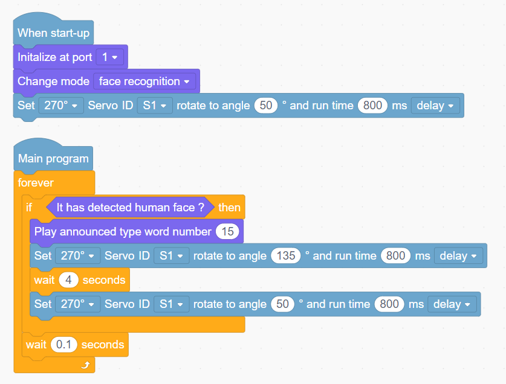

The source files are available for download as a zip archive under [1. Source Code / 02 Program Files for Builds](https://drive.google.com/drive/folders/1guTJsuFCa0f3ZVMcZNNWJ6NruvY7gsUd?usp=sharing).

### 3.7.7 Downloading Programs

### 3.7.8 Project Extensions

Upon facial detection, the barrier arm fully raises and the RGB LED is set to green to indicate access granted. The arm remains elevated for 4 seconds to allow passage, after which the servo automatically lowers the barrier arm and the RGB LED switches to red to indicate access denied.

### 3.7.9 Technical Support and Discussion

Join the forum for sharing questions, ideas, or suggestions, and answers will be provided promptly. Click the hyperlink [Hiwonder Forum](http://forum.hiwonder.com) or enter the URL in a browser: http://forum.hiwonder.com

## 3.8 Smart Beckoning Cat

### 3.8.1 Introduction

This smart Beckoning cat is designed to wave and welcome guests. Upon facial detection, the figure swings its arm to wave while simultaneously broadcasting a welcoming greeting, seamlessly combining traditional auspicious symbolism with smart reception capabilities.

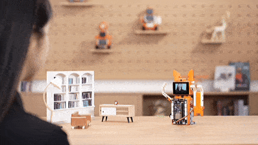

### 3.8.2 Learning Objectives

1. Utilize the WonderLLM facial recognition feature to implement a smart waving and greeting effect.
2. Master programming the ESP32 controller to drive the 270° block servo in a continuous back-and-forth motion, creating an engaging smart reception device.

### 3.8.3 Assembly Guide

 <iframe
    src="../_static/pdf/08_Smart_Beckoning_Cat.pdf#view=FitH"
    title="Assembly Guide PDF"
    width="100%"
    height="850"
    style="border: 1px solid #ddd;"
    loading="lazy">
 </iframe>

### 3.8.4 Mode Switching

This build requires the **offline vision function**. Skip this step and proceed directly to the wiring guide if the offline vision mode is already active. Otherwise, refer to the [4.5.1 Firmware Update](https://wiki.hiwonder.com/projects/DaDablock-AI/en/standard-kit/docs/4_Software_and_Hardware_Guide.html#id21) section in Chapter 4 to re-flash the corresponding firmware.

### 3.8.5 Wiring Guide

Plug the WonderLLM module cable into port 1 of the ESP32 controller.

Insert the 270° block servo cable into port S1 of the ESP32 controller, and insert the orange wire of the servo into the white pin of S1.

The connections are shown in the diagram:

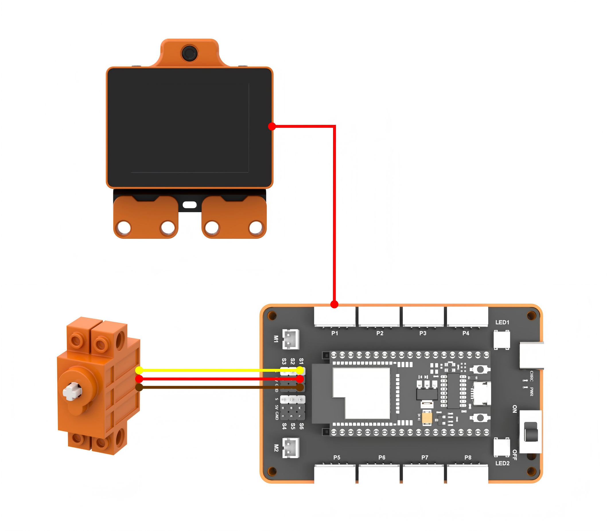

> [!NOTE]
>
> **For the initial setup of the 270° block servo, first remove the gear along with the attached building blocks, and upload the following servo reset program to the ESP32 controller. Next, reattach the removed components, upload the program for this lesson to the ESP32 controller, and wait for the 270° block servo to rotate to the initial position of 135°. This step can be skipped if the servo reset program has been executed previously.**

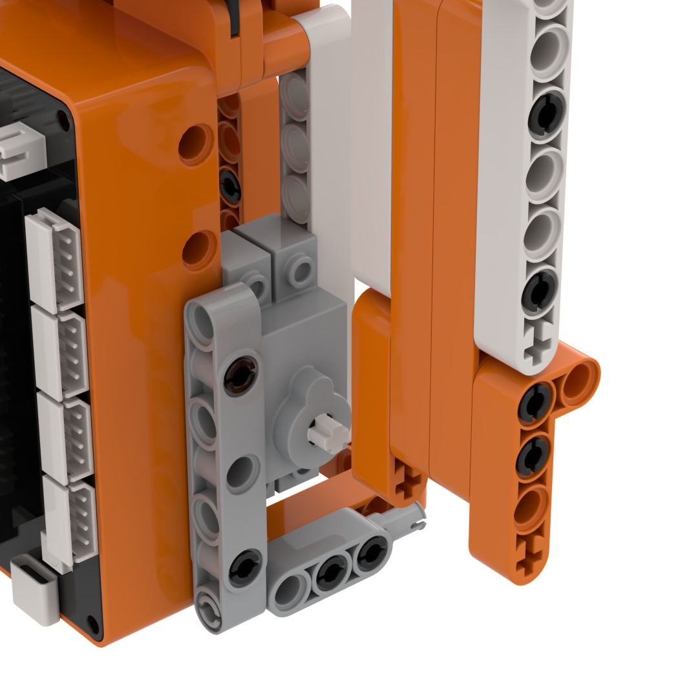

### 3.8.6 Programming

#### (1) Program Concept Diagram

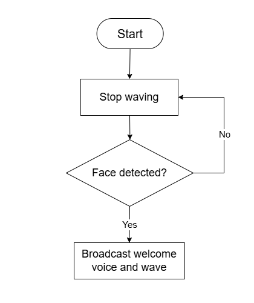

#### (2) Add Extension Libraries

Select **Sensor** in the **Choose an Extension** interface to add **WonderLLM-offline**.

#### (3) Core Blocks Analysis

|                        Command Block                         |                           Category                           |                     Function Description                     |
| :----------------------------------------------------------: | :----------------------------------------------------------: | :----------------------------------------------------------: |
|  |  | Switch the working recognition mode of the WonderLLM module, with options for voice interaction, color recognition, and face recognition. |
|  |  | Detect whether a face exists in the screen in face recognition mode, returning a boolean value for face detection logic. |
|  |  | Select the desired broadcast voice entry and control the module to play the content of the entry. |
|  |  | Control the 270° servo on the specified port to rotate smoothly to the target angle within a set duration, automatically delaying to wait for the servo to complete the action. |

#### (4) Complete Program

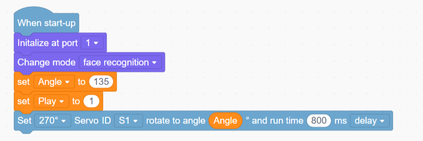

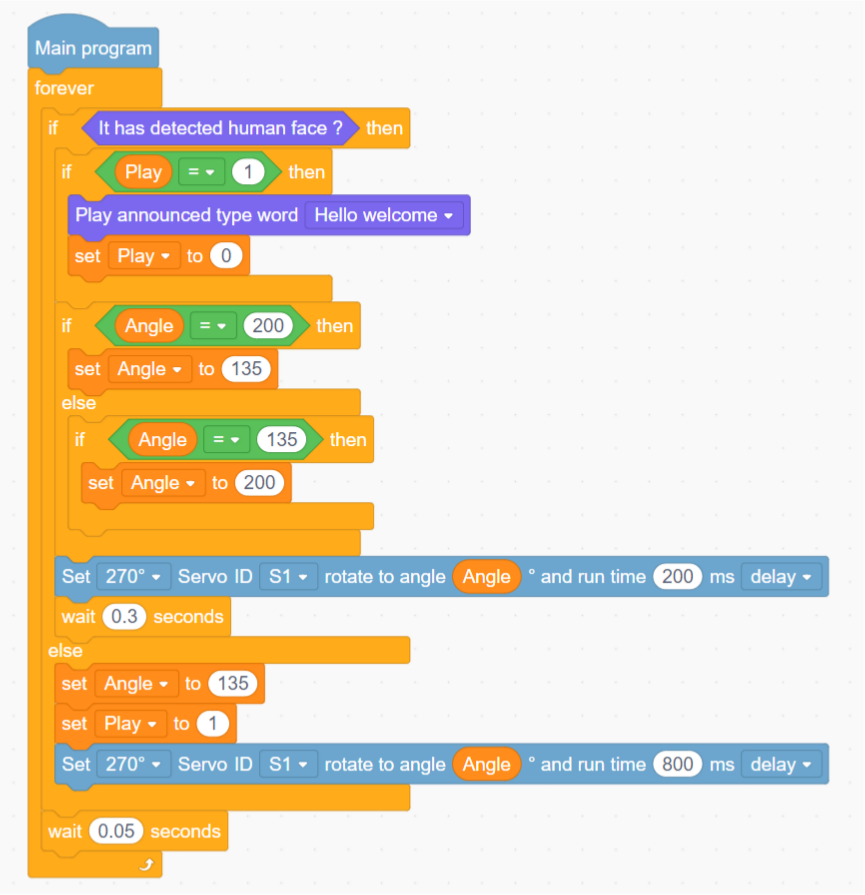

The source files are available for download as a zip archive under [1. Source Code / 02 Program Files for Builds](https://drive.google.com/drive/folders/1guTJsuFCa0f3ZVMcZNNWJ6NruvY7gsUd?usp=sharing).

### 3.8.7 Downloading Programs

### 3.8.8 Project Extensions

Upon facial detection, the cat repeatedly waves its arm. Once the face exits the detection range, the waving motion stops.

### 3.8.9 Technical Support and Discussion

Join the forum for sharing questions, ideas, or suggestions, and answers will be provided promptly. Click the hyperlink [Hiwonder Forum](http://forum.hiwonder.com) or enter the URL in a browser: http://forum.hiwonder.com

## 3.9 Pumpjack Bot

### 3.9.1 Introduction

This simulated pumpjack features voice-controlled start and stop capabilities. Issuing voice commands controls the motor to drive a continuous reciprocating motion, effectively simulating the up-and-down pumping action of a real-world oil field pumpjack.

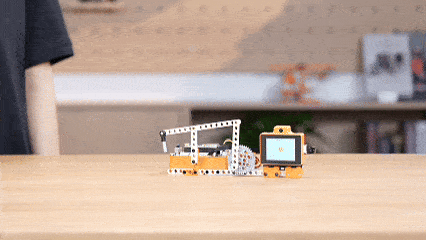

### 3.9.2 Learning Objectives

1. Learn to program the ESP32 controller to drive the 360° block servo in a reciprocating motion, mastering fundamental techniques for forward and reverse rotation, starting, stopping, and speed regulation.
2. Integrate the WonderLLM module and utilize voice commands to implement smart start, stop, and speed control for the pumpjack, enhancing hands-on skills in combining mechanical transmission structures with voice-activated electronic control systems.

### 3.9.3 Assembly Guide

 <iframe
    src="../_static/pdf/09_Pumpjack_Bot.pdf#view=FitH"
    title="Assembly Guide PDF"
    width="100%"
    height="850"
    style="border: 1px solid #ddd;"
    loading="lazy">
 </iframe>

### 3.9.4 Mode Switching

This build requires the **offline voice interaction function**. Skip this step and proceed directly to the wiring guide if the offline voice interaction mode is already active. Otherwise, refer to the [4.5.1 Firmware Update](https://wiki.hiwonder.com/projects/DaDablock-AI/en/standard-kit/docs/4_Software_and_Hardware_Guide.html#id21) section in Chapter 4 to re-flash the corresponding firmware.

### 3.9.5 Wiring Guide

Plug the WonderLLM module cable into port 1 of the ESP32 controller.

Insert the 360° block motor cable into port S1 of the ESP32 controller, and insert the orange wire of the motor into the white pin of  S1.

The connections are shown in the diagram:

### 3.9.6 Programming

#### (1) Program Concept Diagram

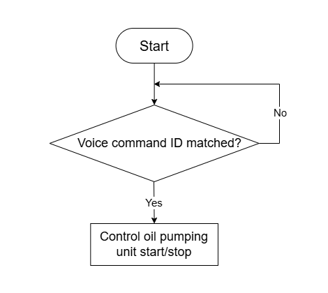

#### (2) Add Extension Libraries

Select **Sensor** in the **Choose an Extension** interface to add **WonderLLM-offline**.

#### (3) Core Blocks Analysis

|                        Command Block                         |                           Category                           |                     Function Description                     |
| :----------------------------------------------------------: | :----------------------------------------------------------: | :----------------------------------------------------------: |
|  |  | Switch the working recognition mode of the WonderLLM module, with options for voice interaction, color recognition, and face recognition. |
|  |  | Read the voice text content recognized by the module in voice interaction mode for subsequent decision-making and interaction logic. |
|  |  | Control the 360° block motor on the specified port to continue rotating at the set custom speed. |

#### (4) Complete Program

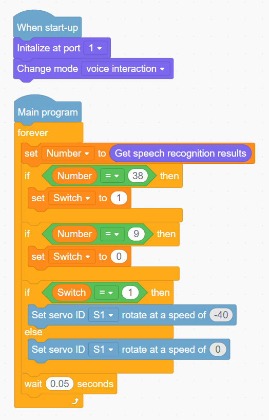

The source files are available for download as a zip archive under [1. Source Code / 02 Program Files for Builds](https://drive.google.com/drive/folders/1guTJsuFCa0f3ZVMcZNNWJ6NruvY7gsUd?usp=sharing).

### 3.9.7 Downloading Programs

### 3.9.8 Project Extensions

Issuing the voice command "Rotate Servo" initiates medium-speed pumping. The commands "Speed Up" and "Slow Down" trigger high-speed and low-speed pumping respectively. Simultaneously, the buzzer adjusts its pitch based on the rotation speed to simulate the mechanical noise generated during the pumping process.

### 3.9.9 Technical Support and Discussion

Join the forum for sharing questions, ideas, or suggestions, and answers will be provided promptly. Click the hyperlink [Hiwonder Forum](http://forum.hiwonder.com) or enter the URL in a browser: http://forum.hiwonder.com

## 3.10 Smart Cradle

### 3.10.1 Introduction

This smart cradle features voice-controlled rocking capabilities. Issuing voice commands controls the motor to drive a slow swinging motion, effectively simulating a gentle, sleep-inducing rocking rhythm and creating a deeply soothing miniature relaxation device.

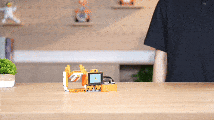

### 3.10.2 Learning Objectives

1. Proficiently utilize WonderLLM voice commands to implement voice control for the smart cradle.
2. Learn to adjust the swing amplitude and speed of the 360° block servo, creating a simulated everyday smart device.

### 3.10.3 Assembly Guide

 <iframe
    src="../_static/pdf/10_Smart_Cradle.pdf#view=FitH"
    title="Assembly Guide PDF"
    width="100%"
    height="850"
    style="border: 1px solid #ddd;"
    loading="lazy">
 </iframe>

### 3.10.4 Mode Switching

This build requires the **offline voice interaction function**. Skip this step and proceed directly to the wiring guide if the offline voice interaction mode is already active. Otherwise, refer to the [4.5.1 Firmware Update](https://wiki.hiwonder.com/projects/DaDablock-AI/en/standard-kit/docs/4_Software_and_Hardware_Guide.html#id21) section in Chapter 4 to re-flash the corresponding firmware.

### 3.10.5 Wiring Guide

Plug the WonderLLM module cable into port 1 of the ESP32 controller.

Insert the 360° block motor cable into port S1 of the ESP32 controller, and insert the orange wire of the motor into the white pin of  S1.

The connections are shown in the diagram:

### 3.10.6 Programming

#### (1) Program Concept Diagram

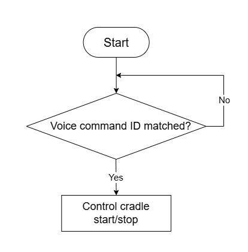

#### (2) Add Extension Libraries

Select **Sensor** in the **Choose an Extension** interface to add **WonderLLM-offline**.

#### (3) Core Blocks Analysis

|                        Command Block                         |                           Category                           |                     Function Description                     |
| :----------------------------------------------------------: | :----------------------------------------------------------: | :----------------------------------------------------------: |
|  |  | Switch the working recognition mode of the WonderLLM module, with options for voice interaction, color recognition, and face recognition. |
|  |  | Read the voice text content recognized by the module in voice interaction mode for subsequent decision-making and interaction logic. |
|  |  | Control the 360° block motor on the specified port to continue rotating at the set custom speed. |

#### (4) Complete Program

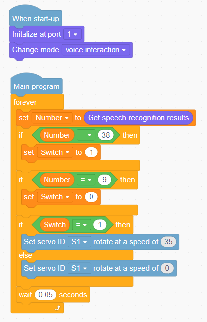

The source files are available for download as a zip archive under [1. Source Code / 02 Program Files for Builds](https://drive.google.com/drive/folders/1guTJsuFCa0f3ZVMcZNNWJ6NruvY7gsUd?usp=sharing).

### 3.10.7 Downloading Programs

### 3.10.8 Project Extensions

Issuing the voice command "Rotate Servo" initiates a slow rocking motion of the cradle. The RGB LED transitions into a breathing mode at the same time, activating the baby-soothing mode.

### 3.10.9 Technical Support and Discussion

Join the forum for sharing questions, ideas, or suggestions, and answers will be provided promptly. Click the hyperlink [Hiwonder Forum](http://forum.hiwonder.com) or enter the URL in a browser: http://forum.hiwonder.com

## 3.11 Smart Catapult

### 3.11.1 Introduction

This catapult features voice-controlled launch capabilities. Issuing voice commands controls the servo to trigger the release mechanism, instantly launching the projectile and effectively simulating an ancient siege engine.

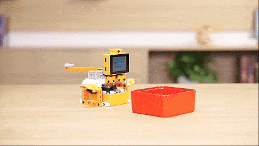

### 3.11.2 Learning Objectives

1. Master the WonderLLM voice trigger feature to implement single-command voice-activated mechanical actions.
2. Understand the control principles of instantaneous torque output for the 270° block servo, completing an engaging voice-controlled launch project.

### 3.11.3 Assembly Guide

 <iframe
    src="../_static/pdf/11_Smart_Catapult.pdf#view=FitH"
    title="Assembly Guide PDF"
    width="100%"
    height="850"
    style="border: 1px solid #ddd;"
    loading="lazy">
 </iframe>

### 3.11.4 Mode Switching

This build requires the online large model. Skip this step and proceed directly to the wiring guide if the online large model mode is already active. Otherwise, refer to the [4.5.1 Firmware Update](https://wiki.hiwonder.com/projects/DaDablock-AI/en/standard-kit/docs/4_Software_and_Hardware_Guide.html#id21) section in Chapter 4 to re-flash the corresponding firmware.

### 3.11.5 Wiring Guide

Plug the WonderLLM module cable into port 1 of the ESP32 controller.

Insert the 270° block servo cable into port S1 of the ESP32 controller, and insert the orange wire of the servo into the white pin of  S1.

The connections are shown in the diagram:

> [!NOTE]
>
> **For the initial setup of the 270° block servo, first remove the gear along with the attached building blocks, and upload the following servo reset program to the ESP32 controller. Next, reattach the removed components, upload the program for this lesson to the ESP32 controller, and wait for the 270° block servo to rotate to the initial position of 135°. At this point, the launch arm is in a horizontal, pre-launch position. This step can be skipped if the servo reset program has been executed previously.**

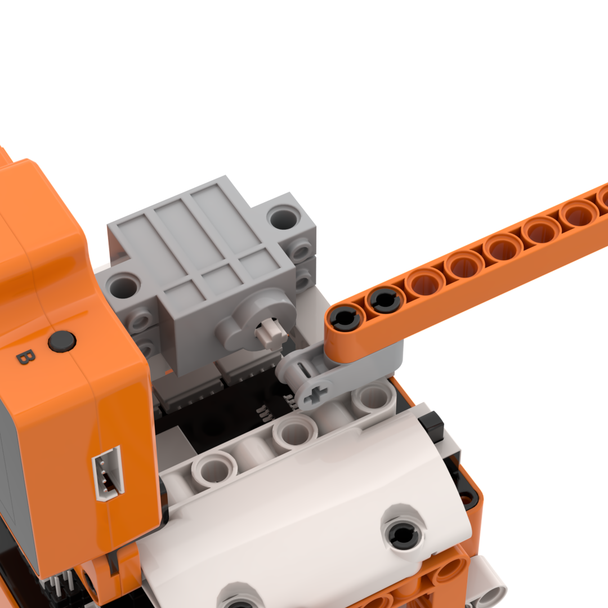

### 3.11.6 Programming

#### (1) Program Concept Diagram

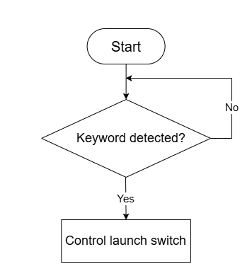

#### (2) Add Extension Libraries

Select **Sensor** in the **Choose an Extension** interface to add **WonderLLM**.

#### (3) Core Blocks Analysis

|                        Command Block                         |                           Category                           |                     Function Description                     |
| :----------------------------------------------------------: | :----------------------------------------------------------: | :----------------------------------------------------------: |
|  |  |   Send custom text messages to the WonderLLM large model.    |
|  |  | Configure mcp tool invocation parameters, customize the tool name, description, execution commands, and return parameters, and set invocation blocking and data return rules. |
|  |  | Turn the mcp switch on or off to control whether WonderLLM enables custom tool invocation capabilities. |
|  |  | Read the result data returned after the execution of the mcp tool is completed. |
|  |  | Control the dialogue message output mode, with capabilities to send an action end flag and enable or disable dialogue content print output. |
|  |  | Control the 270° servo on the specified port to rotate smoothly to the target angle within a set duration, automatically delaying to wait for the servo to complete the action. |
|  |  | Perform boolean logic judgment, determining whether the input condition is true or false, or performing negation operations. |
|  |  | Manually enter or invoke text content to generate string data that can participate in splicing, judgment, and display. |
|  |  | Judge whether a specified element exists within an array, tuple, or dictionary, returning a boolean result. |
|  |  | Extract the corresponding stored value or text content from a dictionary according to the specified key name. |

#### MCP Parameter Configuration

**Tool Name: `self.robot.setThrow`**

1. Tool Description: Control the ejection of the Smart Catapult. Main parameters: projectile switch: 1 for projectile, 0 for non projectile.

2. Command Name: `setThrow`

3. Return Parameters: `[["switch","int","0","0","1"]]` **Note that the first 0 is the default value, the second 0 is the minimum value, and 1 is the maximum value**.

4. Block until call complete: Yes

5. Return data: No

6. Function: This MCP configuration defines an ejection control tool for the WonderLLM module, allowing WonderLLM to issue 0 or 1 switch commands to control the Smart Catapult to launch or not launch. During the call, the program blocks and waits for the launching action to complete fully, without needing to return running data back to WonderLLM.

#### (4) Complete Program

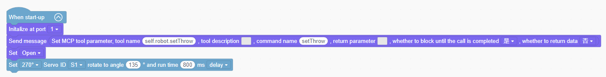

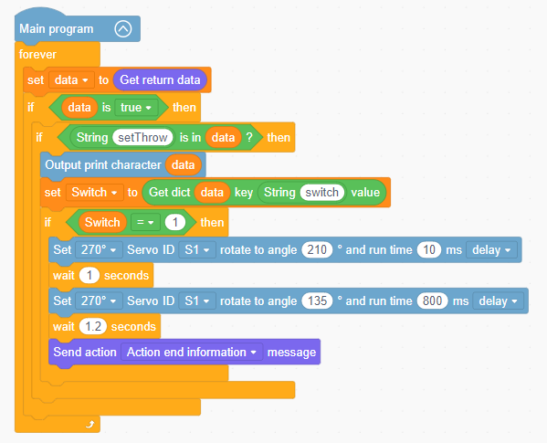

The source files are available for download as a zip archive under [1. Source Code / 02 Program Files for Builds](https://drive.google.com/drive/folders/1guTJsuFCa0f3ZVMcZNNWJ6NruvY7gsUd?usp=sharing).

### 3.11.7 Downloading Programs

### 3.11.8 Project Extensions

The buzzer plays a celebration sound effect after five successful launches.

### 3.11.9 Technical Support and Discussion

Join the forum for sharing questions, ideas, or suggestions, and answers will be provided promptly. Click the hyperlink [Hiwonder Forum](http://forum.hiwonder.com) or enter the URL in a browser: http://forum.hiwonder.com

## 3.12 Smart Swing

### 3.12.1 Introduction

This miniature swing features voice-controlled swinging capabilities. Issuing voice commands controls the servo to drive the suspended seat in a back-and-forth swinging motion, creating a playful miniature playground experience right indoors.

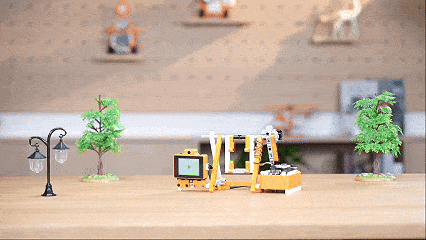

### 3.12.2 Learning Objectives

1. Use WonderLLM voice interaction function to implement smart swing start-stop control.
2. Learn to program the ESP32 controller to regulate the swing rhythm of the 270° block servo, reproducing the outdoor swing movement.

### 3.12.3 Assembly Guide

 <iframe
    src="../_static/pdf/12_Smart_Swing.pdf#view=FitH"
    title="Assembly Guide PDF"
    width="100%"
    height="850"
    style="border: 1px solid #ddd;"
    loading="lazy">
 </iframe>

### 3.12.4 Mode Switching

This build requires the **offline voice interaction function**. Skip this step and proceed directly to the wiring guide if the offline voice interaction mode is already active. Otherwise, refer to the [4.5.1 Firmware Update](https://wiki.hiwonder.com/projects/DaDablock-AI/en/standard-kit/docs/4_Software_and_Hardware_Guide.html#id21) section in Chapter 4 to re-flash the corresponding firmware.

### 3.12.5 Wiring Guide

Plug the WonderLLM module cable into port 1 of the ESP32 controller.

Insert the 270° block servo cable into port S1 of the ESP32 controller, and insert the orange wire of the servo into the white pin of  S1.

The connections are shown in the diagram:

> [!NOTE]
>
> **For the initial setup of the 270° block servo, first remove the gear along with the attached building blocks, and upload the following servo reset program to the ESP32 controller. Next, reattach the removed components, upload the program for this lesson to the ESP32 controller, and wait for the 270° block servo to rotate to the initial position of 135°. At this point, the swing is in a centered position. This step can be skipped if the servo reset program has been executed previously.**

### 3.12.6 Programming

#### (1) Program Concept Diagram

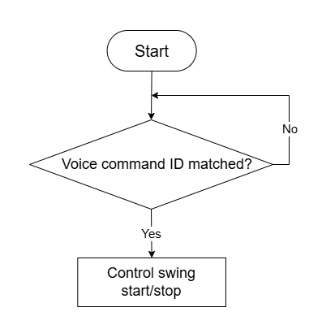

#### (2) Add Extension Libraries

Select **Sensor** in the **Choose an Extension** interface to add **WonderLLM-offline**.

#### (3) Core Blocks Analysis

|                        Command Block                         |                           Category                           |                     Function Description                     |
| :----------------------------------------------------------: | :----------------------------------------------------------: | :----------------------------------------------------------: |
|  |  | Switch the working recognition mode of the WonderLLM module, with options for voice interaction, color recognition, and face recognition. |
|  |  | Read the voice text content recognized by the module in voice interaction mode for subsequent decision-making and interaction logic. |
|  |  | Control the 270° servo on the specified port to rotate smoothly to the target angle within a set duration, automatically delaying to wait for the servo to complete the action. |

#### (4) Complete Program

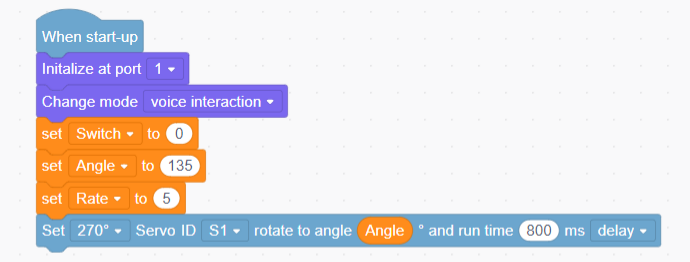

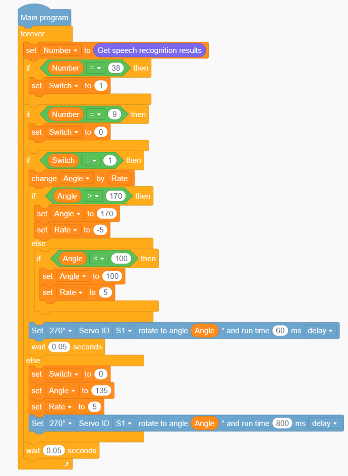

The source files are available for download as a zip archive under [1. Source Code / 02 Program Files for Builds](https://drive.google.com/drive/folders/1guTJsuFCa0f3ZVMcZNNWJ6NruvY7gsUd?usp=sharing).

### 3.12.7 Downloading Programs

### 3.12.8 Project Extensions

Initiate the swinging motion while simultaneously transitioning the RGB LED into a breathing mode.

### 3.12.9 Technical Support and Discussion

Join the forum for sharing questions, ideas, or suggestions, and answers will be provided promptly. Click the hyperlink [Hiwonder Forum](http://forum.hiwonder.com) or enter the URL in a browser: http://forum.hiwonder.com

## 3.13 Rhythm Drummer

### 3.13.1 Introduction

This robotic drummer features voice-controlled rhythm capabilities. Issuing voice commands controls the starting and stopping of the drumming action, automatically striking the drum pad alongside random background music and allowing users to effortlessly switch the playing tempo.

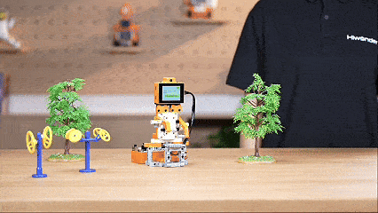

### 3.13.2 Learning Objectives

1. Master the control method of coordinating WonderLLM voice commands with the 360° block motor actions, understanding the corresponding logic between tempo control and mechanical movements.
2. Learn to output precise 360° block motor control signals via the ESP32 controller to simulate drumming actions and control music playback synchronously.

### 3.13.3 Assembly Guide

 <iframe
    src="../_static/pdf/13_Rhythm_Drummer.pdf#view=FitH"
    title="Assembly Guide PDF"
    width="100%"
    height="850"
    style="border: 1px solid #ddd;"
    loading="lazy">
 </iframe>

### 3.13.4 Mode Switching

This build requires the **online large model**. Skip this step and proceed directly to the wiring guide if the online large model mode is already active. Otherwise, refer to the [4.5.1 Firmware Update](https://wiki.hiwonder.com/projects/DaDablock-AI/en/standard-kit/docs/4_Software_and_Hardware_Guide.html#id21) section in Chapter 4 to re-flash the corresponding firmware.

### 3.13.5 Wiring Guide

Plug the WonderLLM module cable into port 1 of the ESP32 controller.

Insert the 360° block motor cable into port S1 of the ESP32 controller, and insert the orange wire of the motor into the white pin of  S1.

The connections are shown in the diagram:

### 3.13.6 Programming

#### (1) Program Concept Diagram

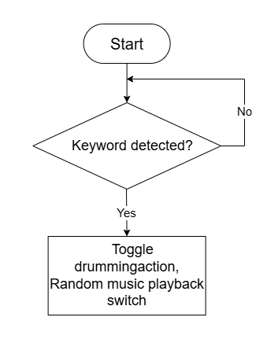

#### (2) Add Extension Libraries

Select **Sensor** in the **Choose an Extension** interface to add **WonderLLM**.

#### (3) Core Blocks Analysis

|                        Command Block                         |                           Category                           |                     Function Description                     |
| :----------------------------------------------------------: | :----------------------------------------------------------: | :----------------------------------------------------------: |
|  |  |   Send custom text messages to the WonderLLM large model.    |
|  |  | Configure mcp tool invocation parameters, customize the tool name, description, execution commands, and return parameters, and set invocation blocking and data return rules. |
|  |  | Turn the mcp switch on or off to control whether WonderLLM enables custom tool invocation capabilities. |
|  |  | Read the result data returned after the execution of the mcp tool is completed. |
|  |  | Control the dialogue message output mode, with capabilities to send an action end flag and enable or disable dialogue content print output. |
|  |  | Control the 360° block motor on the specified port to continue rotating at the set custom speed. |
|  |  | Perform boolean logic judgment, determining whether the input condition is true or false, or performing negation operations. |
|  |  | Manually enter or invoke text content to generate string data that can participate in splicing, judgment, and display. |
|  |  | Judge whether a specified element exists within an array, tuple, or dictionary, returning a boolean result. |
|  |  | Extract the corresponding stored value or text content from a dictionary according to the specified key name. |

#### MCP Parameter Configuration

**Tool Name: `self.robot.setMusic`**

1. Tool Description: You can control the start and stop of the drumming. The parameters are as follows: 1 is returned when starting the drumming, and 0 is returned when stopping.

2. Command Name: `setMusic`

3. Return Parameters: `[["music","int","0","0","1"]]` **Note that the first 0 is the default value, the second 0 is the minimum value, and 1 is the maximum value**.

4. Block until call complete: Yes

5. Return data: No

6. Function: This MCP configuration defines a drumming control tool for the WonderLLM module, allowing WonderLLM to issue 0 or 1 switch commands to control starting or stopping the drumming. During the call, the program blocks and waits for the drumming action to complete fully, without needing to return running data back to WonderLLM.

#### (4) Complete Program

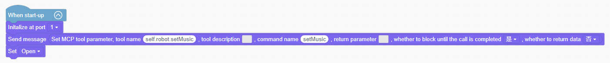

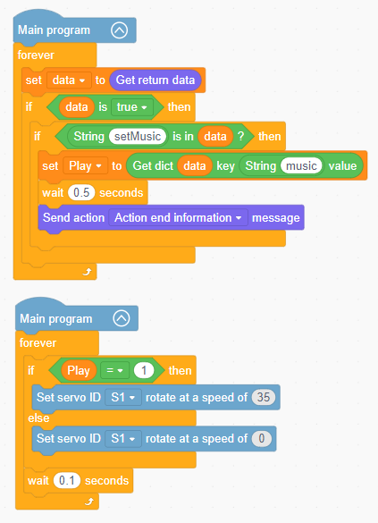

The source files are available for download as a zip archive under [1. Source Code / 02 Program Files for Builds](https://drive.google.com/drive/folders/1guTJsuFCa0f3ZVMcZNNWJ6NruvY7gsUd?usp=sharing).

### 3.13.7 Downloading Programs

### 3.13.8 Project Extensions

Configure the robotic drummer with three tempo settings: low-speed, medium-speed, and high-speed. Issuing the corresponding voice command at any time initiates the drumming action at the specified tempo.

### 3.13.9 Technical Support and Discussion

Join the forum for sharing questions, ideas, or suggestions, and answers will be provided promptly. Click the hyperlink [Hiwonder Forum](http://forum.hiwonder.com) or enter the URL in a browser: http://forum.hiwonder.com

## 3.14 Sawing Bot

### 3.14.1 Introduction

This sawing bot features voice-controlled interactive capabilities. Issuing voice commands controls the servo to pull the cord, driving the figure in an up-and-down motion and effortlessly initiating an engaging interactive experience with just a simple command.

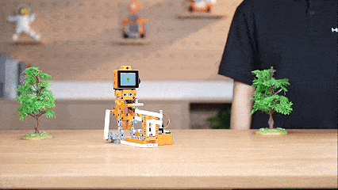

### 3.14.2 Learning Objectives

1. Use WonderLLM voice functions to achieve voice control of labor models.
2. Master how to program the 270° block servo to execute back-and-forth pushing and pulling movements, simulating manual sawing labor.

### 3.14.3 Assembly Guide

 <iframe
    src="../_static/pdf/14_Sawing_Bot.pdf#view=FitH"
    title="Assembly Guide PDF"
    width="100%"
    height="850"
    style="border: 1px solid #ddd;"
    loading="lazy">
 </iframe>

### 3.14.4 Mode Switching

This build requires the **offline voice interaction function**. Skip this step and proceed directly to the wiring guide if the offline voice interaction mode is already active. Otherwise, refer to the [4.5.1 Firmware Update](https://wiki.hiwonder.com/projects/DaDablock-AI/en/standard-kit/docs/4_Software_and_Hardware_Guide.html#id21) section in Chapter 4 to re-flash the corresponding firmware.

### 3.14.5 Wiring Guide

Plug the WonderLLM module cable into port 1 of the ESP32 controller.

Insert the 270° block servo cable into port S1 of the ESP32 controller, and insert the orange wire of the servo into the white pin of  S1.

The connections are shown in the diagram:

**For the initial setup of the 270° block servo, first remove the gear along with the attached building blocks, and upload the following servo reset program to the ESP32 controller. Next, reattach the removed components, upload the program for this lesson to the ESP32 controller, and wait for the 270° block servo to rotate to the initial position of 135°. This step can be skipped if the servo reset program has been executed previously.**

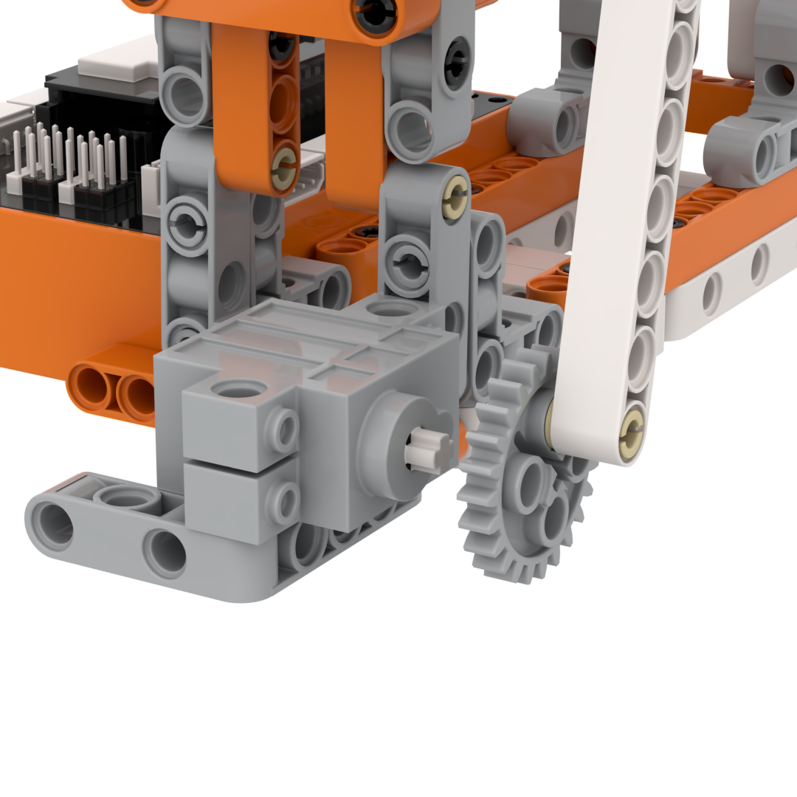

### 3.14.6 Programming

#### (1) Program Concept Diagram

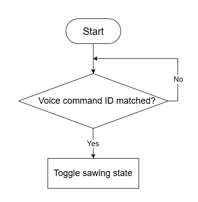

#### (2) Add Extension Libraries

Select **Sensor** in the **Choose an Extension** interface to add **WonderLLM-offline**.

#### (3) Core Blocks Analysis

|                        Command Block                         |                           Category                           |                     Function Description                     |
| :----------------------------------------------------------: | :----------------------------------------------------------: | :----------------------------------------------------------: |
|  |  | Switch the working recognition mode of the WonderLLM module, with options for voice interaction, color recognition, and face recognition. |
|  |  | Read the voice text content recognized by the module in voice interaction mode for subsequent decision-making and interaction logic. |
|  |  | Control the 270° servo on the specified port to rotate smoothly to the target angle within a set duration, automatically delaying to wait for the servo to complete the action. |

#### (4) Complete Program

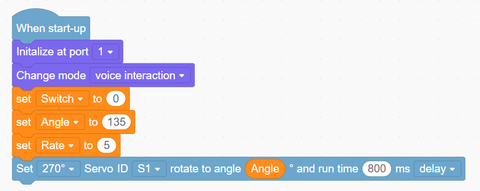

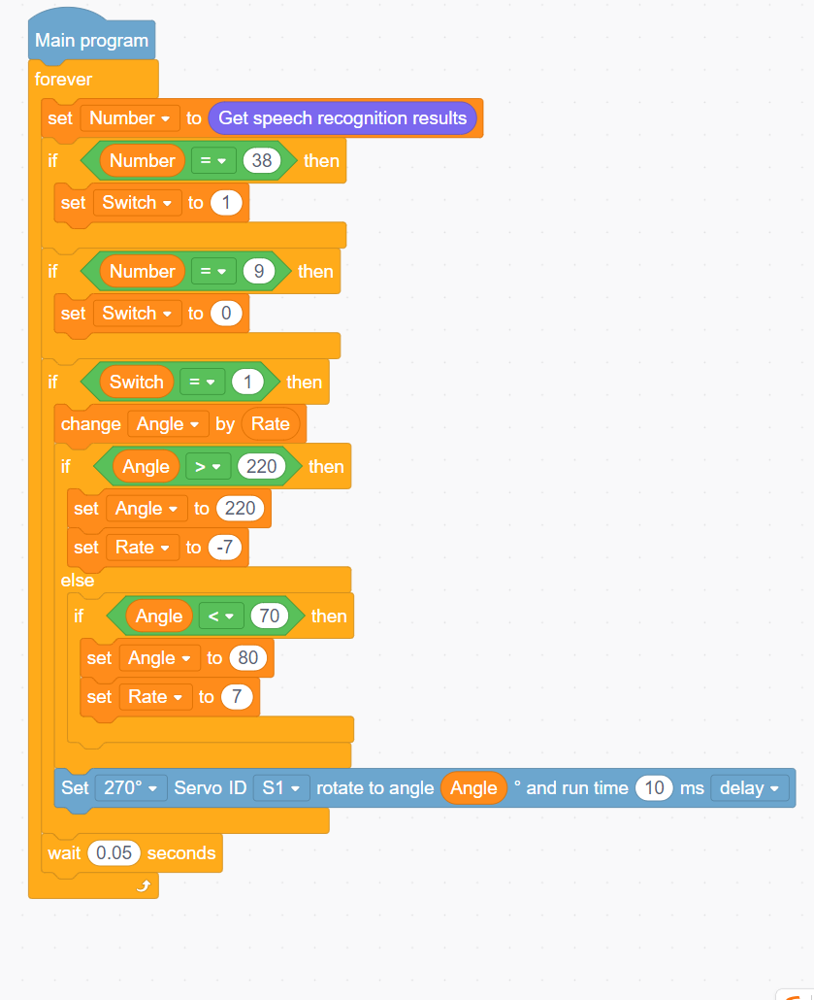

The source files are available for download as a zip archive under [1. Source Code / 02 Program Files for Builds](https://drive.google.com/drive/folders/1guTJsuFCa0f3ZVMcZNNWJ6NruvY7gsUd?usp=sharing).

### 3.14.7 Downloading Programs

### 3.14.8 Project Extensions

Issuing the voice command "Rotate Servo" initiates the bot's sawing motion. Simultaneously, the buzzer plays a specific pitch to simulate the sound of sawing wood.

### 3.14.9 Technical Support and Discussion

Join the forum for sharing questions, ideas, or suggestions, and answers will be provided promptly. Click the hyperlink [Hiwonder Forum](http://forum.hiwonder.com) or enter the URL in a browser: http://forum.hiwonder.com

## 3.15 Smart Exercise Bike

### 3.15.1 Introduction

This exercise bike features voice-controlled start capabilities. Issuing voice commands controls the servo to drive the wheels in a continuous rotational motion, effectively simulating a dynamic workout experience.

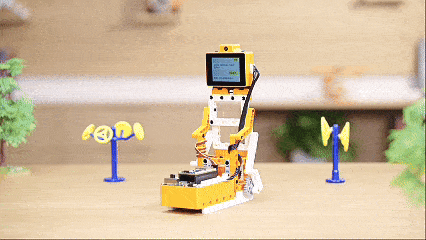

### 3.15.2 Learning Objectives

1. Implement multi-gear speed adjustment control of the 360° block motor with WonderLLM multi-semantic voice recognition.
2. Learn to regulate the speed of the 360° block motor via the ESP32 controller, achieving free switching between running mode and stationary mode.

### 3.15.3 Assembly Guide

 <iframe
    src="../_static/pdf/15_Smart_Exercise_Bike.pdf#view=FitH"
    title="Assembly Guide PDF"
    width="100%"
    height="850"
    style="border: 1px solid #ddd;"
    loading="lazy">
 </iframe>

### 3.15.4 Mode Switching

This build requires the online large model. Skip this step and proceed directly to the wiring guide if the online large model mode is already active. Otherwise, refer to the [4.5.1 Firmware Update](https://wiki.hiwonder.com/projects/DaDablock-AI/en/standard-kit/docs/4_Software_and_Hardware_Guide.html#id21) section in Chapter 4 to re-flash the corresponding firmware.

### 3.15.5 Wiring Guide

Plug the WonderLLM module cable into port 1 of the ESP32 controller.

Insert the 360° block motor cable into port S1 of the ESP32 controller, and insert the orange wire of the motor into the white pin of  S1.

The connections are shown in the diagram:

### 3.15.6 Programming

#### (1) Program Concept Diagram

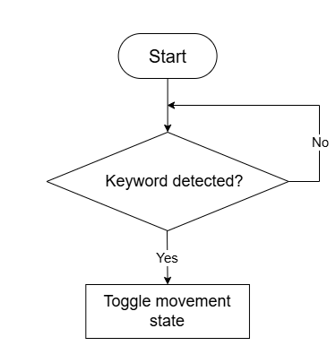

#### (2) Add Extension Libraries

Select **Sensor** in the **Choose an Extension** interface to add **WonderLLM**.

#### (3) Core Blocks Analysis

|                        Command Block                         |                           Category                           |                     Function Description                     |
| :----------------------------------------------------------: | :----------------------------------------------------------: | :----------------------------------------------------------: |
|  |  |   Send custom text messages to the WonderLLM large model.    |
|  |  | Configure mcp tool invocation parameters, customize the tool name, description, execution commands, and return parameters, and set invocation blocking and data return rules. |
|  |  | Turn the mcp switch on or off to control whether WonderLLM enables custom tool invocation capabilities. |
|  |  | Read the result data returned after the execution of the mcp tool is completed. |
|  |  | Control the dialogue message output mode, with capabilities to send an action end flag and enable or disable dialogue content print output. |
|  |  | Control the 360° block motor on the specified port to continue rotating at the set custom speed. |
|  |  | Perform boolean logic judgment, determining whether the input condition is true or false, or performing negation operations. |
|  |  | Manually enter or invoke text content to generate string data that can participate in splicing, judgment, and display. |
|  |  | Judge whether a specified element exists within an array, tuple, or dictionary, returning a boolean result. |
|  |  | Extract the corresponding stored value or text content from a dictionary according to the specified key name. |

#### MCP Parameter Configuration

**Tool Name: `self.robot.setRun`**

1. Tool Description: You are a smart Exercise Bike that can start the fitness mode through voice control. Parameter description: Gear range: 0 to 1, returns 0 when stopped, returns 1 when running.

2. Command Name: `setRun`

3. Return Parameters: `[["run","int","0","0","1"]]` **Note that the first 0 is the default value, the second 0 is the minimum value, and 1 is the maximum value**.

4. Block until call complete: Yes

5. Return data: No

6. Function: This MCP configuration defines a running control tool for the WonderLLM module, allowing WonderLLM to issue 0 or 1 gear commands to control the starting or stopping of the Smart Exercise Bike fitness mode. During the call, the program blocks and waits for the bike running action to complete, without needing to return running data back to WonderLLM.

#### (4) Complete Program

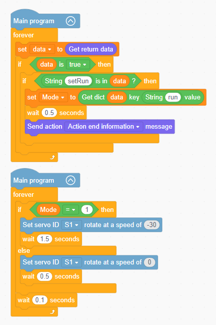

The source files are available for download as a zip archive under [1. Source Code / 02 Program Files for Builds](https://drive.google.com/drive/folders/1guTJsuFCa0f3ZVMcZNNWJ6NruvY7gsUd?usp=sharing).

### 3.15.7 Downloading Programs

### 3.15.8 Project Extensions

Customize the riding duration using voice commands. Once the specified time elapses, the riding motion automatically stops.

### 3.15.9 Technical Support and Discussion

Join the forum for sharing questions, ideas, or suggestions, and answers will be provided promptly. Click the hyperlink [Hiwonder Forum](http://forum.hiwonder.com) or enter the URL in a browser: http://forum.hiwonder.com

## 3.16 Face-Changing Bot

### 3.16.1 Introduction

This expression-changing device features voice-controlled expression-switching capabilities. Issuing voice commands controls the dot matrix display to switch between four distinct facial expressions—speechless, happy, sad, and eager—effectively conveying a diverse range of emotions.

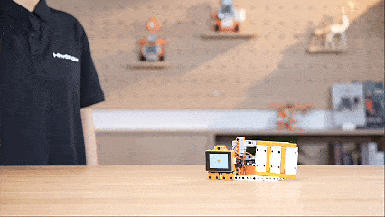

### 3.16.2 Learning Objectives

1. Master the voice screen control function of WonderLLM to implement voice commands to switch dot matrix expression patterns.
2. Learn to retrieve built-in pattern resources via the ESP32 to complete the fun human-robot interaction project.

### 3.16.3 Assembly Guide

 <iframe
    src="../_static/pdf/16_Face-Changing_Bot.pdf#view=FitH"
    title="Assembly Guide PDF"
    width="100%"
    height="850"
    style="border: 1px solid #ddd;"
    loading="lazy">
 </iframe>

### 3.16.4 Mode Switching

This build requires the **offline voice interaction function**. Skip this step and proceed directly to the wiring guide if the offline voice interaction mode is already active. Otherwise, refer to the [4.5.1 Firmware Update](https://wiki.hiwonder.com/projects/DaDablock-AI/en/standard-kit/docs/4_Software_and_Hardware_Guide.html#id21) section in Chapter 4 to re-flash the corresponding firmware.

### 3.16.5 Wiring Guide

Insert the dot matrix module cable into port 5 of the ESP32 controller.

Plug the WonderLLM module cable into port 1 of the ESP32 controller.

Insert the 270° block servo cable into port S1 of the ESP32 controller, and insert the orange wire of the servo into the white pin of  S1.

The connections are shown in the diagram:

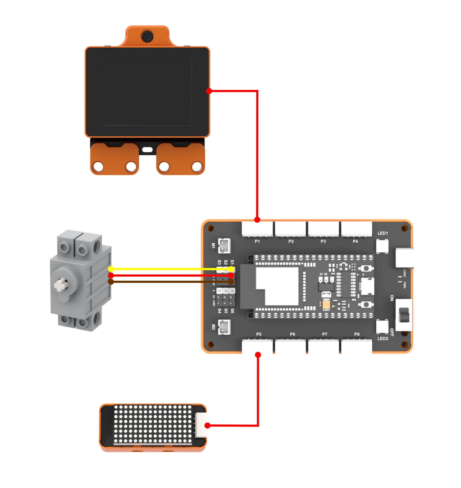

> [!NOTE]
>
> **For the initial setup of the 270° block servo, first remove the gear along with the attached building blocks, and upload the following servo reset program to the ESP32 controller. Next, reattach the removed components, upload the program for this lesson to the ESP32 controller, and wait for the 270° block servo to rotate to the initial position of 135°. At this point, the mask is in a lowered position. This step can be skipped if the servo reset program has been executed previously.**

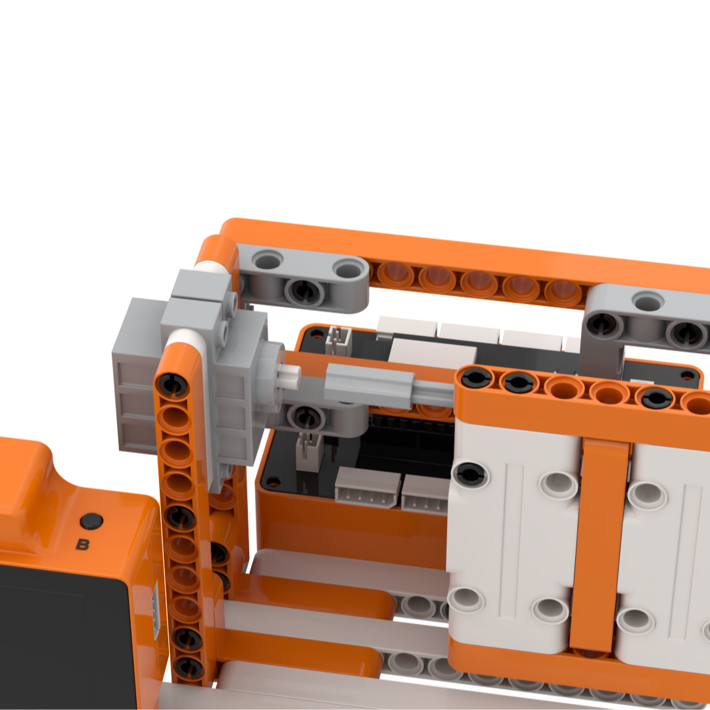

### 3.16.6 Programming

#### (1) Program Concept Diagram

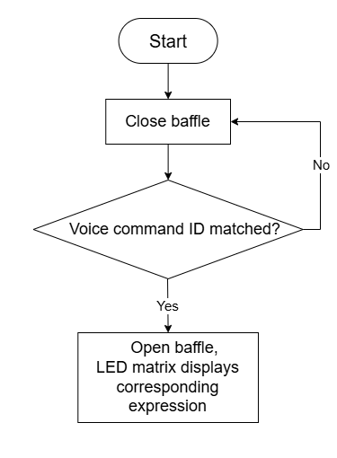

#### (2) Add Extension Libraries

- Select **Sensor** in the **Choose an Extension** interface to add **WonderLLM-offline**.

- Select **Output module** in the **Choose an Extension** interface to add **Dot matrix module**.

#### (3) Core Blocks Analysis

|                        Command Block                         |                           Category                           |                     Function Description                     |
| :----------------------------------------------------------: | :----------------------------------------------------------: | :----------------------------------------------------------: |
|  |  | Switch the working recognition mode of the WonderLLM module, with options for voice interaction, color recognition, and face recognition. |
|  |  | Read the voice text content recognized by the module in voice interaction mode for subsequent decision-making and interaction logic. |
|  |  | Control the dot matrix screen to load and display preset patterns, enabling custom switching of various graphics and symbol screens. |
|  |  | Control the 270° servo on the specified port to rotate smoothly to the target angle within a set duration, automatically delaying to wait for the servo to complete the action. |

#### (4) Complete Program

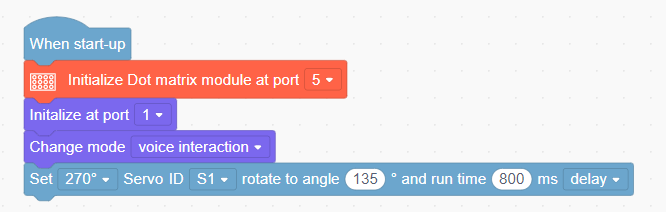

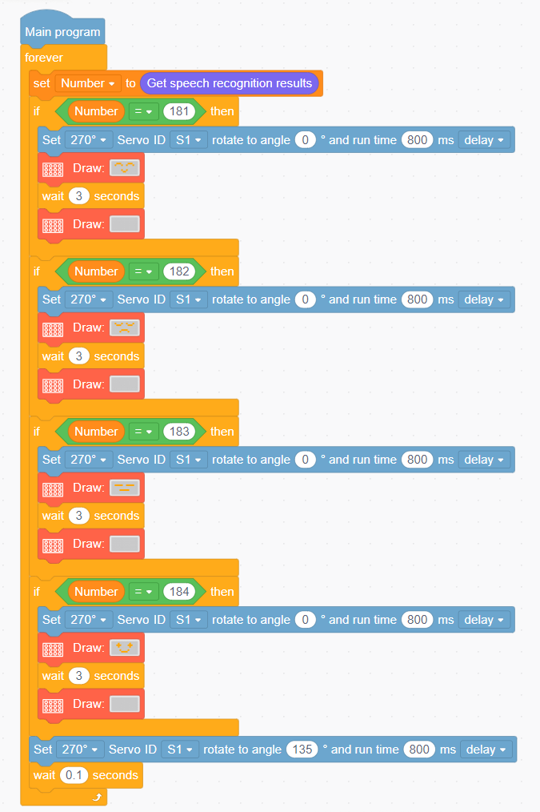

The source files are available for download as a zip archive under [1. Source Code / 02 Program Files for Builds](https://drive.google.com/drive/folders/1guTJsuFCa0f3ZVMcZNNWJ6NruvY7gsUd?usp=sharing).

### 3.16.7 Downloading Programs

### 3.16.8 Project Extensions

Speaking keywords such as "happy" or "sad" triggers the dot matrix display to switch to the corresponding expression in real-time. Simultaneously, the buzzer plays distinct pitches corresponding to the emotion conveyed by the expression.

### 3.16.9 Technical Support and Discussion

Join the forum for sharing questions, ideas, or suggestions, and answers will be provided promptly. Click the hyperlink [Hiwonder Forum](http://forum.hiwonder.com) or enter the URL in a browser: http://forum.hiwonder.com

## 3.17 Tracking Fan

### 3.17.1 Introduction

This tracking fan features human-following capabilities to deliver a cooling breeze. Upon detecting a face, the fan automatically sweeps back and forth. The sweeping action stops immediately when the individual departs, ensuring the airflow dynamically tracks the individual.

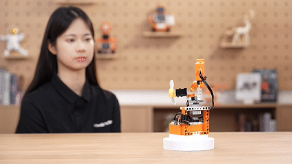

### 3.17.2 Learning Objectives

1. Develop proficiency in using WonderLLM facial detection and tracking features to implement coordinated start, stop, and sweeping control.
2. Learn to integrate the ESP32 controller with a 270° block servo and a fan module to design a face-tracking smart cooling system.

### 3.17.3 Assembly Guide

 <iframe
    src="../_static/pdf/17_Tracking_Fan.pdf#view=FitH"
    title="Assembly Guide PDF"
    width="100%"
    height="850"
    style="border: 1px solid #ddd;"
    loading="lazy">
 </iframe>

### 3.17.4 Mode Switching

This build requires the **offline vision function**. If the offline vision function mode has already been entered, skip this step and proceed directly to the wiring guide. Otherwise, refer to [4.5.1 Firmware Update](https://wiki.hiwonder.com/projects/DaDablock-AI/en/standard-kit/docs/4_Software_and_Hardware_Guide.html#id21) to flash the corresponding firmware.

### 3.17.5 Wiring Guide

Connect the fan module cable to port 5 of the ESP32 controller.

Connect the WonderLLM module cable to port 1 of the ESP32 controller.

Connect the 270° block servo cable to port S1 of the ESP32 controller and ensure the orange wire of the servo aligns with the white pin of S1.

The wiring configuration is shown below:

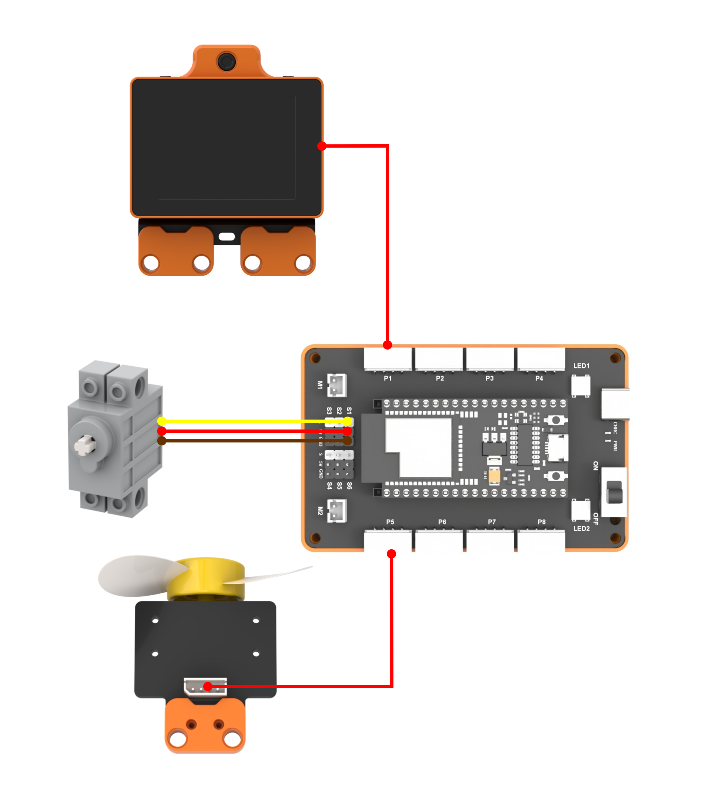

> [!NOTE]
>
> **When using the 270° block servo for the first time, remove the gear and its attached building blocks from the 270° block servo first. Upload the following 270° block servo reset program to the ESP32 controller. Reassemble the building blocks afterwards and upload the program of this lesson to the ESP32 controller. Wait for the 270° block servo to rotate to the initial position of 135°. At this point, the fan and the WonderLLM module should face straight ahead. This step can be skipped if the servo reset program has been executed previously.**

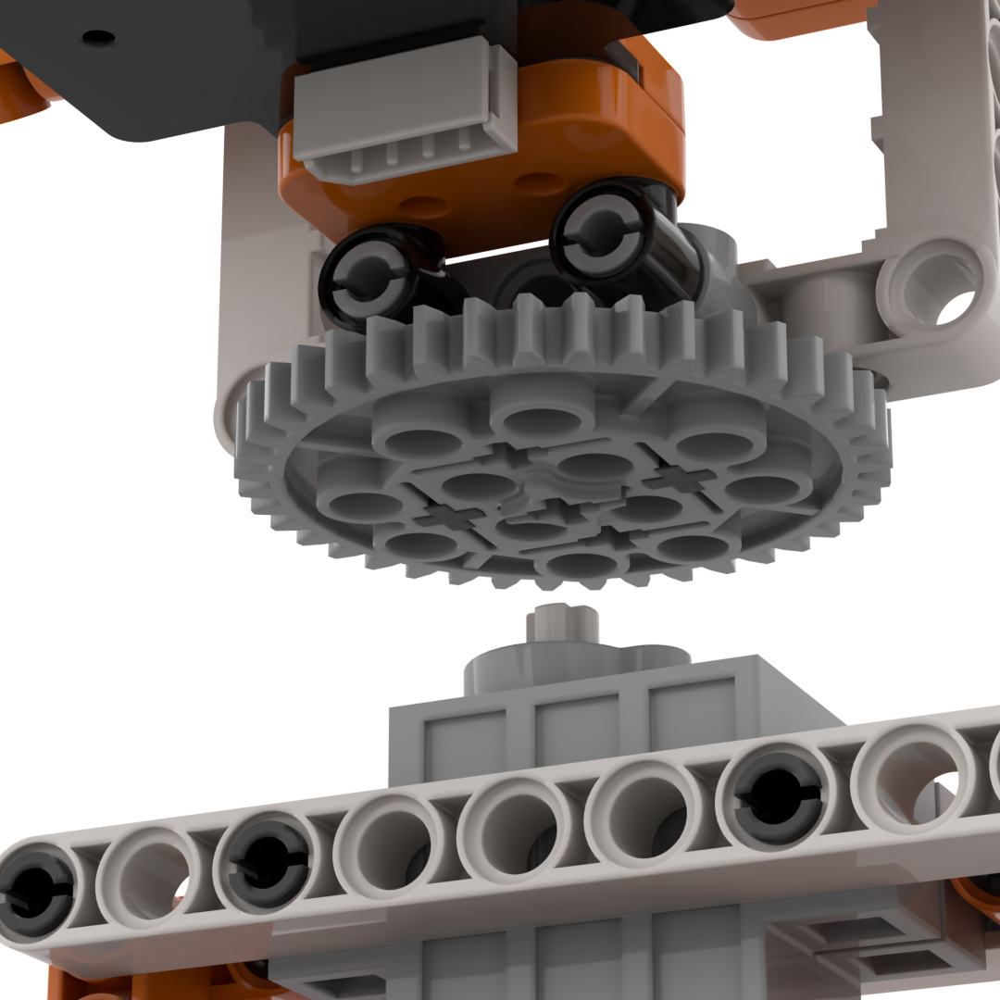

### 3.17.6 Programming

#### (1) Program Concept Diagram

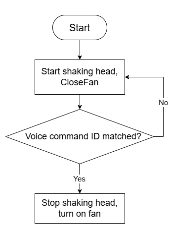

#### (2) Add Extension Libraries

- Select **Sensor** in the **Choose an Extension** interface to add **WonderLLM-offline**.

- Select **Output module** in the **Choose an Extension** interface to add **Fan module (black)**.

#### (3) Core Blocks Analysis

| Block | Category | Function Description |
| :---: | :---: | :--- |
|  |  | Switch the working identification mode of the WonderLLM module. Three working modes are available: voice interaction, color recognition, and face recognition. |
|  |  | Under face recognition mode, detect if there is a face on the screen. A boolean value is returned for face presence judgment logic. |
| 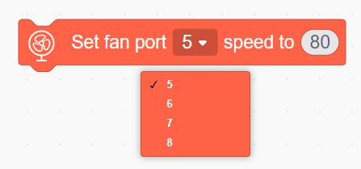 |  | Control the specified fan port. Set the speed value within the range of 0 to 100 to adjust the fan speed. |
|  |  | Control the 270° block servo on the specified port to rotate smoothly to the target angle within a set duration. The program automatically delays and waits for the servo to complete the action. |

#### (4) Complete Program

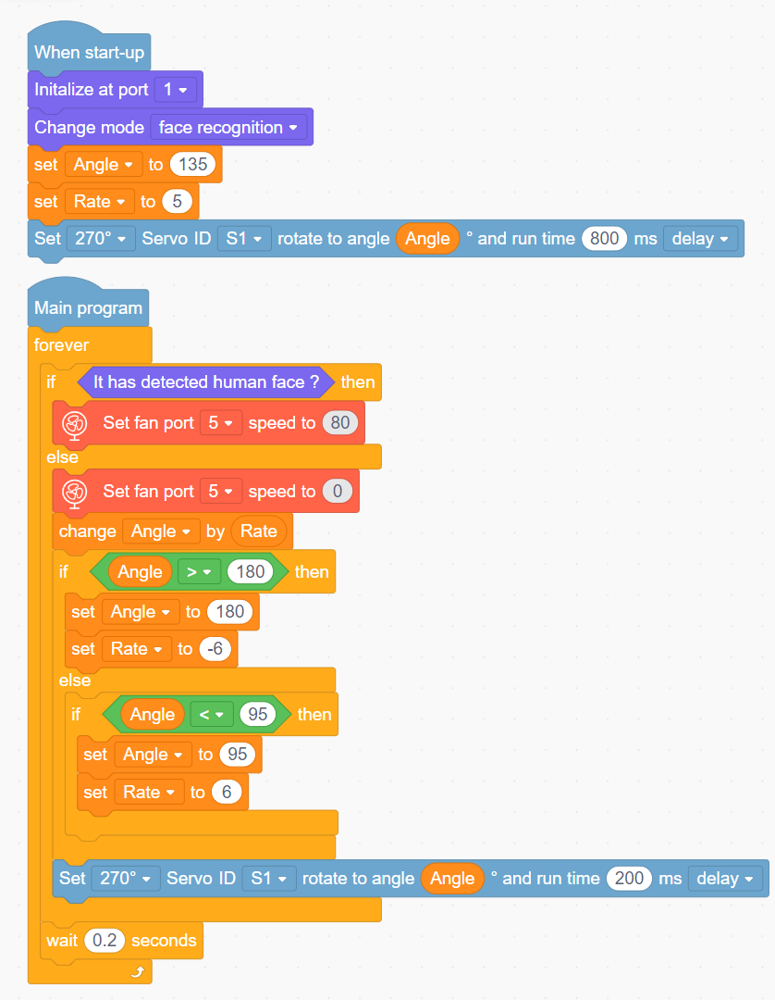

The source files are available for download as a zip archive under [1. Source Code / 02 Program Files for Builds](https://drive.google.com/drive/folders/1guTJsuFCa0f3ZVMcZNNWJ6NruvY7gsUd?usp=sharing).

### 3.17.7 Downloading the Program

### 3.17.8 Project Extensions

In the absence of a detected face, the fan sweeps back and forth at low speed. Once a face enters the near-distance detection zone, the sweeping motion stops and the fan switches to high-speed direct airflow.

### 3.17.9 Technical Support and Discussion

Join the forum for sharing questions, ideas, or suggestions, and answers will be provided promptly. Click the hyperlink [Hiwonder Forum](http://forum.hiwonder.com) or enter the URL in a browser: http://forum.hiwonder.com

## 3.18 Bubble Maker

### 3.18.1 Introduction

This bubble maker features voice-controlled bubble-blowing capabilities. Spoken commands activate the servo and fan to automatically disperse bubbles, instantly creating a playful atmosphere with a single phrase.

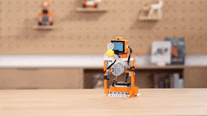

### 3.18.2 Learning Objectives

1. Master utilizing WonderLLM voice control features to regulate the start, stop, and operational modes of the bubble maker.
2. Learn to program the ESP32 controller to drive a 270° block servo and a fan module, completing an engaging voice-controlled bubble-blowing project.

### 3.18.3 Assembly Guide

 <iframe
    src="../_static/pdf/18_Bubble_Maker.pdf#view=FitH"
    title="Assembly Guide PDF"
    width="100%"
    height="850"
    style="border: 1px solid #ddd;"
    loading="lazy">
 </iframe>

### 3.18.4 Mode Switching

This build requires the **online large model**. If the online large model mode has already been entered, skip this step and proceed directly to the wiring guide. Otherwise, refer to [4.4.10 Firmware Update](https://wiki.hiwonder.com/projects/DaDablock-AI/en/standard-kit/docs/4_Software_and_Hardware_Guide.html#firmware-update) to flash the corresponding firmware.

### 3.18.5 Wiring Guide

Connect the fan module cable to port 5 of the ESP32 controller.

Connect the WonderLLM module cable to port 1 of the ESP32 controller.

Connect the 270° block servo cable to port S1 of the ESP32 controller and ensure the orange wire of the servo aligns with the white pin of S1.

The wiring configuration is shown below:

> [!NOTE]
>
> **When using the 270° block servo for the first time, remove the gear and its attached building blocks from the 270° block servo first. Upload the following 270° block servo reset program to the ESP32 controller. Reassemble the building blocks afterwards and upload the program of this lesson to the ESP32 controller. Wait for the 270° block servo to rotate to the initial position of 135°. This step can be skipped if the servo reset program has been executed previously.**

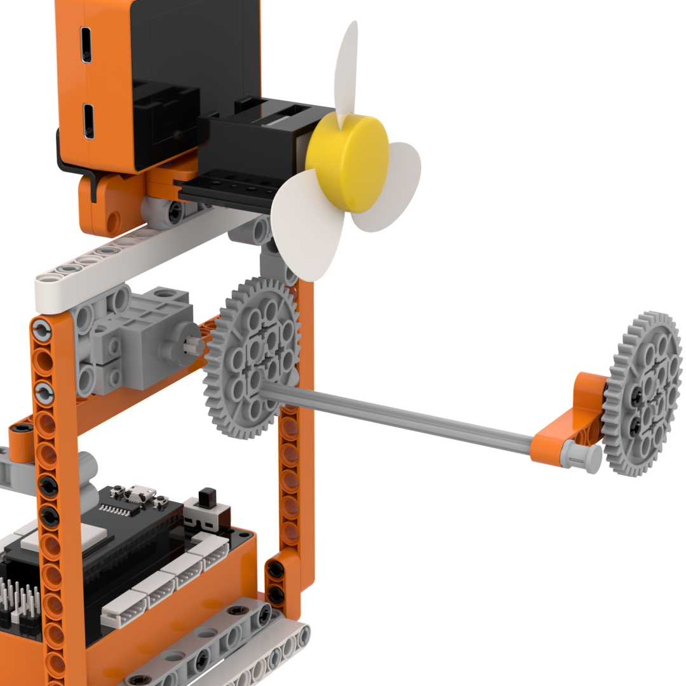

### 3.18.6 Programming

#### (1) Program Concept Diagram

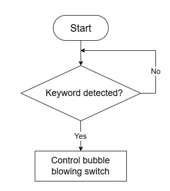

#### (2) Add Extension Libraries

- Select **Sensor** in the **Choose an Extension** interface to add **WonderLLM**.

- Select **Output module** in the **Choose an Extension** interface to add **Fan module (black)**.

#### (3) Core Blocks Analysis

| Block | Category | Function Description |
| :---: | :---: | :--- |
|  |  | Send customized text information to the WonderLLM large model. |
|  |  | Configure MCP tool call parameters, customize the tool name, description, execution instruction, and return parameters, and set tool call blocking and data return rules. |
|  |  | Turn the MCP switch on or off to control whether WonderLLM enables the custom tool calling capability. |
|  |  | Read the returned result data after the MCP tool execution is completed. |
|  |  | Control the dialogue message output mode. This block can send action end identifiers, and turn on or off the dialogue content print output. |
|  |  | Control the specified fan port. Set the speed value within the range of 0 to 100 to adjust the fan speed. |
|  |  | Control the 270° block servo on the specified port to rotate smoothly to the target angle within a set duration. The program automatically delays and waits for the servo to complete the action. |

#### (4) MCP Parameter Configuration

**Tool Name:** `self.robot.setAction`

1. **Tool Description:** You are a machine that makes foam. It blows out bubbles through the fan module. The parameters are as follows: switch: 0 or 1. Return 1 when opening and 0 when closing.
2. **Instruction Name:** `setAction`
3. **Return Parameters:** `[["action","int","0","0","1"]]` **Note that the first 0 is the default value, the second 0 is the minimum value, and 1 is the maximum value.**
4. **Block until call completed:** Yes
5. **Return data:** No
6. **Function:** This MCP configuration defines the bubble machine control tool for the WonderLLM module. It allows WonderLLM to issue 0 to 1 switch commands to control the start and stop of the bubble machine. During the call, the program blocks to wait for the bubble blowing action to complete, and there is no need to send running data back to WonderLLM.

#### (5) Complete Program

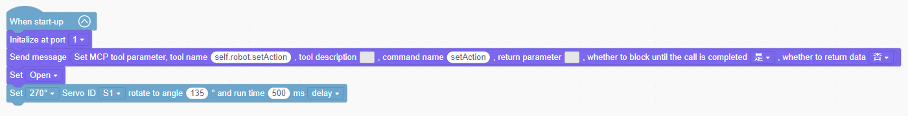

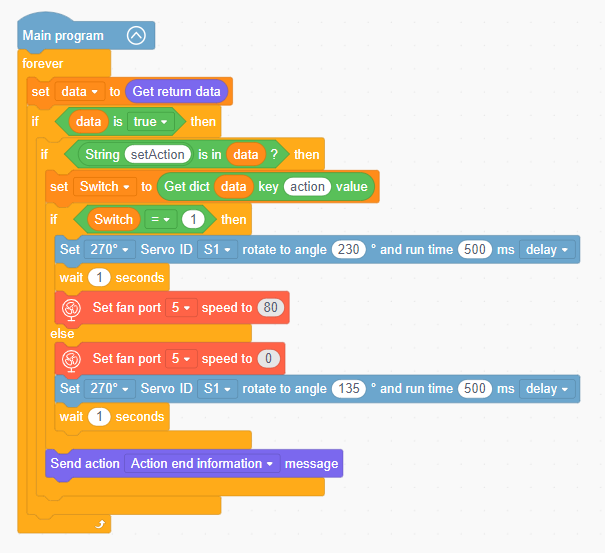

The source files are available for download as a zip archive under [1. Source Code / 02 Program Files for Builds](https://drive.google.com/drive/folders/1guTJsuFCa0f3ZVMcZNNWJ6NruvY7gsUd?usp=sharing).

### 3.18.7 Downloading the Program

### 3.18.8 Project Extensions

Activating the bubble-blowing sequence via voice command triggers the controller's onboard RGB LEDs to enter a running water light pattern. Upon receiving a stop command, the fan and servo cease operation, and the RGB LEDs turn off synchronously.

### 3.18.9 Technical Support and Discussion

Join the forum for sharing questions, ideas, or suggestions, and answers will be provided promptly. Click the hyperlink [Hiwonder Forum](http://forum.hiwonder.com) or enter the URL in a browser: http://forum.hiwonder.com

## 3.19 Smart Cooler

### 3.19.1 Introduction

This smart cooling device features voice-controlled temperature regulation. Spoken commands like "Turn on the fan" lower the fan assembly to start blowing air, while "Turn off the fan" automatically stops and retracts the mechanism, serving as an intuitive cooling assistant.

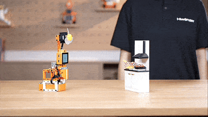

### 3.19.2 Learning Objectives

1. Develop proficiency in using WonderLLM voice interaction features to control the fan's start, stop, and positional angles.
2. Learn to program the ESP32 controller to drive a 270° block servo and a fan module, completing a voice-controlled smart cooling project.

### 3.19.3 Assembly Guide

 <iframe
    src="../_static/pdf/19_Smart_Cooler.pdf#view=FitH"
    title="Assembly Guide PDF"
    width="100%"
    height="850"
    style="border: 1px solid #ddd;"
    loading="lazy">
 </iframe>

### 3.19.4 Mode Switching

This build requires the **offline voice interaction**. If the offline voice interaction mode has already been entered, skip this step and proceed directly to the wiring guide. Otherwise, refer to [4.5.1 Firmware Update](https://wiki.hiwonder.com/projects/DaDablock-AI/en/standard-kit/docs/4_Software_and_Hardware_Guide.html#id21) to flash the corresponding firmware.

### 3.19.5 Wiring Guide

Connect the fan module cable to port 5 of the ESP32 controller.

Connect the WonderLLM module cable to port 1 of the ESP32 controller.

Connect the 270° block servo cable to port S1 of the ESP32 controller and ensure the orange wire of the servo aligns with the white pin of S1.

The wiring configuration is shown below:

> [!NOTE]
>
> **When using the 270° block servo for the first time, remove the gear and its attached building blocks from the 270° block servo first. Upload the following 270° block servo reset program to the ESP32 controller. Reassemble the building blocks afterwards and upload the program of this lesson to the ESP32 controller. Wait for the 270° block servo to rotate to the initial position of 130 degrees. This step can be skipped if the servo reset program has been executed previously.**

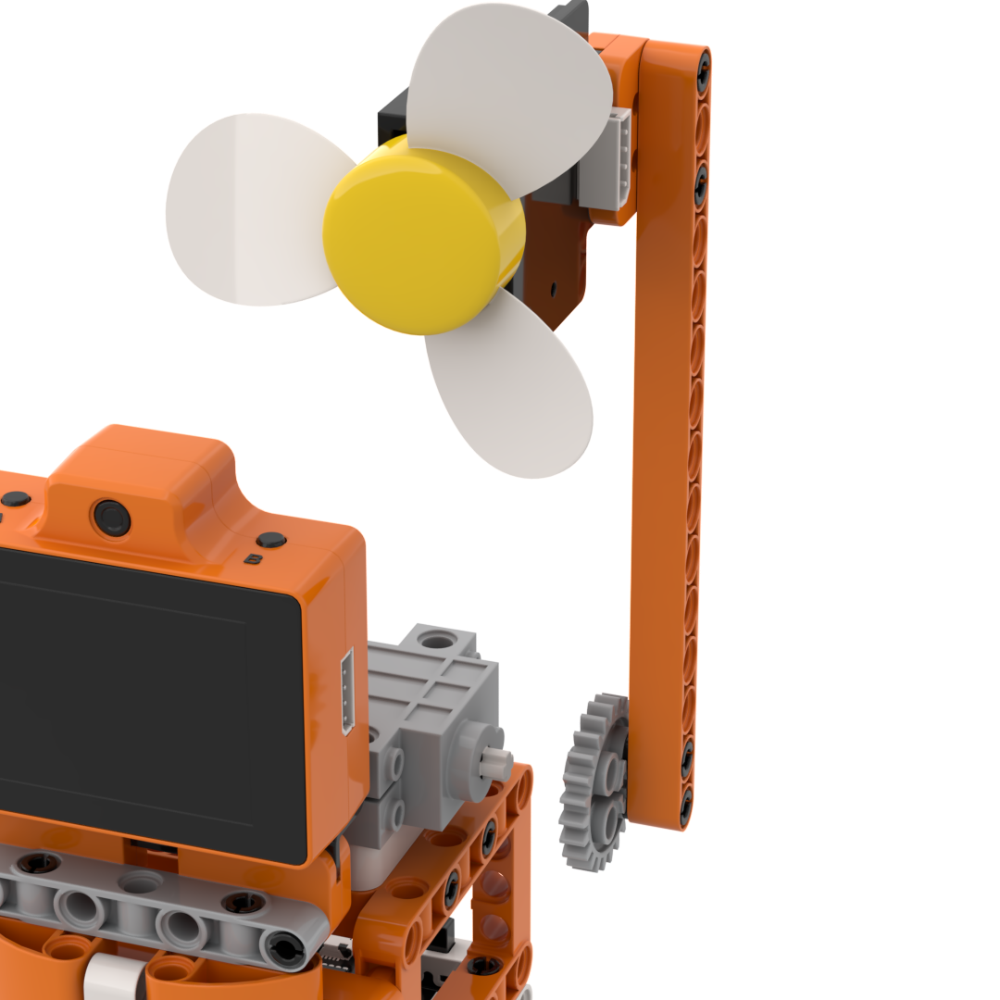

### 3.19.6 Programming

#### (1) Program Concept Diagram

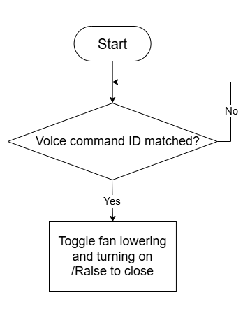

#### (2) Add Extension Libraries

- Select **Sensor** in the **Choose an Extension** interface to add **WonderLLM-offline**.

- Select **Output module** in the **Choose an Extension** interface to add **Fan module (black)**.

#### (3) Core Blocks Analysis

| Block | Category | Function Description |
| :---: | :---: | :--- |
|  |  | Switch the working identification mode of the WonderLLM module. Three working modes are available: voice interaction, color recognition, and face recognition. |
|  |  | Under voice interaction mode, read the recognized voice text content from the module for subsequent judgment and interaction logic. |
|  |  | Control the specified fan port. Set the speed value within the range of 0 to 100 to adjust the fan speed. |
|  |  | Control the 270° block servo on the specified port to rotate smoothly to the target angle within a set duration. The program automatically delays and waits for the servo to complete the action. |

#### (4) Complete Program

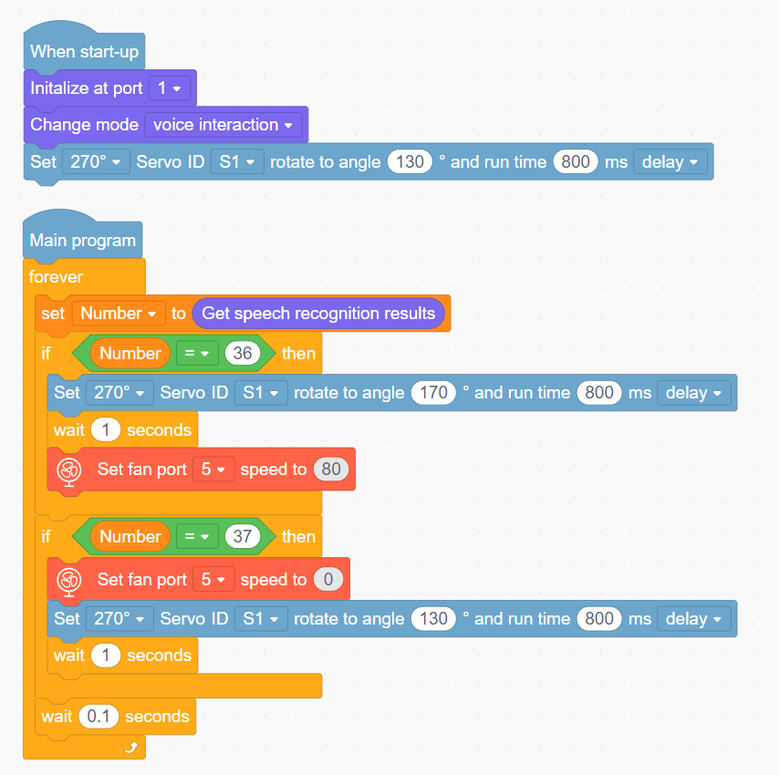

The source files are available for download as a zip archive under [1. Source Code / 02 Program Files for Builds](https://drive.google.com/drive/folders/1guTJsuFCa0f3ZVMcZNNWJ6NruvY7gsUd?usp=sharing).

### 3.19.7 Downloading the Program

### 3.19.8 Project Extensions

Issuing the voice command "Turn on the fan" lowers the fan and initiates medium-speed airflow by default. The commands "Speed Up" and "Slow Down" adjust the fan to high-speed and low-speed blowing, respectively. Issuing the command "Turn off the fan" automatically stops the fan, raising and retracting the mechanism.

### 3.19.9 Technical Support and Discussion

Join the forum for sharing questions, ideas, or suggestions, and answers will be provided promptly. Click the hyperlink [Hiwonder Forum](http://forum.hiwonder.com) or enter the URL in a browser: http://forum.hiwonder.com

## 3.20 Ski Star

### 3.20.1 Introduction

This skiing figure features voice-controlled motion capabilities. Spoken commands activate the motor to drive the figure in a sliding motion or stop it in place, fully simulating a real skiing experience.

### 3.20.2 Learning Objectives

1. Develop proficiency in using WonderLLM voice interaction features to control the starting and stopping of the 360° block motor, simulating skiing movements.
2. Learn to program the ESP32 controller to drive the 360° block motor, constructing an engaging voice-controlled motion simulation model.

### 3.20.3 Assembly Guide

 <iframe
    src="../_static/pdf/20_Ski_Star.pdf#view=FitH"
    title="Assembly Guide PDF"
    width="100%"
    height="850"
    style="border: 1px solid #ddd;"
    loading="lazy">
 </iframe>

### 3.20.4 Mode Switching

This build requires the **offline voice interaction**. If the offline voice interaction mode has already been entered, skip this step and proceed directly to the wiring guide. Otherwise, refer to [4.5.1 Firmware Update](https://wiki.hiwonder.com/projects/DaDablock-AI/en/standard-kit/docs/4_Software_and_Hardware_Guide.html#id21) to flash the corresponding firmware.

### 3.20.5 Wiring Guide

Connect the WonderLLM module cable to port 1 of the ESP32 controller.

Connect the 360° block servo cable to port S1 of the ESP32 controller and ensure the orange wire of the servo aligns with the white pin of S1.

The wiring configuration is shown below:

### 3.20.6 Programming

#### (1) Program Concept Diagram

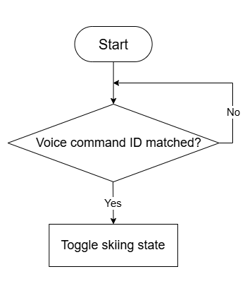

#### (2) Add Extension Libraries

Select **Sensor** in the **Choose an Extension** interface to add **WonderLLM-offline**.

#### (3) Core Blocks Analysis

| Block | Category | Function Description |
| :---: | :---: | :--- |
|  |  | Switch the working identification mode of the WonderLLM module. Three working modes are available: voice interaction, color recognition, and face recognition. |
|  |  | Under voice interaction mode, read the recognized voice text content from the module for subsequent judgment and interaction logic. |
|  |  | Control the 360° block servo on the specified port to rotate continuously at the customized speed. |

#### (4) Complete Program

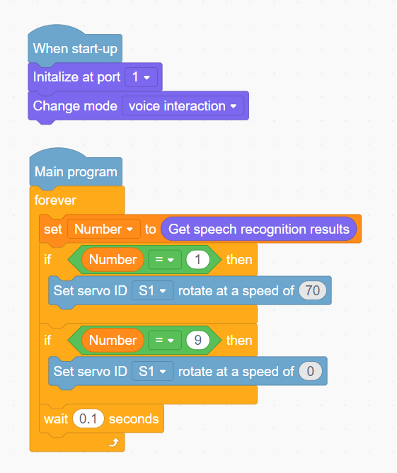

The source files are available for download as a zip archive under [1. Source Code / 02 Program Files for Builds](https://drive.google.com/drive/folders/1guTJsuFCa0f3ZVMcZNNWJ6NruvY7gsUd?usp=sharing).

### 3.20.7 Downloading the Program

### 3.20.8 Project Extensions

Issuing the voice command "Go forward" drives the figure forward at medium speed by default. Spoken commands like "Speed Up" and "Slow Down" adjust the speed to high and low levels, respectively. Issuing a stop command immediately halts all forward movement.

### 3.20.9 Technical Support and Discussion

Join the forum for sharing questions, ideas, or suggestions, and answers will be provided promptly. Click the hyperlink [Hiwonder Forum](http://forum.hiwonder.com) or enter the URL in a browser: http://forum.hiwonder.com

## 3.21 Vision Tracking Car

### 3.21.1 Introduction

This smart robotic car features color-based vision tracking capabilities. Once the vision recognition system locks onto a colored ball, the car automatically navigates left and right to follow it, precisely maintaining target lock to track and move forward.

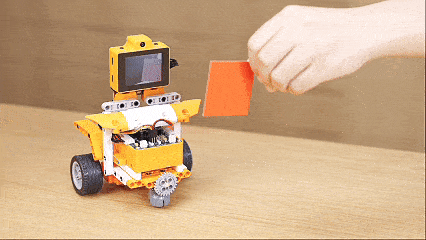

### 3.21.2 Learning Objectives

1. Master utilizing the WonderLLM color tracking feature to implement automated tracking and navigation control for the car.
2. Learn to program the ESP32 controller to coordinate dual block servos with dot matrix display feedback, completing an interactive vision-tracking car project.

### 3.21.3 Assembly Guide

 <iframe
    src="../_static/pdf/21_Vision_Tracking_Car.pdf#view=FitH"
    title="Assembly Guide PDF"
    width="100%"
    height="850"
    style="border: 1px solid #ddd;"
    loading="lazy">
 </iframe>

### 3.21.4 Mode Switching

This build requires the **offline vision function**. If the offline vision function mode has already been entered, skip this step and proceed directly to the wiring guide. Otherwise, refer to [4.5.1 Firmware Update](https://wiki.hiwonder.com/projects/DaDablock-AI/en/standard-kit/docs/4_Software_and_Hardware_Guide.html#id21) to flash the corresponding firmware.

### 3.21.5 Wiring Guide

Connect the WonderLLM module cable to port 1 of the ESP32 controller.

Connect the left 360° block servo cable to port S1 of the ESP32 controller and ensure the orange wire of the servo aligns with the white pin of S1.

Connect the right 360° block servo cable to port S2 of the ESP32 controller and ensure the orange wire of the servo aligns with the white pin of S2.

The wiring configuration is shown below:

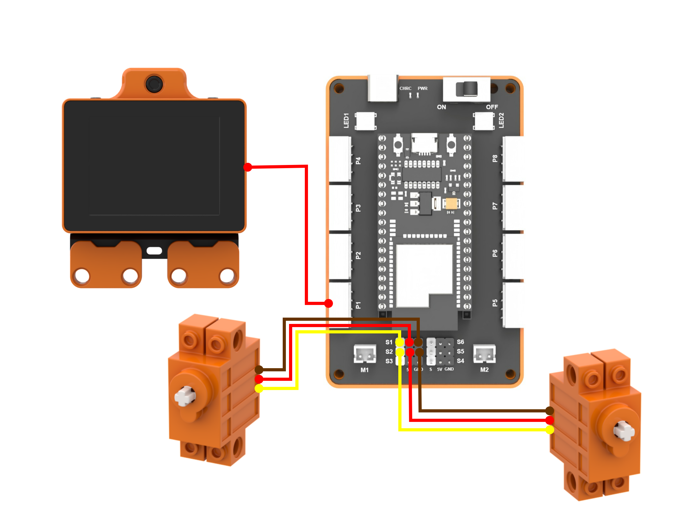

### 3.21.6 Programming

#### (1) Program Concept Diagram

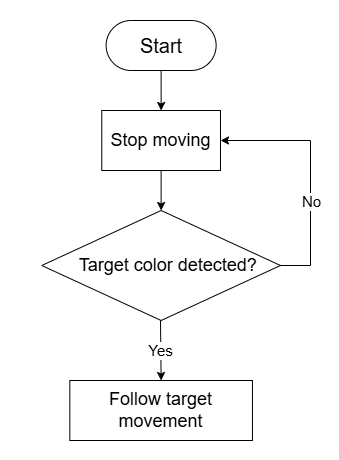

#### (2) Add Extension Libraries

Select **Sensor** in the **Choose an Extension** interface to add **WonderLLM-offline**.

#### (3) Core Blocks Analysis

| Block | Category | Function Description |
| :---: | :---: | :--- |
|  |  | Switch the working identification mode of the WonderLLM module. Three working modes are available: voice interaction, color recognition, and face recognition. |
|  |  | Under color recognition mode, read the ID corresponding to the color with the largest area in the screen. |
| 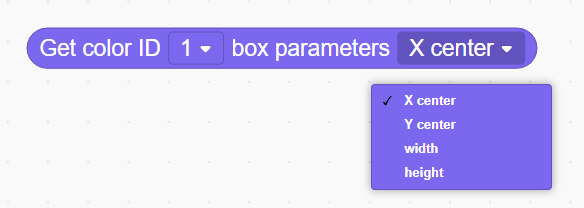 |  | Under color recognition mode, read screen pixel parameters such as the coordinates and size of the specified color block for color block positioning calculation. |
|  |  | Control the 360° block servo on the specified port to rotate continuously at the customized speed. |

#### (4) Complete Program

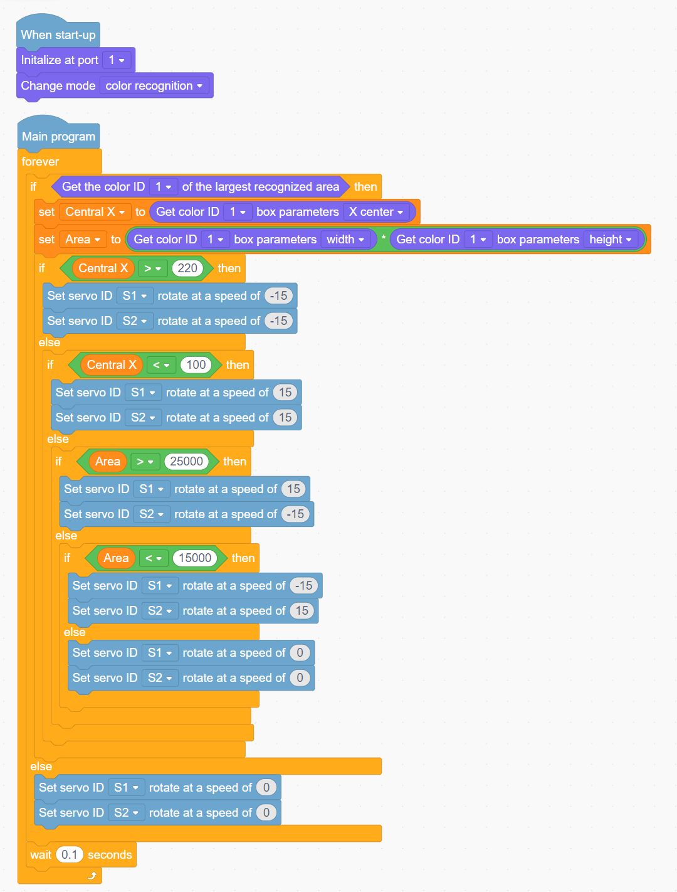

The source files are available for download as a zip archive under [1. Source Code / 02 Program Files for Builds](https://drive.google.com/drive/folders/1guTJsuFCa0f3ZVMcZNNWJ6NruvY7gsUd?usp=sharing).

### 3.21.7 Downloading the Program

### 3.21.8 Project Extensions

When the target color is far away, the car accelerates to close the distance, and then transitions to a steady low-speed cruise once the target is at a moderate distance. As the target moves very close, the car fine-tunes its heading in place without moving forward. If the target leaves the field of view entirely, the car automatically turns right to search, resuming tracking immediately once the target is re-acquired.

### 3.21.9 Technical Support and Discussion

Join the forum for sharing questions, ideas, or suggestions, and answers will be provided promptly. Click the hyperlink [Hiwonder Forum](http://forum.hiwonder.com) or enter the URL in a browser: http://forum.hiwonder.com

## 3.22 Color Sorter

### 3.22.1 Introduction

This color sorting system features automated color categorization capabilities. The vision recognition system distinguishes the colors of approaching objects, and the servo automatically moves the sorting mechanism to separate orange and black items to the left and right sides, respectively.

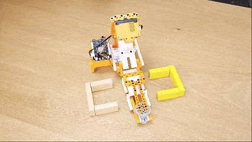

### 3.22.2 Learning Objectives

1. Master utilizing the WonderLLM color recognition feature to implement dual-channel control of 270° block servos, completing automated object sorting.
2. Learn to program the ESP32 controller to drive dual block servos, achieving automated left-and-right sorting based on vision detection results.

### 3.22.3 Assembly Guide

 <iframe
    src="../_static/pdf/22_Color_Sorter.pdf#view=FitH"
    title="Assembly Guide PDF"
    width="100%"
    height="850"
    style="border: 1px solid #ddd;"
    loading="lazy">
 </iframe>

### 3.22.4 Mode Switching

This build requires the **offline vision function**. If the offline vision function mode has already been entered, skip this step and proceed directly to the wiring guide. Otherwise, refer to [4.5.1 Firmware Update](https://wiki.hiwonder.com/projects/DaDablock-AI/en/standard-kit/docs/4_Software_and_Hardware_Guide.html#id21) to flash the corresponding firmware.

### 3.22.5 Wiring Guide

Connect the WonderLLM module cable to port 1 of the ESP32 controller.

Connect the 270° block servo cable that controls the guard plate to port S1 of the ESP32 controller and ensure the orange wire of the servo aligns with the white pin of S1.

Connect the 270° block servo cable that controls the sorting to port S2 of the ESP32 controller and ensure the orange wire of the servo aligns with the white pin of S2.

The wiring configuration is shown below:

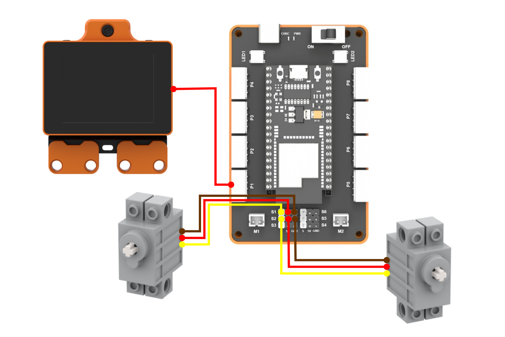

> [!NOTE]
>
> **When using the 270° block servo for the first time, remove the gear and its attached building blocks from the 270° block servo first. Upload the following 270° block servo reset program to the ESP32 controller. Reassemble the building blocks afterwards and upload the program of this lesson to the ESP32 controller. Wait for the 270° block servo to rotate to the initial position of 135°. At this point, the guard plate should block and the sorter should be in the middle position. This step can be skipped if the servo reset program has been executed previously.**

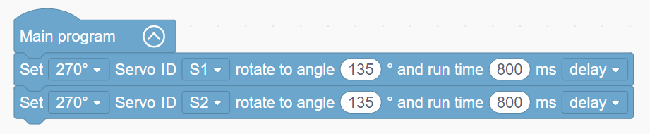

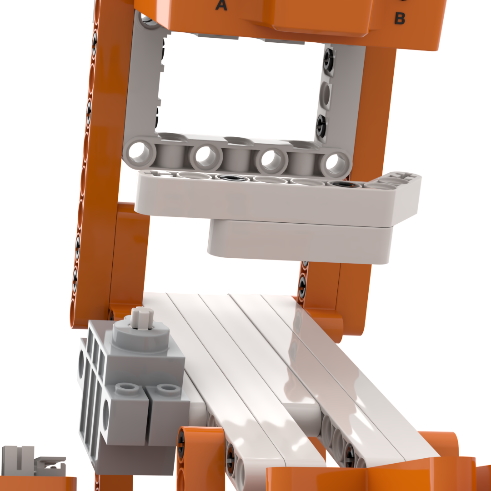

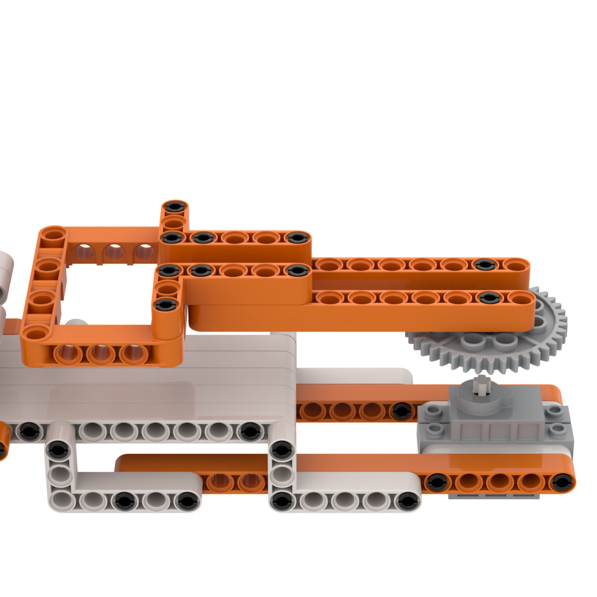

### 3.22.6 Programming

#### (1) Program Concept Diagram

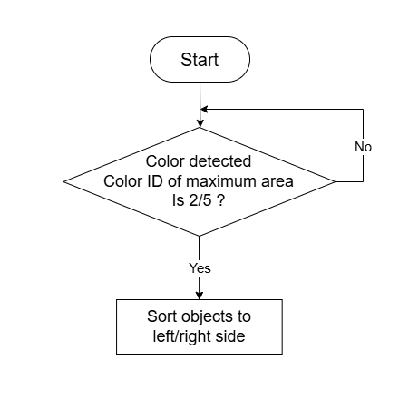

#### (2) Add Extension Libraries

Select **Sensor** in the **Choose an Extension** interface to add **WonderLLM-offline**.

#### (3) Core Blocks Analysis

| Block | Category | Function Description |
| :---: | :---: | :--- |
|  |  | Switch the working identification mode of the WonderLLM module. Three working modes are available: voice interaction, color recognition, and face recognition. |
|  |  | Under color recognition mode, read the id corresponding to the color with the largest area in the screen. |
|  |  | Control the 270° block servo on the specified port to rotate smoothly to the target angle within a set duration. The program automatically delays and waits for the servo to complete the action. |

#### (4) Complete Program

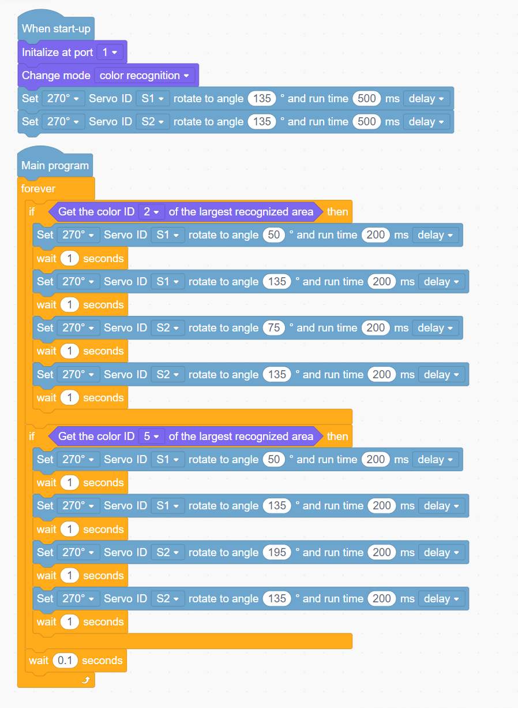

The source files are available for download as a zip archive under [1. Source Code / 02 Program Files for Builds](https://drive.google.com/drive/folders/1guTJsuFCa0f3ZVMcZNNWJ6NruvY7gsUd?usp=sharing).

### 3.22.7 Downloading the Program

### 3.22.8 Project Extensions

Orange items are sorted to the left and black items to the right. After each sorting cycle, the mechanism automatically resets to wait for the next object. Upon continuously sorting 5 items, the system automatically pauses and waits for the voice command "Turn on color recognition" to resume the process.

### 3.22.9 Technical Support and Discussion

Join the forum for sharing questions, ideas, or suggestions, and answers will be provided promptly. Click the hyperlink [Hiwonder Forum](http://forum.hiwonder.com) or enter the URL in a browser: http://forum.hiwonder.com

## 3.23 Smart Helper Bot

### 3.23.1 Introduction

This smart helper robot features voice-controlled mobility and visual interaction. Vocal commands control the car's movements in all directions, while the dot matrix display provides real-time text feedback, creating an intuitive smart interactive assistant.

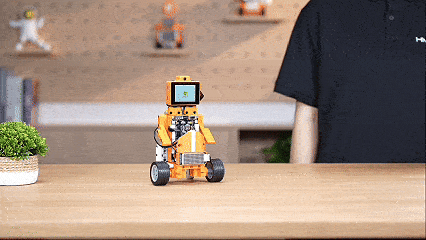

### 3.23.2 Learning Objectives

1. Master utilizing the WonderLLM voice control features to control all-directional movement of the robot car alongside dot matrix display feedback.
2. Learn to program the ESP32 controller to coordinate dual block servos with a dot matrix display, constructing a voice-controlled helper robot car project.

### 3.23.3 Assembly Guide

 <iframe
    src="../_static/pdf/23_Smart_Helper_Bot.pdf#view=FitH"
    title="Assembly Guide PDF"
    width="100%"
    height="850"
    style="border: 1px solid #ddd;"
    loading="lazy">
 </iframe>

### 3.23.4 Mode Switching

This build requires the **offline voice interaction**. If the offline voice interaction mode has already been entered, skip this step and proceed directly to the wiring guide. Otherwise, refer to [4.5.1 Firmware Update](https://wiki.hiwonder.com/projects/DaDablock-AI/en/standard-kit/docs/4_Software_and_Hardware_Guide.html#id21) to flash the corresponding firmware.

### 3.23.5 Wiring Guide

Connect the dot matrix module cable to port 5 of the ESP32 controller.

Connect the WonderLLM module cable to port 4 of the ESP32 controller.

Connect the left 360° block servo cable to port S1 of the ESP32 controller and ensure the orange wire of the servo aligns with the white pin of S1.

Connect the right 360° block servo cable to port S2 of the ESP32 controller and ensure the orange wire of the servo aligns with the white pin of S2.

The wiring configuration is shown below:

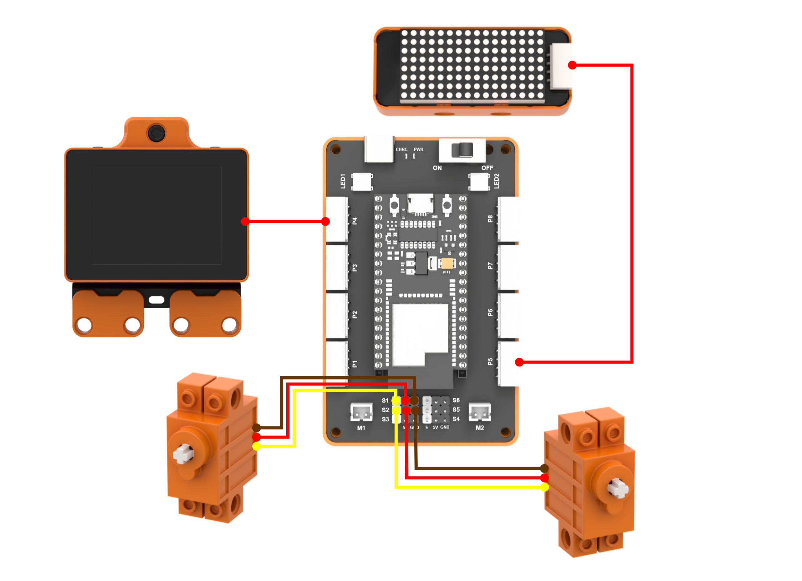

### 3.23.6 Programming

#### (1) Program Concept Diagram

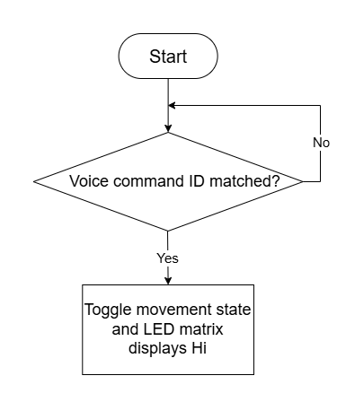

#### (2) Add Extension Libraries

- Select **Sensor** in the **Choose an Extension** interface to add **WonderLLM-offline**.

- Select **Output module** in the **Choose an Extension** interface to add **Dot matrix module**.

#### (3) Core Blocks Analysis

| Block | Category | Function Description |
| :---: | :---: | :--- |
|  |  | Switch the working identification mode of the WonderLLM module. Three working modes are available: voice interaction, color recognition, and face recognition. |
|  |  | Under voice interaction mode, read the recognized voice text content from the module for subsequent judgment and interaction logic. |
|  |  | Output and display custom text content at the specified x and y coordinates on the dot matrix screen. |
|  |  | Control the dot matrix screen to load and display preset patterns with customizable switching of various graphics and symbol screens. |
|  |  | Control the 360° block servo on the specified port to rotate continuously at the customized speed. |

#### (4) Complete Program

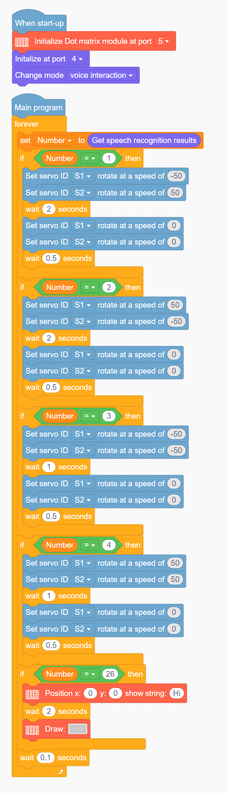

The source files are available for download as a zip archive under [1. Source Code / 02 Program Files for Builds](https://drive.google.com/drive/folders/1guTJsuFCa0f3ZVMcZNNWJ6NruvY7gsUd?usp=sharing).

### 3.23.7 Downloading the Program

### 3.23.8 Project Extensions

Saying "Hello" keeps the car stationary while the dot matrix display shows **Hi.** When movement commands like forward, backward, left, or right are issued, the car moves accordingly and the display dynamically switches to show the corresponding direction word.

### 3.23.9 Technical Support and Discussion

Join the forum for sharing questions, ideas, or suggestions, and answers will be provided promptly. Click the hyperlink [Hiwonder Forum](http://forum.hiwonder.com) or enter the URL in a browser: http://forum.hiwonder.com

## 3.24 Kinetic Wings

### 3.24.1 Introduction

This set of Kinetic Wings features voice-controlled wing-flapping capabilities. Vocal commands engage the motor to drive the wings through three distinct speed levels, vividly simulating the graceful motion of a bird spreading its wings to fly.

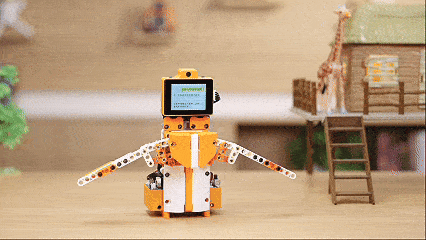

### 3.24.2 Learning Objectives

1. Master utilizing WonderLLM voice control features to implement three-level speed regulation for a 360° block motor.
2. Learn to program the ESP32 controller to drive the 360° block motor, building a voice-controlled kinetic wings model with three adjustable speed levels.

### 3.24.3 Assembly Guide

 <iframe
    src="../_static/pdf/24_Kinetic_Wings.pdf#view=FitH"
    title="Assembly Guide PDF"
    width="100%"
    height="850"
    style="border: 1px solid #ddd;"
    loading="lazy">
 </iframe>

### 3.24.4 Mode Switching

This build requires the **online large model**. If the online large model mode has already been entered, skip this step and proceed directly to the wiring guide. Otherwise, refer to [4.4.10 Firmware Update](https://wiki.hiwonder.com/projects/DaDablock-AI/en/standard-kit/docs/4_Software_and_Hardware_Guide.html#firmware-update) to flash the corresponding firmware.

### 3.24.5 Wiring Guide

Connect the WonderLLM module cable to port 1 of the ESP32 controller.

Connect the 360° block servo cable to port S1 of the ESP32 controller and ensure the orange wire of the servo aligns with the white pin of S1.

The wiring configuration is shown below:

### 3.24.6 Programming

#### (1) Program Concept Diagram

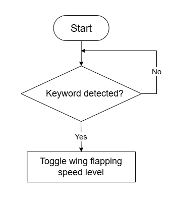

#### (2) Add Extension Libraries

Select **Sensor** in the **Choose an Extension** interface to add **WonderLLM**.

#### (3) Core Blocks Analysis

| Block | Category | Function Description |
| :---: | :---: | :--- |
|  |  | Send customized text information to the WonderLLM large model. |
|  |  | Configure mcp tool call parameters, customize the tool name, description, execution instruction, and return parameters, and set tool call blocking and data return rules. |
|  |  | Turn the mcp switch on or off to control whether WonderLLM enables the custom tool calling capability. |
|  |  | Read the returned result data after the mcp tool execution is completed. |
|  |  | Control the dialogue message output mode. This block can send action end identifiers, and turn on or off the dialogue content print output. |
|  |  | Control the 360° block servo on the specified port to rotate continuously at the customized speed. |
|  |  | Boolean logical judgment. It performs true or false determination or negation operations on input conditions. |
|  |  | Custom entry or calling of text content to generate string data that can participate in splicing, judgment, or display. |
|  |  | Determine whether a specified element exists in an array, tuple, or dictionary, and return a boolean result. |
|  |  | Extract the corresponding stored numeric value or text content from a dictionary based on the specified key name. |

#### (4) MCP Parameter Configuration

**Tool Name:** `self.robot.setSpeed`

1. **Tool Description:** Set the speed of wing flapping. Main parameters: Speed: Range 0 to 3, also known as gear.
2. **Instruction Name:** `setSpeed`
3. **Return Parameters:** `[["speed","int","0","0","3"]]` **Note that the first 0 is the default value, the second 0 is the minimum value, and 3 is the maximum value.**
4. **Block until call completed:** Yes
5. **Return data:** No
6. **Function:** This MCP configuration defines the wing flapping speed adjustment tool for the WonderLLM module. It allows WonderLLM to issue commands from gear 0 to 3 to adjust the wing flapping speed. During the call, the program blocks to wait for the speed switching to complete, and there is no need to send running data back to WonderLLM.

#### (5) Complete Program

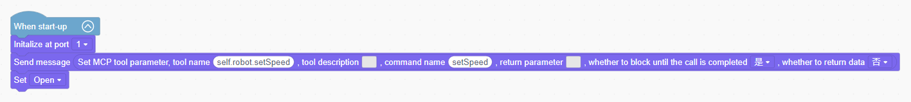

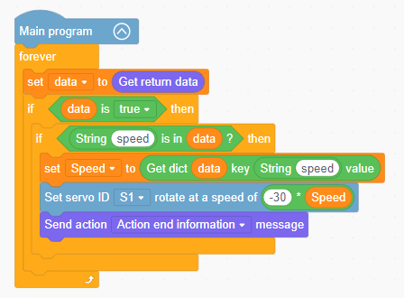

The source files are available for download as a zip archive under [1. Source Code / 02 Program Files for Builds](https://drive.google.com/drive/folders/1guTJsuFCa0f3ZVMcZNNWJ6NruvY7gsUd?usp=sharing).

### 3.24.7 Downloading the Program

### 3.24.8 Project Extensions

Voice commands can activate an automatic loop mode where the wings flap through low, medium, and high speeds sequentially. A single voice command can lock the system into a specific speed level for continuous flapping, and a stop command resets the wings to a stationary, folded position.

### 3.24.9 Technical Support and Discussion

Join the forum for sharing questions, ideas, or suggestions, and answers will be provided promptly. Click the hyperlink [Hiwonder Forum](http://forum.hiwonder.com) or enter the URL in a browser: http://forum.hiwonder.com
