# 4. Software and Hardware Guide

## 4.1 ESP32 Controller

### 4.1.1 Introduction to the ESP32 Controller

This is a smart controller powered by the ESP32 chip, supporting both block-based graphical programming and Python programming. Enclosed in a PC plastic shell, the board features integrated electronic modules including PWM servo ports, motor ports, programmable buttons, and a buzzer. It also features reserved sensor ports for high expandability. The uniform 4-pin anti-reverse ports make connecting with the full line of Hiwonder sensors convenient and safe.

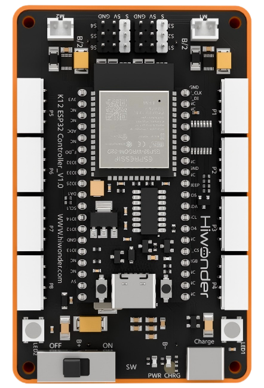

### 4.1.2 ESP32 Controller Port Overview

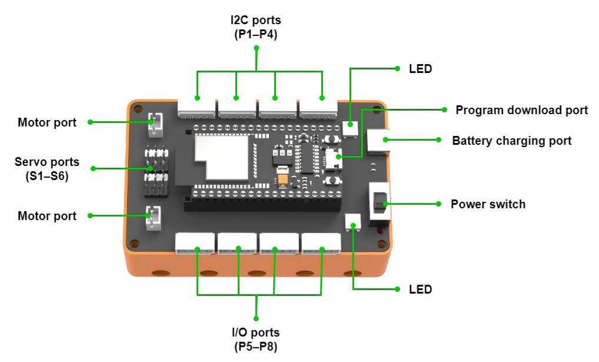

### 4.1.3 ESP32 Controller Specifications

| Parameter | Description |
| :---: | :---: |
| Product name | ESP32 controller |
| Dimensions | 88.0 x 55.5 x 42.5 mm |
| Charging voltage | 5 V |
| Charging current | 1500 mA |
| Charging time | 3.5 h |
| Battery capacity | Two 1200 mAh 3.7 V lithium batteries |
| Maximum operating voltage | 8.4 V |
| Rated operating voltage | 7.4 V |

## 4.2 WonderCode Programming Software

### 4.2.1 Platform Overview

WonderCode is a dedicated Scratch-based programming software tool for Hiwonder products. The software supports automatic conversion between graphical instruction blocks and Python code. Code can be written by dragging and dropping instruction blocks, making it highly suitable for beginners to learn programming.

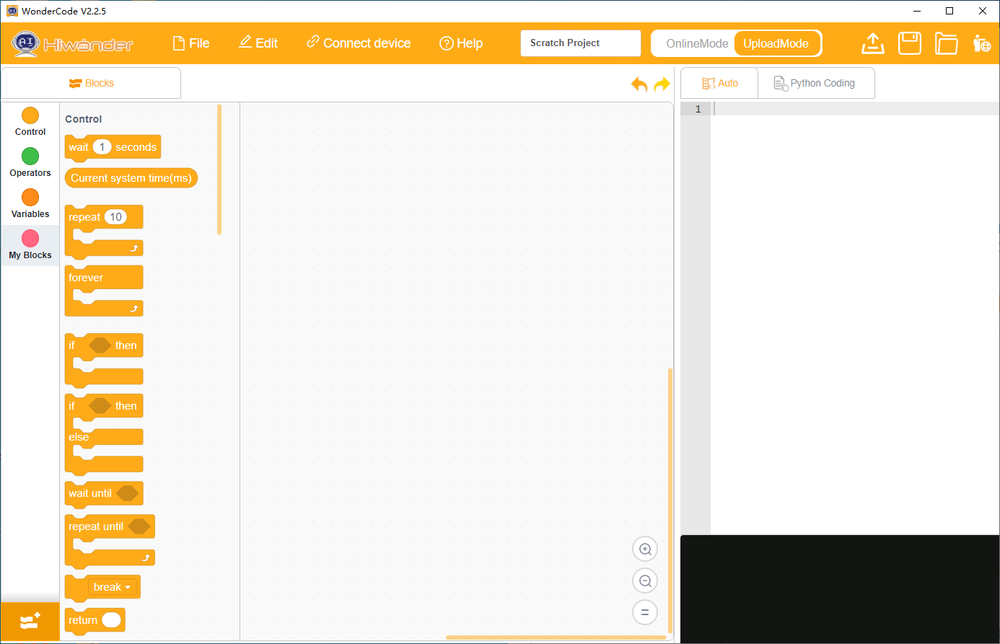

### 4.2.2 Platform Interface Overview

The diagram below illustrates the functional areas of the WonderCode software: ① Menu bar, ② Blocks area, ③ Script area, and ④ Code display and upload area.

The corresponding functions are described in the table below:

| Icon | Function |
| :---: | :--- |
|  | Creates, saves, and opens program files. |
|  | Used for online mode, which is only for informational purposes and does not need to be mastered. |
|  | Connects or disconnects the device and software, and confirms the connection port. |
|  | Provides access to help materials, software updates, and driver installation. |
|  | Displays the program file name. If programming has not started or the file has not been saved, **Scratch Project** will be displayed. |
|  | Interface switch button used to switch between **OnlineMode** and **UploadMode**. |
|  | Selects the display language, with support for English. |
|  | Undoes or redoes actions during programming. |
|  | Switches the edit mode. **Auto** automatically converts block programs into Python format, while **Python Coding** allows direct editing in Python. |
|  | Saves the program as Python code. |
|  | Opens saved Python files. |
|  | Enables device interaction and downloads programs to the controller. |
|  | Adds device extension packages. |
|  | Zooms in, zooms out, or restores the default size of the code editing interface. |

### 4.2.3 Basic Blocks Overview

| Block | Category | Function Description |
| :---: | :---: | :--- |
|  |  | Pauses program execution for a specified duration before proceeding to the next instruction. This is used for action intervals and delay buffering. |
|  |  | Reads the total runtime of the device in milliseconds since powering on. This is used for timing and delay logic determination. |
| 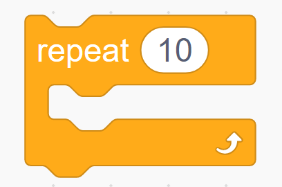 |  | Runs the code inside the loop for a specified number of times and exits the loop upon completion. |
|  |  | Runs the nested instructions inside a loop indefinitely. The program continuously repeats the logic inside the loop. |
|  |  | Basic conditional statement. Executes the code inside if the condition is met. Otherwise, skips it. |
| 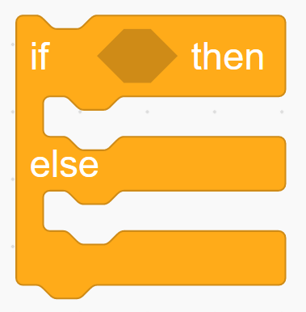 |  | Dual-branch conditional statement. Executes the code in the `then` branch if the condition is met. Otherwise, executes the code in the `else` branch. |
|  |  | Pauses program execution for a custom duration. |
|  |  | Repeatedly executes the code inside the loop until the specified condition is met, then exits the loop. |
|  |  | Terminates the current loop early and exits to execute the subsequent program. |
|  |  | Used inside a custom function to return specified data to the function caller. |
|  |  | Adds two values and returns the result. |
|  |  | Subtracts one value from another and returns the result. |
|  |  | Multiplies two values and returns the result. |
|  |  | Divides one value by another and returns the result. |
|  |  | Compares two numbers and returns a boolean value of true or false. |
|  |  | Logical AND operation. The overall result is true only when all conditions are met simultaneously. |
|  |  | Logical OR operation. The overall result is true if any of the conditions are met. |
|  |  | Logical NOT operation, which reverses the boolean value, making true become false and vice versa. |
|  |  | Boolean logical statement that evaluates the input condition as true or false, or performs a NOT operation. |
|  |  | Checks whether a specified element exists inside a list, tuple, or dictionary, and returns a boolean result. |
|  |  | Extracts the value associated with the specified key in a dictionary. |
|  |  | Linearly maps the input value from its original range to a target range to complete the value range conversion. |
|  |  | Enters or calls text content to generate string data that can be used for concatenation, logic checks, or display. |
|  |  | Concatenates two strings to output a combined text string. |
|  |  | Converts the input numerical value into text format, which is used for display or string concatenation. |
|  |  | Creates a custom variable to store a single piece of data, such as a number or text. |
|  |  | Reads the data stored in a variable for operations such as calculation, comparison, or output. |
|  |  | Assigns a value to the specified variable, overwriting the original data. |
|  |  | Increments a numerical variable by adding a specified number to its current value. |
|  |  | Creates an empty list with a custom name to store multiple sets of data. |
|  |  | Generates an empty list container that can hold various types of data, such as numbers and text, for subsequent operations. |
|  |  | Clears all stored elements in the target list to reset it. |
|  |  | Inserts custom content at the specified index in the target list. |
|  |  | Creates a custom function block, sets the function name, and defines input parameters of number or text type to package and reuse program logic. |
|  |  | Provides a number or text parameter input value for the custom function. |
|  |  | Calls the defined custom function block to execute the encapsulated program code. |
|  |  | Creates a custom function block to encapsulate a segment of reusable program logic. |
|  |  | Calls the defined custom function to execute the encapsulated program code. |

### 4.2.4 ESP32 Controller Extension Library Blocks Overview

| Block | Category | Function Description |
| :---: | :---: | :--- |
|  |  | The main program loop container. It continuously executes the code inside in a loop after the power-on initialization is completed. |
|  |  | Executes only once after the device is powered on. This is used for startup logic such as hardware initialization and parameter configuration. |
|  |  | Drives the buzzer to play music of a specified pitch and beat. Running in background mode does not block the execution of subsequent programs. |
|  |  | Adjusts the volume of the buzzer, with a range of 0 to 100. Larger values indicate higher volume. |
|  |  | Stops the buzzer from sounding immediately, terminating the currently playing tone or music. |
|  |  | Controls the RGB light at the specified index, or all RGB lights, to light up in the selected color. |
|  |  | Customizes the light color using RGB three-channel values to control the corresponding RGB light to output mixed color light. |
| 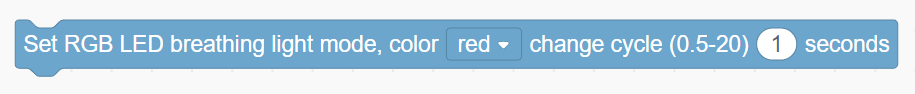 |  | Makes the specified RGB light perform a brightness-fading breathing effect in the selected color, with a customizable dimming cycle. |
|  |  | Enables the flowing RGB lighting effect that automatically cycles through a multi-color gradient. |
|  |  | Turns off the specified RGB light or all RGB lights to cut off the light output. |
|  |  | Prints custom text strings to the computer through the serial port to view debugging information. |
| 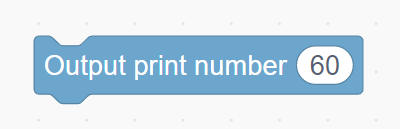 |  | Prints specified numerical values to the computer through the serial port for data debugging. |
| 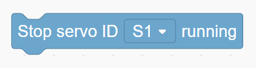 |  | Immediately stops the rotation of the 360° block servo on the specified port. |
|  |  | Controls the 360° block servo on the specified port to rotate continuously at a custom speed. |
|  |  | Controls the 270° block servo on the specified port to rotate smoothly to the target angle within a set duration, automatically waiting for the servo to complete the action. |

## 4.3 Electronic Modules Overview

### 4.3.1 360° Block Servo

#### 1. Introduction

This is a servo compatible with various LEGO building block components. PWM, or Pulse Width Modulation, is generally used for control. It is a continuous rotation servo whose rotation speed and direction can be controlled via PWM signals, although the specific rotation angle cannot be controlled.

#### 2. Specifications

| Parameter | Description |
| :---: | :---: |
| Operating voltage | 4.8-6 V DC |
| Rated torque | 1 N·m |
| Rotation range | 0° to 360° |
| Cable length | 25 cm |
| Dimensions | 40 x 16 mm |

#### 3. Wiring Diagram

Connect the 360° servo to the controller ports S1 to S6. Note that the yellow wire connects to S, the red wire connects to 5V, and the brown wire connects to GND, as shown in the diagram below:

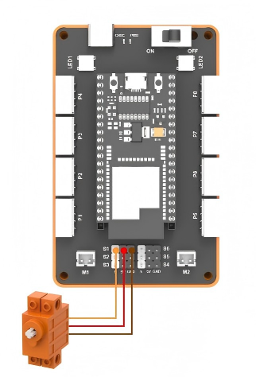

#### 4. Hands-on Practice

**Case: Timed Forward and Reverse Servo Rotation**

**Program Logic:** Once the program starts running, the 360° block servo rotates forward at a speed of 50 for 2 seconds, then rotates backward for 2 seconds, and finally stops.

**Program Upload Instructions:** Follow the steps shown in the GIF: click **Connect device**, select the port, and then click the upload icon to complete the program upload. Once finished, proceed to test the program's execution.

> [!NOTE]
>
> * **The block `Set servo ID S1 rotate at a speed of 50` is used in the program because a PWM signal is required to control the rotation of the 360° block servo. Since the PWM output ports on the controller are S1 to S6, the S1 port is used here to send the signal to the servo.**
> * **The source files are available for download as a zip archive under [1. Source Code / 01 Program Files for Sensors](https://drive.google.com/drive/folders/11p36JV_E-lObXeoHPkrtIhoMU-Q2H3ye?usp=sharing).**

### 4.3.2 270° Block Servo

#### 1. Introduction

This is a servo compatible with various LEGO building block components. PWM, or Pulse Width Modulation, is generally used for control. It is a limited-rotation servo, meaning that while the rotation angle can be controlled, it has a limited range from 0° to 270°.

#### 2. Specifications

| Parameter | Description |
| :---: | :---: |
| Operating voltage | 4.8-6 V DC |
| Rated torque | 1 N·m |
| Rotation range | 0° to 270° |
| Cable length | 25 cm |
| Dimensions | 40 x 16 mm |

#### 3. Wiring Diagram

Connect the 270° servo to the controller ports S1 to S6. Note that the yellow wire connects to S, the red wire connects to 5V, and the brown wire connects to GND, as shown in the diagram below:

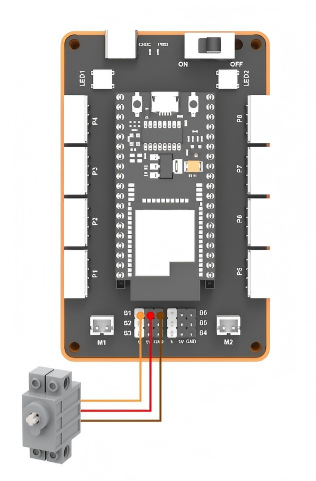

#### 4. Hands-on Practice

**Case: 270° Servo Timed Multi-Angle Rotation**

**Program Logic:** Once the program starts running, the 270° block servo rotates to 135° first. After 2 seconds, it rotates to 0°. After another 2 seconds, it rotates to 270°, and then stops after 2 seconds.

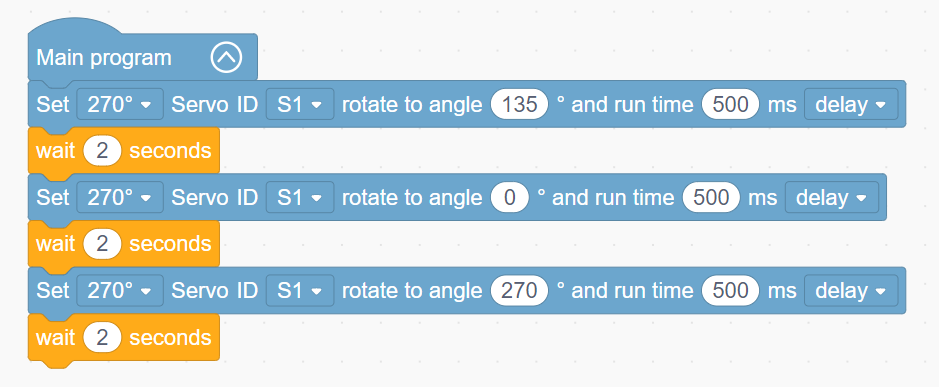

**Program Upload Instructions:** Follow the steps shown in the GIF: click **Connect device**, select the port, and then click the upload icon to complete the program upload. Once finished, proceed to test the program's execution.

> [!NOTE]
>
> * **The 270° servo must be reset to its initial position before use.**
> * **The source files are available for download as a zip archive under [1. Source Code / 01 Program Files for Sensors](https://drive.google.com/drive/folders/11p36JV_E-lObXeoHPkrtIhoMU-Q2H3ye?usp=sharing).**

### 4.3.3 Dot Matrix Module

#### 1. Introduction

This is an LED dot matrix screen display module, featuring high brightness, flicker-free display, and easy wiring. It can display numbers, text, patterns, and other content. The module also features onboard LEGO-compatible holes for more creative DIY designs.

#### 2. Specifications

| Parameter | Description |
| :---: | :---: |
| Operating voltage | 5 V DC |
| Operating current | 45 mA |
| Matrix pixels | 8 x 16 dot matrix |
| Matrix brightness | 8 adjustable brightness levels |
| Connector type | 5264-4AW |
| Dimensions | 55.5 x 23.5 x 18.1 mm |

#### 3. Wiring Diagram

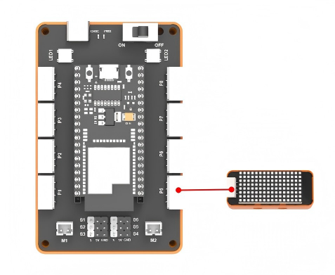

- Connecting the module to ports 5, 6, 7, or 8 on the controller is supported.

#### 4. Hands-on Practice

**Case: Looping Graphics and Text on the Dot Matrix Display**

**Program Logic:** Once the program starts running, the dot matrix screen switches to display `Hi`, 123, and a heart pattern.

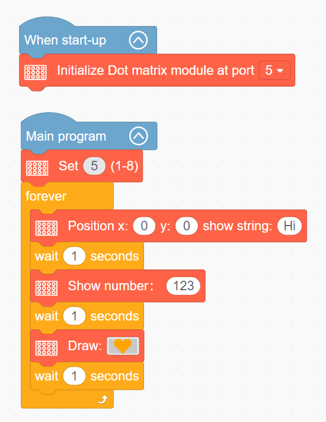

**Program Upload Instructions:** Follow the steps shown in the GIF: click **Connect device**, select the port, and then click the upload icon to complete the program upload. Once finished, proceed to test the program's execution.

> [!NOTE]
>
> - **When using the dot matrix module, initializing its port at startup is required.**
> - **The source files are available for download as a zip archive under [1. Source Code / 01 Program Files for Sensors](https://drive.google.com/drive/folders/11p36JV_E-lObXeoHPkrtIhoMU-Q2H3ye?usp=sharing).**
>

### 4.3.4 Fan Module

#### 1. Introduction

This is a fan module with adjustable rotation speed that does not require an additional motor driver board. It can be paired with a temperature sensor to create a smart fan device, enabling automatic fan speed adjustment based on temperature. Additionally, the module features onboard LEGO-compatible holes for more creative DIY designs.

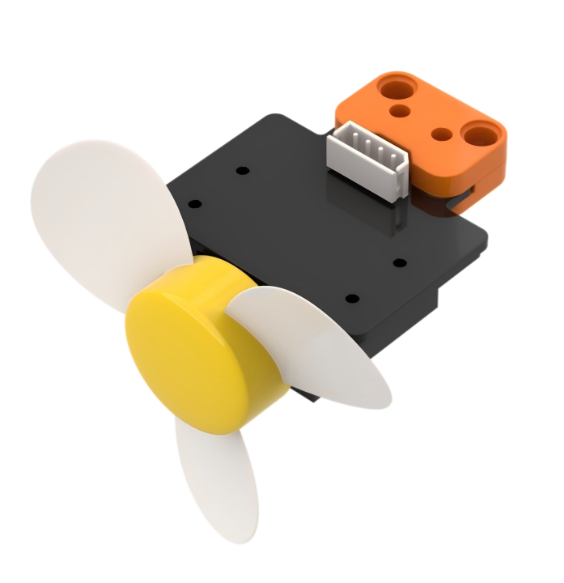

#### 2. Specifications

| Parameter | Description |
| :---: | :---: |
| Operating voltage | DC 5 V |
| Control method | PWM control |
| Connector type | 5264-4AW |
| Dimensions | 64.3 x 41.8 x 25.0 mm |

#### 3. Wiring Diagram

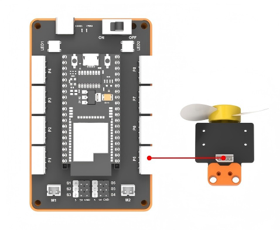

- It supports connection to ports 5, 6, 7, and 8 on the controller.

#### 4. Hands-on Practice

**Case: Timed Fan Control**

**Program Logic:** Once the program is downloaded, the fan rotates at a speed of 60 and stops after 10 seconds.

**Program Upload Instructions:** Follow the steps shown in the GIF: click **Connect device**, select the port, and then click the upload icon to complete the program upload. Once finished, proceed to test the program's execution.

> [!NOTE]
>
> - **When using the fan module, connecting to either port 5 or port 8 is recommended to prevent the fan from rotating upon power-on due to the initial high level of the controller ports.**
> - **The source files are available for download as a zip archive under [1. Source Code / 01 Program Files for Sensors](https://drive.google.com/drive/folders/11p36JV_E-lObXeoHPkrtIhoMU-Q2H3ye?usp=sharing).**
>

## 4.4 WonderLLM Module

### 4.4.1 Module Introduction

#### 1. Module Overview

WonderLLM is an AI large language model, or LLM, module. It features an integrated ESP32-S3 high-performance chip, a 2-megapixel high-definition camera, a microphone, a high-definition display, a speaker, and a CI1302 voice recognition chip, deeply integrating multimodal models such as text, voice, and vision.

This module is easy to operate and is commonly paired with robots. This equips the robot with a super brain, enabling a deep understanding of commands and granting exceptional perception, reasoning, and action capabilities to create a flexible and natural human-robot interaction experience.

#### 2. Operating Principle

The module uses a voice command wake-up mode to activate human-robot interaction. Flashing the English voice recognition firmware is required to enable English voice recognition. Once flashed, the wake word is **Hello Hiwonder**.

Once the wake word is recognized, the buzzer sounds once, and then interaction can begin. The module supports communication in different languages, automatically identifying the language spoken and switching accordingly. If no voice is recognized within 1 minute, the module enters sleep mode, requiring it to be woken up again for subsequent use.

#### 3. Hardware Interface Overview

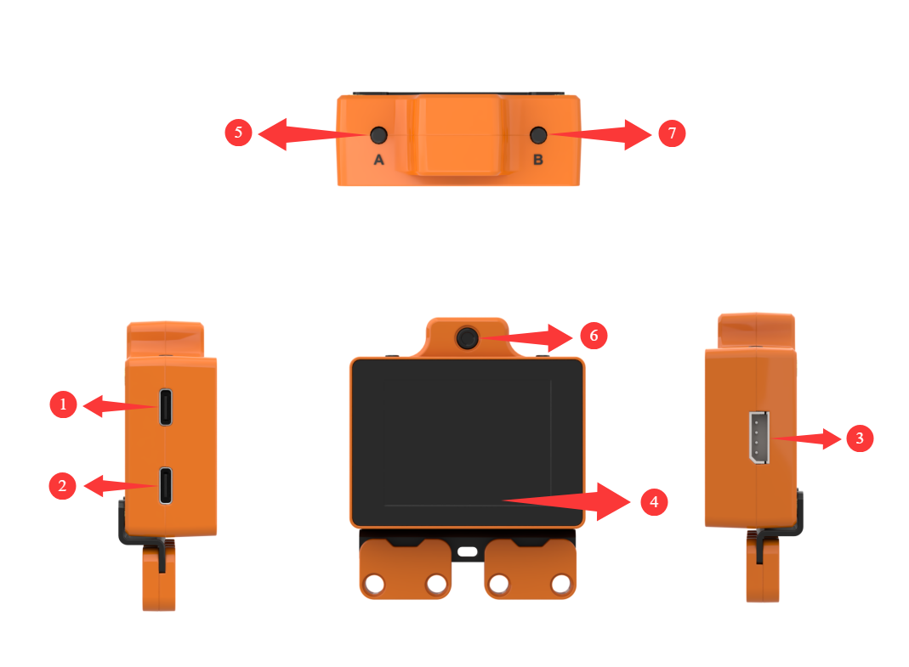

| No. | Description |
| :---: | :--- |
| 1 | Top Type-C port, used to flash firmware for the ESP32-S3 chip |
| 2 | Bottom Type-C port, used to flash voice recognition firmware for the CI1302 chip |
| 3 | 4-pin I2C communication port, which can be used for secondary development |
| 4 | Capacitive touch screen, used to display images and adjust the volume |
| 5 | Left button, used to switch between Expression and Chat modes |
| 6 | High-definition camera, which can capture real-time images |
| 7 | Right button, used for network configuration and interaction control |

#### 4. Important Notes

1. Use a 5V power supply. Otherwise, the module may be damaged.

2. Use the module in a quiet environment, as background noise will affect recognition performance.

3. Speak clearly and loudly at a moderate speed. It is recommended to stay within 5 meters of the module.

### 4.4.2 Network Connection and Configuration

#### 4.4.2.1 Module Network Connection

> [!NOTE]
>
> **Connecting the module to the network is required in three situations: 1. During initial use or after flashing the firmware, when no Wi-Fi credentials are saved in memory. 2. When no hotspot in the environment matches the saved Wi-Fi connection information, as described in [2.1.2 Module Network Configuration](https://wiki.hiwonder.com/projects/DaDablock-AI/en/standard-kit/docs/2_Quick_Start.html#module-network-configuration). 3. When manually entering network configuration mode by long-pressing the right button B.**

- **Manually Enter Network Configuration Mode**

1. The WonderLLM module supports manually entering network configuration mode to allow custom selection of hotspots for connection.

2. After powering on the module, long-press the **right button** to restart the module. The screen will turn off. Keep holding the button. Once the module restarts and begins trying to connect, a white circular loading bar will appear on the screen. The module will detect that the **right button** is still being held, stop matching saved hotspots, and enter network configuration mode. The button can now be released.

3. Existing Wi-Fi configurations will not be lost. The network can be configured via the page, or the **right button** can be short-pressed to exit network configuration mode.

4. After exiting network configuration mode, the module will continue to attempt to connect using the saved Wi-Fi configurations. If it cannot connect to any saved hotspot, it will re-enter network configuration mode.

- **Manage Saved Connection Configurations**

1. When the module is in network configuration mode, connecting to the module's hotspot and accessing the network configuration interface will display a list of all saved hotspot connections, if any were previously configured, as shown below:

2. Clicking the delete icon  next to any saved hotspot deletes it. Clicking the up arrow icon  raises its priority during network matching, with priority decreasing from top to bottom.

#### 2. Device Binding

> [!NOTE]
>
> **Two methods are available for device binding: 1. Quick binding, which is described in [2.1.3 Device Binding](https://wiki.hiwonder.com/projects/DaDablock-AI/en/standard-kit/docs/2_Quick_Start.html#device-binding). 2. Binding by creating a new AI agent.**

- **Bind by Creating a New Agent**

1. Open a browser and go to `hiwonder.ai`, or click the [WonderHUB AI Chatbot](https://hiwonder.ai/) link directly. Log in to the WonderHUB AI platform account. If no account exists, refer to [2.1.3 Device Binding](https://wiki.hiwonder.com/projects/DaDablock-AI/en/standard-kit/docs/2_Quick_Start.html#device-binding) to register.

2. Click **Agents** on the left menu to switch to the agents interface.

3. Click **Create Agent** to open the agent creation page.

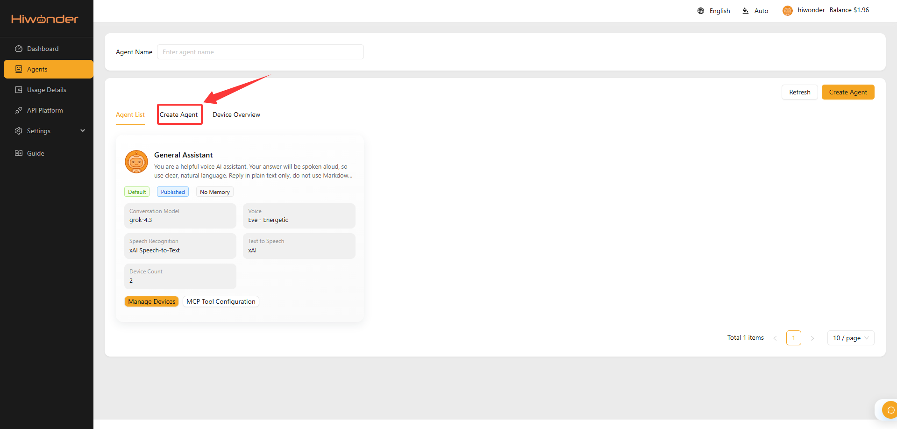

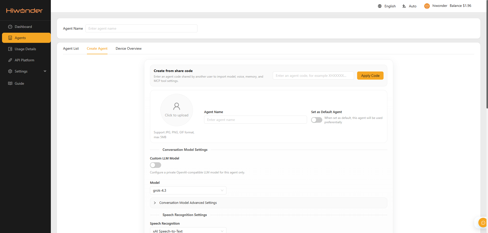

4. Agents created by others can be copied using role codes. Simply paste the role code into the input field and click **Apply Code**.

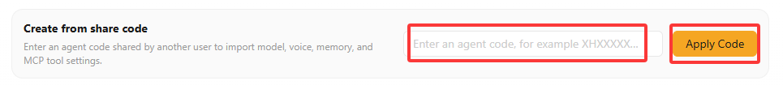

5. The agent's avatar can be customized. Set the agent's name to **Hiwonder**, matching the name of the wake word. Designate this agent as the default agent, as the device binds to the default agent by default.

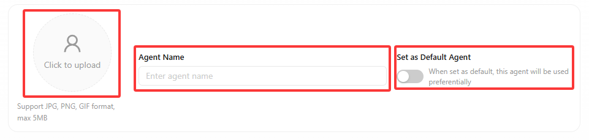

6. In the conversation model settings, it is recommended to select **grok-4.3** as the language model. Detailed parameters can be adjusted in the advanced settings, or the default settings can be kept.

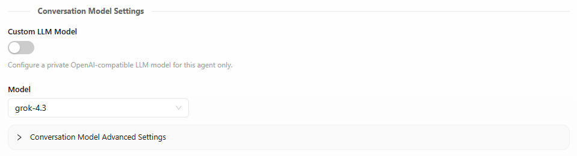

7. In the voice recognition settings, selecting **xAI Speech-to-Text** is recommended. Detailed working parameters can be adjusted in the advanced settings, or the default settings can be kept.

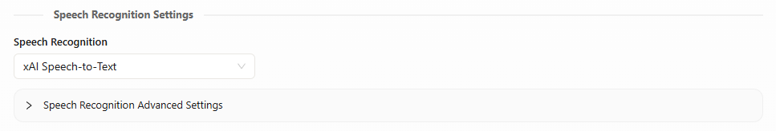

8. In the voice synthesis settings, select **xAI** and choose a preferred voice tone. Clicking the **Preview** button on the right is supported to preview and select a voice tone. Detailed parameters can be adjusted in the advanced settings, or the default settings can be kept.

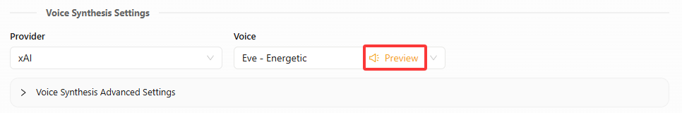

9. Select **No Memory** for the memory settings.

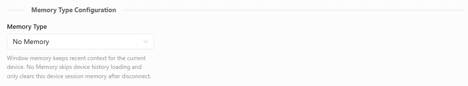

10. MCP tools are enabled by default. Keep the default settings here.

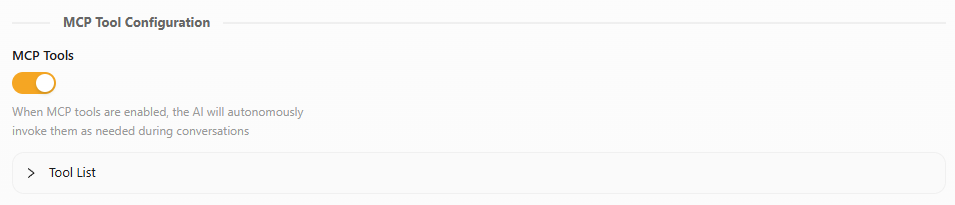

11. Select the **General Assistant** template under the agent prompts, and then click **Create Agent**.

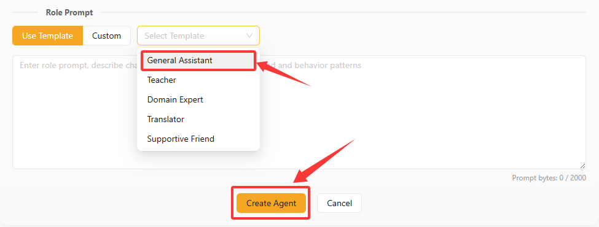

12. After creating the agent, return to the agent homepage and click **Manage Devices** under the newly created agent.

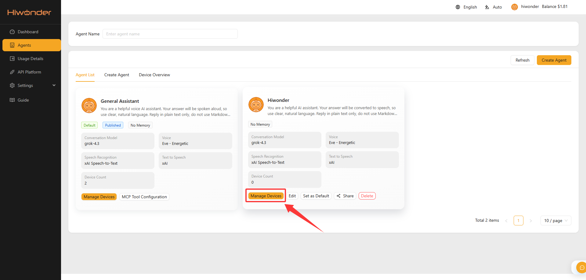

13. Enter the **6-digit device ID** displayed on the module screen into the binding code input field, and then click **Add Device**.

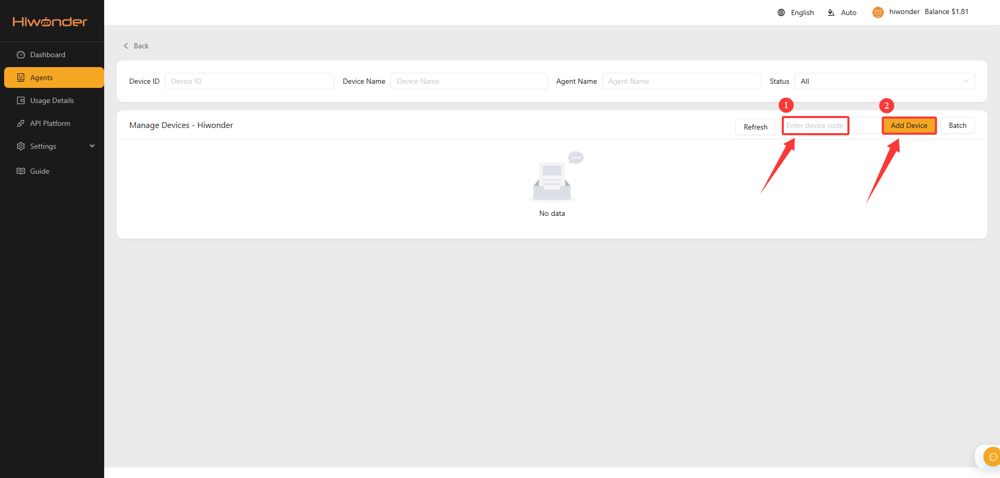

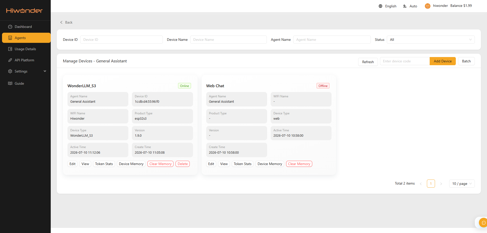

#### 3. Device Unbinding

> [!NOTE]
>
> **There are two methods for unbinding the device: platform unbinding and conversational unbinding.**

- **Platform Unbinding**

1. Once logged in, click **Agents**, then click **Device Overview**. Select the device to delete and click **Delete**.

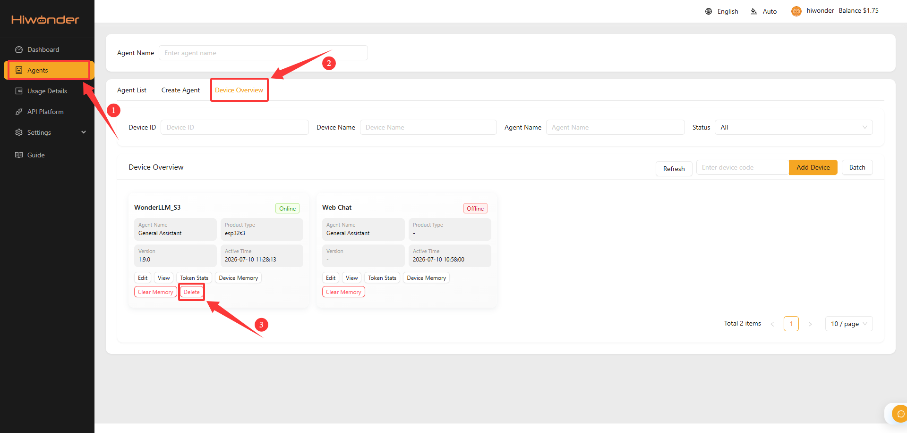

2. Click **Confirm** to delete and unbind the device.

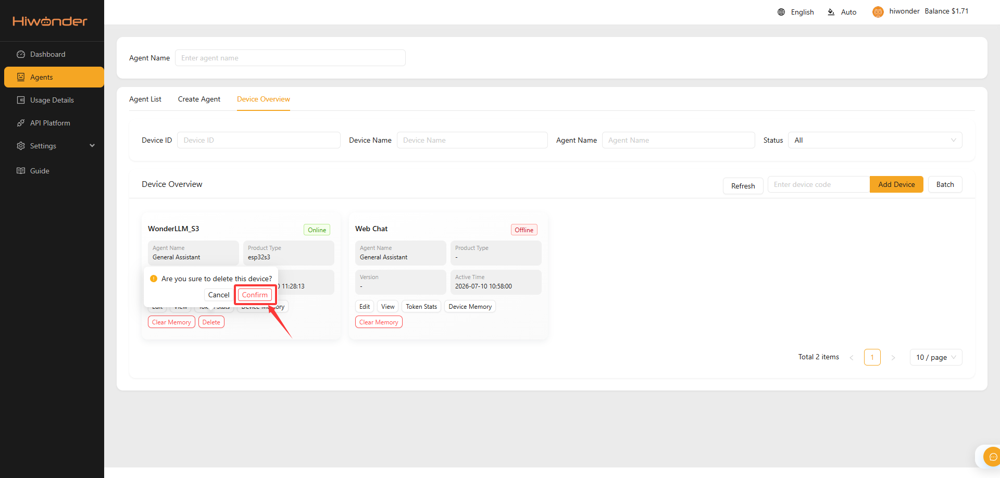

- **Conversational Unbinding**

Speak the command **Confirm delete device** to unbind the device.

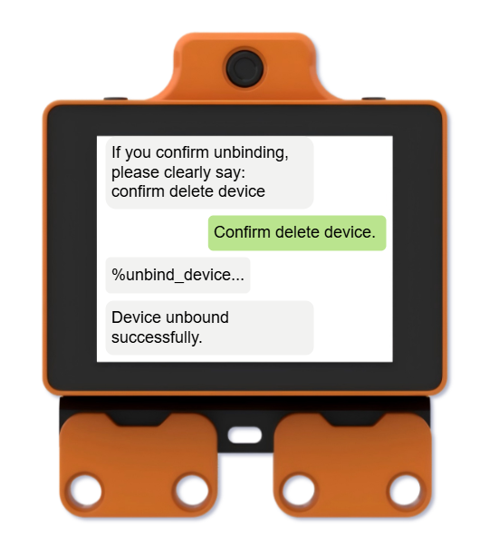

#### 4. Device Restart

1. The module supports manual restart after powering on. The module can be restarted without disconnecting power in two ways: by long-pressing the **left button**, or by long-pressing the **right button**.

2. Upon detecting the restart command from the long-press, the screen will turn off and the module will restart automatically. The button can be released once the screen turns off.

3. If restarting by long-pressing the **right button**, failing to release it in time may cause the module to enter network configuration mode. To avoid this, restarting the module by long-pressing the **left button** is recommended.

### 4.4.3 Volume Control

> [!NOTE]
>
> **Changing the volume while WonderLLM is speaking will take effect during the next voice output.**

#### 1. Screen Touch Control

1. After the module is powered on and connected to a hotspot, slide on the screen in either of these two interfaces to adjust the volume: ① Expression Mode interface, or ② Chat Mode interface.

2. Slide anywhere on the screen to adjust the volume. Swipe up to increase the volume, and swipe down to decrease it. The volume change depends on the swiping distance. Swiping multiple times is supported to reach the desired volume.

3. While swiping to adjust the volume, the current volume level is displayed at the top of the screen. The diagram below shows swiping up on the **Expression Mode interface** to increase the volume:

#### 2. Voice Interaction Control

1. During interaction, the volume can also be adjusted using voice commands.

2. Activate the module and enter the **Chat Mode interface** by speaking the wake word or short-pressing the **right button**. Voice commands can be used to: 1. Set the volume to a specific value from 0 to 100, or express it as a percentage. 2. Increase or decrease the volume using vague expressions where the module adjusts the volume automatically.

3. Once recognized, the system executes the volume adjustment automatically. The chat interface then displays and broadcasts a response generated by the large language model.

### 4.4.4 Chat Mode

#### 1. Mode Overview

1. In this mode, the module listens to voice input and generates appropriate replies.

2. The transitions between modes are shown in the diagram below. To enter Chat Mode from any other mode, speak the wake word or short-press the **right button**.

#### 2. Operating Instructions

1. After network configuration, the module first enters the Expression Mode interface, as shown below:

2. Wake up the module and enter Chat Mode by speaking the wake word **Hello Hiwonder** or short-pressing the right button, Button B. The buzzer will beep, the screen will switch to the **chat interface**, and the module will start listening.

3. If entering Chat Mode by **speaking the wake word**, the module automatically sends "Hello" to start the conversation once the wake word is recognized. The large language model will generate a greeting, display it in the chat interface, and broadcast it. The greeting can be interrupted to skip it quickly, as detailed in [4.4.8 Free Chat](#anther4.4.8). The module only starts listening for speech after the greeting finishes or is interrupted.

4. If entering Chat Mode by **short-pressing the right button**, the module **immediately starts listening** for speech.

5. During the interaction, the chat interface can be hidden, keeping the expression interface displayed continuously. For details, refer to the instructions in [4.4.5 Expression Mode](#anther4.4.5).

### 4.4.5 Expression Mode

> [!NOTE]
>
> * **If no voice interaction occurs within 20 seconds on the expression interface, the module enters Clock Mode. Tapping anywhere on the screen returns it to Expression Mode.**
>
> * **Switching modes changes the screen display style during Chat Mode.**
>
> * **Short-pressing the left button to switch display modes does not wake up the module or start a conversation. To chat, the module must be woken up.**
>
> * **If the display style is set to Chat Mode to show text, waking up the module displays the text chat interface and the typed responses from the large language model.**
>
> * **If the display style is set to Expression Mode, the module remains on the expression interface during the conversation and shows facial expressions corresponding to the voice response.**

#### 1. Mode Overview

1. In this mode, the module displays various facial expressions.

2. The transitions between modes are shown in the diagram below. To enter Expression Mode: 1. In **Clock Mode**, tap the screen. 2. In **Camera Mode**, double-tap the screen. 3. In **Chat Mode** , when the module is not speaking,, short-press the **right button**.

#### 2. Operating Instructions

1. In Expression Mode, short-press the **left button** to switch the Chat Mode display style between **Chat Mode** showing text and **Expression Mode** showing facial expressions. The current selection is displayed at the top of the screen.

2. When the display style is set to Expression Mode, the module will show expressions matching the conversation. There are two ways to trigger expressions: 1. Describe a situation, and the AI will automatically react with a matching expression. 2. Directly command the module to show a specific expression, such as "Make a happy face".

### 4.4.6 Clock Mode

> [!NOTE]
>
> **In Clock Mode, tapping anywhere on the screen returns the module to Expression Mode. Waking up the module by speaking the wake word or short-pressing the right button is also supported.**

#### 1. Mode Overview

1. In this mode, the module displays real-time weather and time information based on the configured city.

2. The transitions between modes are shown in the diagram below. To enter Clock Mode, remain idle for 20 seconds or tap the screen while in Expression Mode. Direct transitions from **Camera Mode** or **Chat Mode** to Clock Mode are **not supported**.

#### 2. Operating Instructions

1. Remaining idle for 20 seconds or tapping the screen in Expression Mode switches the module to Clock Mode.

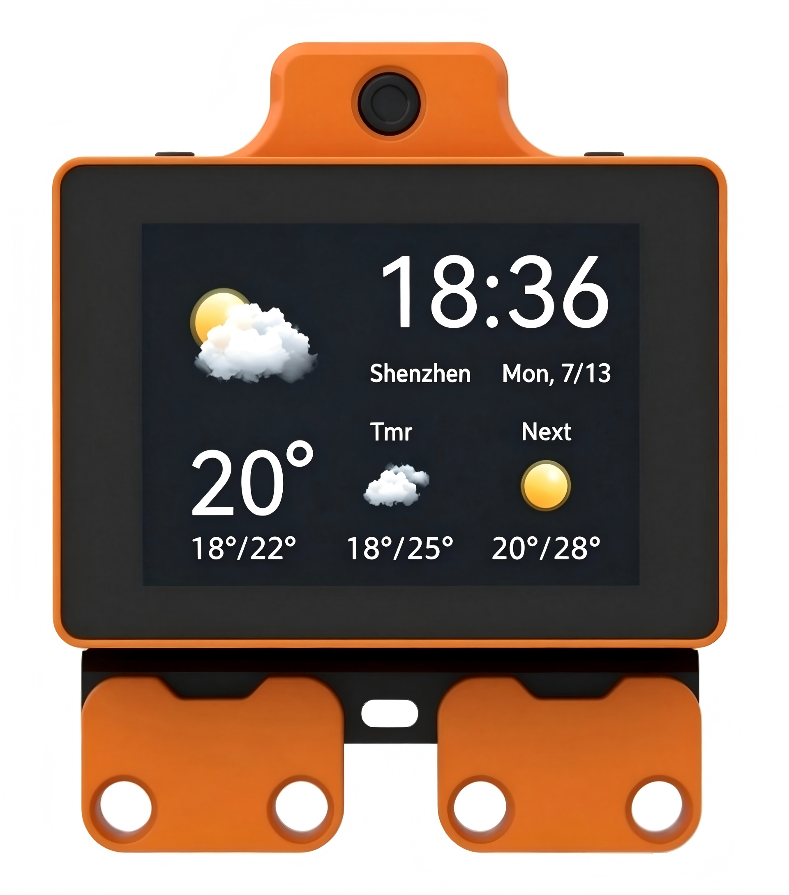

2. Once in Clock Mode, the module remains in this mode until another action is taken.

3. In this mode, the screen displays: ① Real-time weather and a 2-day forecast, ② Current date and time, and ③ The configured city.

4. Modifying the weather location is supported. Wake up the module and say: 1. "Change the city", and the AI will ask to specify a city in the subsequent conversation. 2. "Switch the city to [City Name]". The location for Clock Mode will update once the module responds.

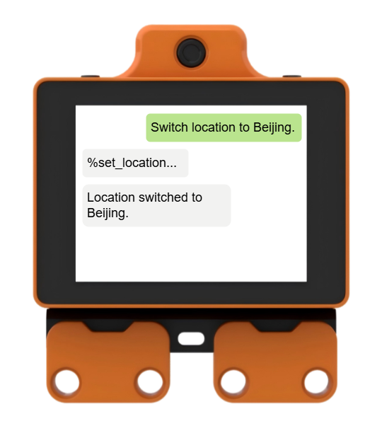

### 4.4.7 Camera Mode

#### 1. Mode Overview

1. In this mode, the module uses the camera to capture and display real-time images continuously.

2. The transitions between modes are shown in the diagram below. To enter Camera Mode, double-tap the screen while in Expression Mode. Direct switching to Camera Mode from **Clock Mode** or **Chat Mode** is **not supported**.

#### 2. Operating Instructions

1. Double-tapping the screen in **Expression Mode** switches the module to Camera Mode.

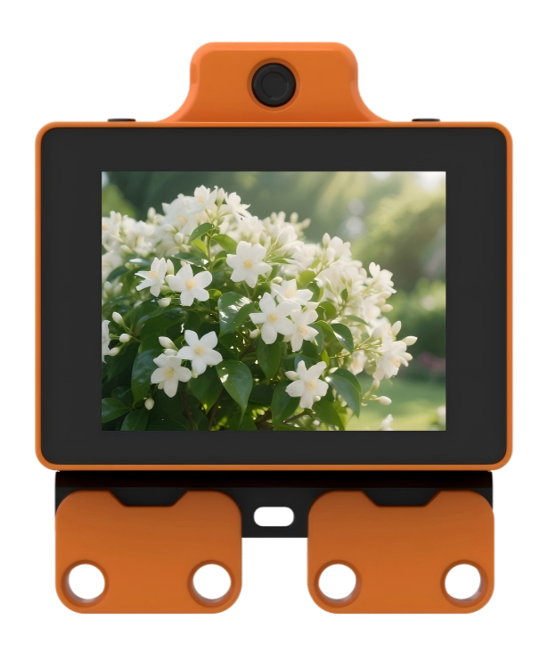

2. In Camera Mode, the module continuously captures and displays real-time images. The module remains in this mode until another action is taken.

3. In Camera Mode, tap anywhere on the screen to trigger the scene understanding function, as detailed in [4.4.9 Scene Understanding](#anther4.4.9).

### 4.4.8 Free Chat

#### 1. General Operating Instructions

1. After the module is powered on and the network configuration is complete, wake it up to enter Chat Mode by **speaking the wake word or short-pressing the right button**.

2. The module supports natural language input. It understands and responds with text and voice by communicating with the cloud large language model. The module also features memory and supports multi-round continuous conversations.

3. After each round of interaction, including after waking up the module, the module continues to listen. If no speech is recognized within 1 minute, the module automatically stops listening, and the AI displays and broadcasts a farewell response. To continue the interaction, wake up the module again by **speaking the wake word or short-pressing the right button**.

4. Actively ending the conversation is supported by saying: 1. **Goodbye**, or 2. **Okay, that's all for now**. The module will stop listening after responding with a farewell.

5. The WonderLLM module supports voice interruption. When the module is speaking, whether replying, greeting, or saying goodbye, short-press the **right button** to immediately end the current response and start listening for the next input.

6. The WonderLLM module supports bilingual recognition and speech. The module's working language can be switched by saying: **Can you speak English?**, or asking the module to communicate in English in custom words.

#### 2. Special Function Invocation

The module features built-in functions that can be triggered by voice commands during conversations. To query all supported functions, the following can be asked: 1. "What can you do?", or 2. "Introduce your functions." The table below lists the currently supported functions:

| No. | Function | No. | Function |
| :---: | :--- | :---: | :--- |
| 1 | Weather inquiry | 4 | Joke telling |
| 2 | News broadcast | 5 | Music playback |
| 3 | Dressing advice |  |  |

For details on how to call the corresponding special functions, refer to [2.1.4 Smart Chat](https://wiki.hiwonder.com/projects/DaDablock-AI/en/standard-kit/docs/2_Quick_Start.html#smart-chat).

### 4.4.9 Scene Understanding

> [!NOTE]
>
> * **The scene understanding function does not support continuous observation. The module only captures and analyzes a single image when the function is triggered.**
>
> * **In Camera Mode, double-tap the screen to return to the Expression Mode interface.**
>
> * **Before the function is triggered in Camera Mode, the module only displays the real-time camera feed without sending any image to the large language model for analysis.**

#### 1. Voice Interaction Control

1. After powering on the module, enter the Expression Mode interface. Speak the wake word or short-press the **right button** to activate the module and open the chat interface.

Command references are listed below: 1. **Describe what is in front of you**, or 2. **Take a photo**.

2. Upon receiving the command, the camera captures a real-time image and displays it briefly on the screen for confirmation. The system automatically handles the image capture, and then the chat interface displays and broadcasts the AI's analysis of the image.

#### 2. Screen Touch Trigger

1. Double-tapping the screen in **Expression Mode** switches the module to Camera Mode, displaying the real-time camera feed.

2. In Camera Mode, tapping the screen captures an image, displays it briefly, and then returns to the camera feed. The module will automatically broadcast the AI's analysis of the captured image.

### 4.4.10 Firmware Update

#### 1. ESP32-S3 Firmware Flashing

1. Connect the top Type-C port of the WonderLLM module to the computer using a USB cable.

2. Open the file **flash_download_tool_3.9.7.exe** in the folder **[Appendix/2. WonderLLM Related Files/WonderLLM Flashing Tool/ESP32-S3 Firmware Flashing Tool/flash_download_tool_3.9.7](https://drive.google.com/drive/folders/1VT4wKRY0sFAQrTcgnuTOps3clNoc88w1?usp=sharing)**.

3. Select **ESP32-S3** as the **Chip Type**, leave other settings as default, and click **OK**.

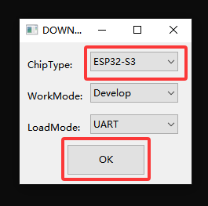

4. Once the tool opens, click **...** to select the firmware bin file to flash. Choose **WonderLLM_S3_V1.9.0_EN.bin** from the folder **[Appendix/2. WonderLLM Related Files/WonderLLM Firmware File/Online](https://drive.google.com/drive/folders/1GhlY747Im35TiNxDImEB4xVlcXIDP1lX?usp=sharing)**.

5. Check the box on the left, configure the other settings as shown in the diagram below, and select the COM port occupied by the module. 

> [!NOTE]
>
> **If the module does not work properly after flashing the firmware with SPI MODE set to DIO, try setting SPI MODE to DOUT and flashing it again.**

6. Click **ERASE** first to erase the existing firmware, which is a mandatory step, and wait for the status bar to display **FINISH**.

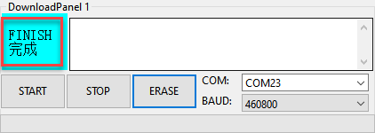

7. Click **START** to flash the selected firmware, and wait for the progress bar to complete.

#### 2. CI1302 Firmware Flashing

1. Connect the bottom Type-C port of the WonderLLM module to the computer using a USB cable.

2. Open the file **PACK_UPDATE_TOOL.exe** in the folder **[Appendix/2. WonderLLM Related Files/WonderLLM Flashing Tool/CI1302 Firmware Flashing Tool](https://drive.google.com/drive/folders/1J_IZBq0eLWigoezojcnE9XaKbCIOjJLI?usp=sharing)**.

3. Select the **CI1302** chip and click **Upgrade**.

4. Click **Select firmware** and choose **CI1302-EN.bin** from the folder **[Appendix/2. WonderLLM Related Files/WonderLLM Firmware File/Online](https://drive.google.com/drive/folders/1GhlY747Im35TiNxDImEB4xVlcXIDP1lX?usp=sharing)**.

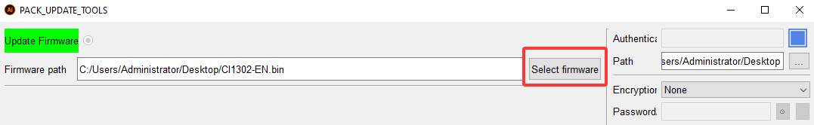

5. Find the corresponding COM port and click to select it.

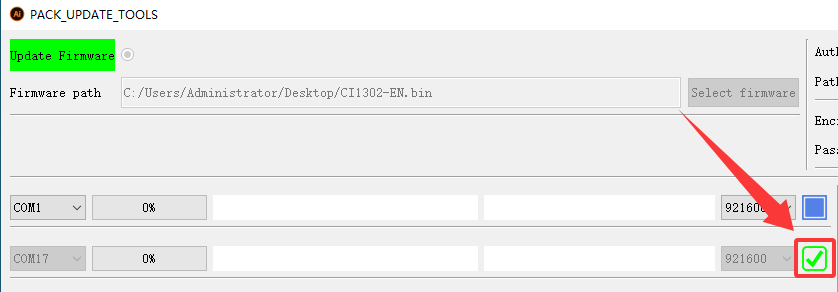

6. Press and hold both the left and right buttons on the WonderLLM module simultaneously to start flashing, and wait for it to complete successfully.

## 4.5 WonderLLM Offline Version

### 4.5.1 Firmware Update

#### 1. ESP32-S3 Firmware Flashing

1. Connect the top Type-C port of the WonderLLM module to the computer using a USB cable.

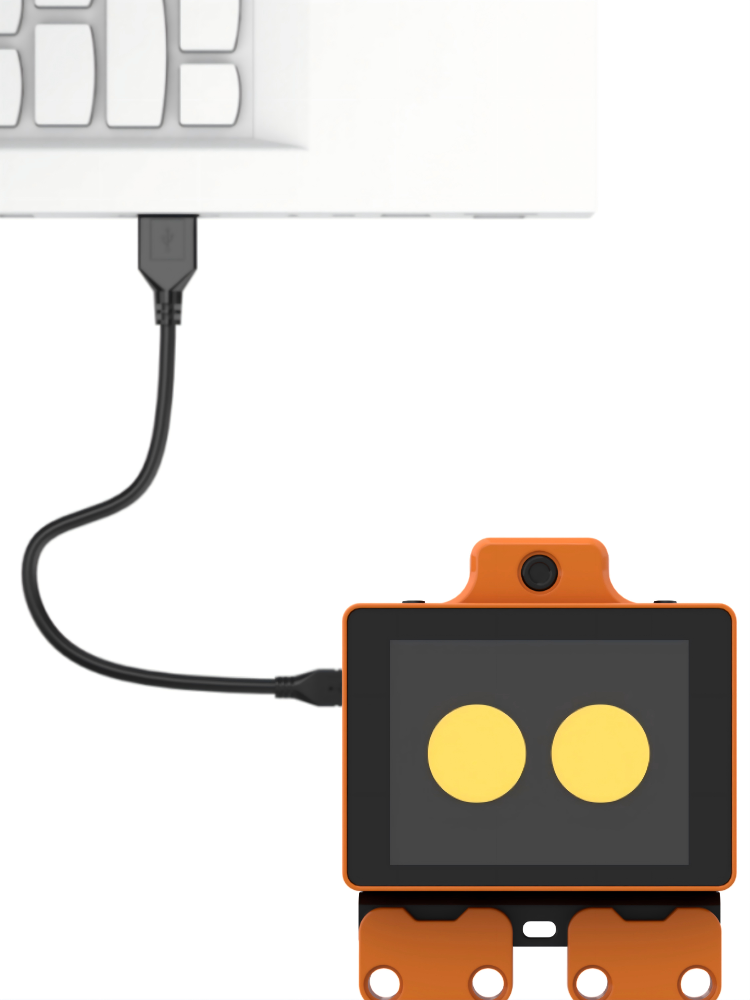

2. Open the file **flash_download_tool_3.9.7.exe** in the folder **[Appendix/2. WonderLLM Related Files/WonderLLM Flashing Tool/ESP32-S3 Firmware Flashing Tool](https://drive.google.com/drive/folders/1VT4wKRY0sFAQrTcgnuTOps3clNoc88w1?usp=sharing)**.

3. Select **ESP32-S3** as the **Chip Type**, leave other settings as default, and click **OK**.

4. Once the tool opens, click **...** to select the firmware bin file. Choose **WonderLLM_Echo_K12.bin** from the folder **[Appendix/2. WonderLLM Related Files/WonderLLM Firmware File/Offline](https://drive.google.com/drive/folders/1aP3l_tDYIrCMCrs51QaVBYc_gvaAIAeg?usp=sharing)**.

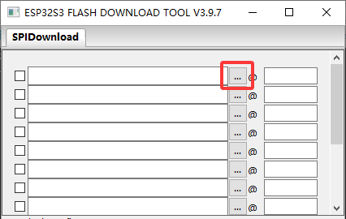

5. Check the box on the left, configure the other settings as shown in the diagram below, and select the COM port occupied by the module. 

> [!NOTE]
>
> **If the module does not work properly after flashing the firmware with SPI MODE set to DIO as shown in the diagram below, try setting SPI MODE to DOUT and flash again.**

6. Click **ERASE** first to erase the existing firmware, which is a mandatory step, and wait for the status bar to display **FINISH**.

7. Click **START** to flash the selected firmware, and wait for the progress bar to complete.

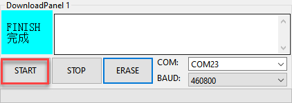

#### 2. CI1302 Firmware Flashing

1. Connect the bottom Type-C port of the WonderLLM module to the computer using a USB cable.

2. Open the file **PACK_UPDATE_TOOL.exe** in the folder **[Appendix/2. WonderLLM Related Files/WonderLLM Flashing Tool/CI1302 Firmware Flashing Tool](https://drive.google.com/drive/folders/1J_IZBq0eLWigoezojcnE9XaKbCIOjJLI?usp=sharing)**.

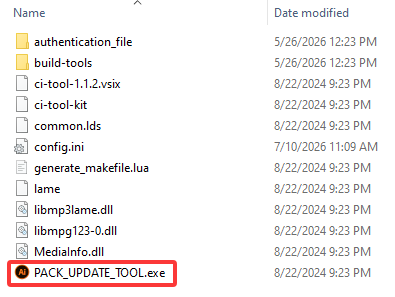

3. Select the **CI1302** chip and click **Upgrade**.

4. Click **Select firmware** and choose **CI1302_Echo_K12.bin** from the folder **[Appendix/2. WonderLLM Related Files/WonderLLM Firmware File/Offline](https://drive.google.com/drive/folders/1aP3l_tDYIrCMCrs51QaVBYc_gvaAIAeg?usp=sharing)**.

5. Find the corresponding COM port and select it.

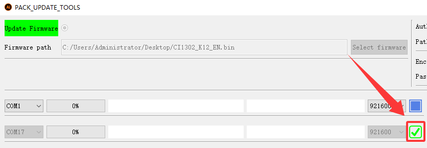

6. Press and hold both the left and right buttons on the WonderLLM module simultaneously to start flashing, and wait for it to complete successfully.

### 4.5.2 Voice Interaction Mode

1. After updating both firmwares to the offline version, the module first enters the **Standby** state.

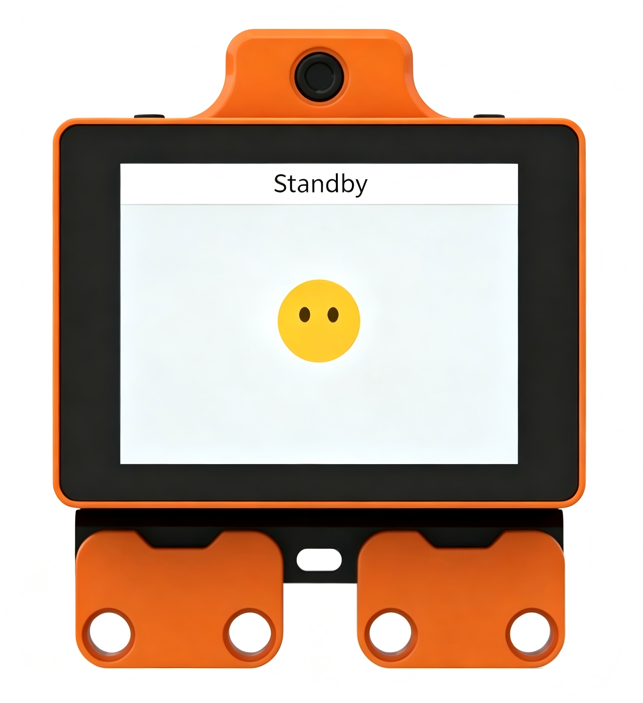

2. In any mode, long-press the **right button** to enter Voice Interaction Mode.

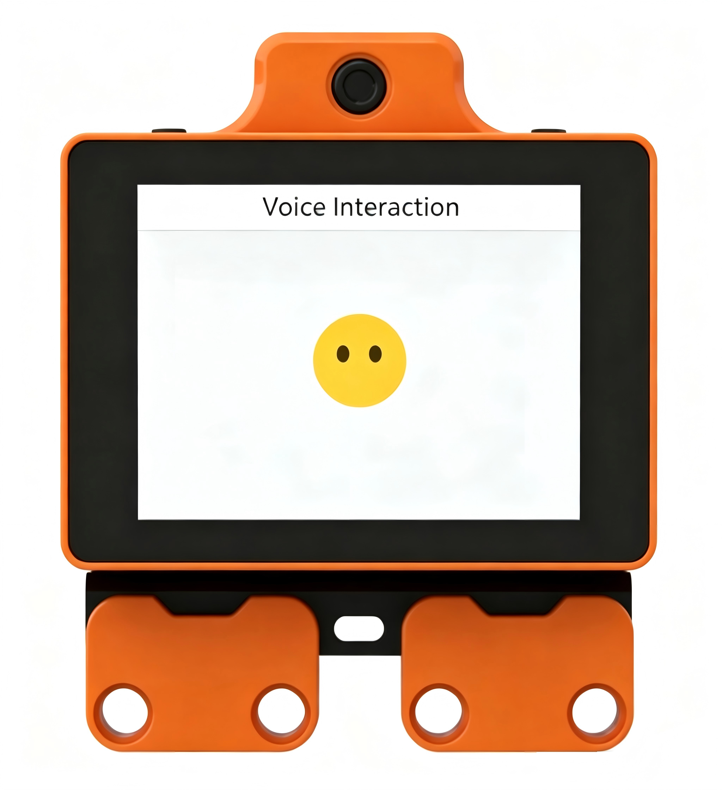

3. Speak the wake word **Hello Hiwonder** to enter **Voice Interaction Mode**. The module will reply, **I'm here**.

4. After entering **Voice Interaction Mode**, the module responds with corresponding actions or responses based on voice commands. Common commands are listed below, and more can be found in the appendix.

| Command ID | Command Word | Broadcast Phrase |
| :---: | :--- | :--- |
| / | HELLO-HI-WONDER | I'm here |
| / | TURN-UP-VOLUME | Volume increase |
| / | TURN-DOWN-VOLUME | Volume decrease |
| / | MAXIMUM-VOLUME | Maximum volume |
| / | MEDIUM-VOLUME | Medium volume |
| / | MINIMUM-VOLUME | Minimum volume |
| 26 | Hello | Hi |
| 27 | INTRODUCE-YOURSELF | Hello, I'm Hiwonder, and I can talk and dance. |
| 15 | WELCOME-YOU | Hello, welcome! |
| 1 | GO-STRAIGHT | Going straight |
| 2 | GO-BACKWARD | Going backward |
| 3 | TURN-LEFT | Turning left |
| 4 | TURN-RIGHT | Turning right |
| 9 | Stop | Copy that |
| 13 | SPEED-UP | Copy that |
| 14 | SLOW-DOWN | Copy that |
| 186 | MOVE-LEFT | Moving to the left |
| 187 | MOVE-RIGHT | Moving to the right |
| 18 | TURN-ON-THE-LIGHT | Turn on the light |
| 19 | TURN-OFF-THE-LIGHT | Turn off the light |
| 39 | GIVE-A-RED-LIGHT | Copy that |
| 40 | GIVE-A-GREEN-LIGHT | Copy that |
| 41 | GIVE-A-BLUE-LIGHT | Copy that |
| 20 | OPEN-THE-DOOR | The door is open |
| 21 | CLOSE-THE-DOOR | The door is closed |
| 24 | UNFOLD-THE-AIRING-RACK | Copy that |
| 25 | FOLD-THE-AIRING-RACK | Copy that |
| 36 | TURN-ON-THE-FAN | Copy that |
| 37 | TURN-OFF-THE-FAN | Copy that |
| 38 | ROTATING-STEERING-GEAR | Copy that |
| 181 | SHOW-HAPPY-EXPRESSION | Copy that |
| 182 | SHOW-SAD-EXPRESSION | Copy that |
| 183 | SHOW-HELPLESS-EXPRESSION | Copy that |
| 184 | SHOW-EXPECTED-EXPRESSION | Copy that |

5. After each round of interaction, including after waking up the module, the module continues to listen. If no speech is recognized within 1 minute, the module automatically stops listening and switches to the standby/sleep interface. To resume, wake up the module again by **speaking the wake word**.

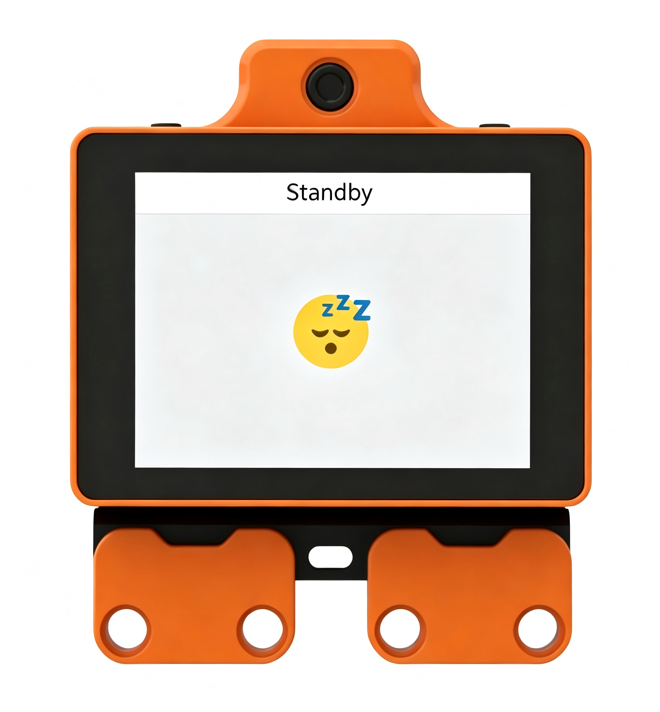

### 4.5.3 Face Recognition Mode

In any mode, long-press the **right button** to enter Face Recognition mode.

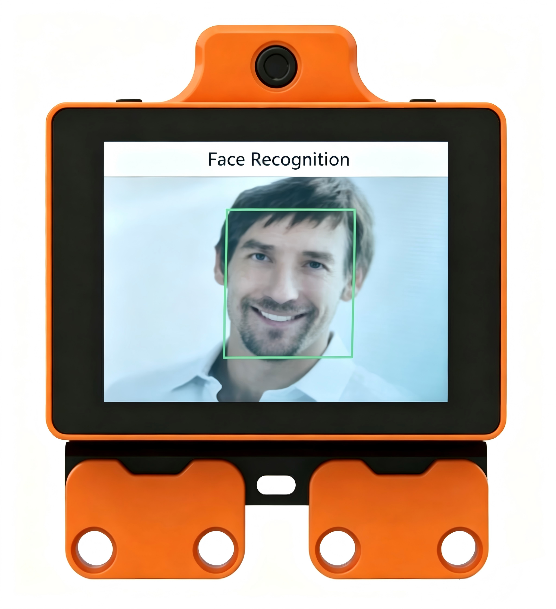

### 4.5.4 Color Recognition Mode

In any mode, short-press the **left button** to enter Color Recognition mode.

The color IDs correspond to the colors as follows:

| Color ID | Color |
| :---: | :---: |
| 1 | Red |
| 2 | Orange |
| 3 | Green |
| 4 | Blue |
| 5 | Black |
