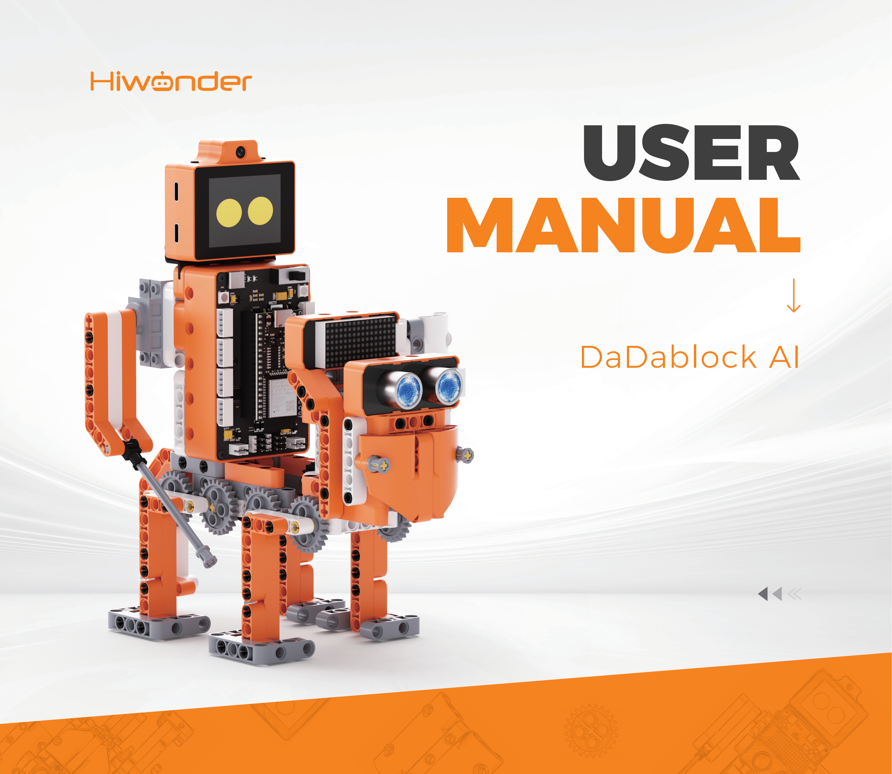
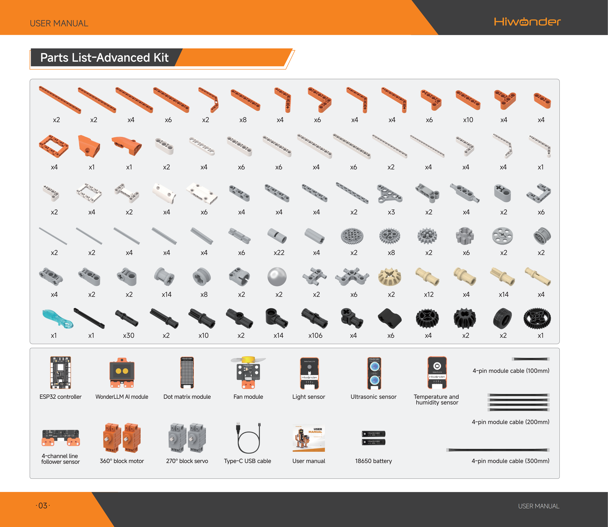

# 1. Product Introduction

## 1.1 Product Introduction

DaDablock AI is a versatile, large AI model building block kit specially designed for teenagers. Powered by the large AI model module, this kit features a brain and a rich selection of electronic modules. It instantly provides building blocks with eyes to recognize colors, remember faces, and follow lines flexibly. It also features ears and a mouth to understand instructions and engage in natural conversations, making it easy to master AI!

## 1.2 Packing List

## 1.3 Disclaimer

- The products described in this manual, including hardware and software, are provided on an **as-is** basis. Every effort has been made to ensure the accuracy of the content at the time of writing, but the manual may still contain errors or omissions. The tutorials are reviewed regularly, and suggestions for improvement are welcome.
- Product content may change as product versions are updated. Contact customer service when ordering to obtain the latest product information.
- In addition, unless Hiwonder explicitly states that the product is intended for a specific use, no liability is assumed for losses caused by malfunction or damage when the product is used under extreme conditions.
