# 2. Quick Start

## 2.1 Large Language Model Interaction

> [!NOTE]
>
> **This section introduces the WonderLLM module for a quick start. Since there are various ways to play with this module, refer to [Section 4.4 WonderLLM Module](https://wiki.hiwonder.com/projects/DaDablock-AI/en/ultimate-kit/docs/4_Software_and_Hardware_Guide.html#wonderllm-module) for detailed learning.**

### 2.1.1 Powering On the Device

- The module supports the following ports for power supply: **① Upper Type-C port**, **② Lower Type-C port**, and **③ 4-PIN I2C communication interface**. Connect an external power supply to any of these ports to automatically power on the module.

- After powering on the module, the screen displays the **Wi-Fi name** and the **web configuration URL**, accompanied by a voice broadcast. Complete the network configuration for the module before starting the following sections.

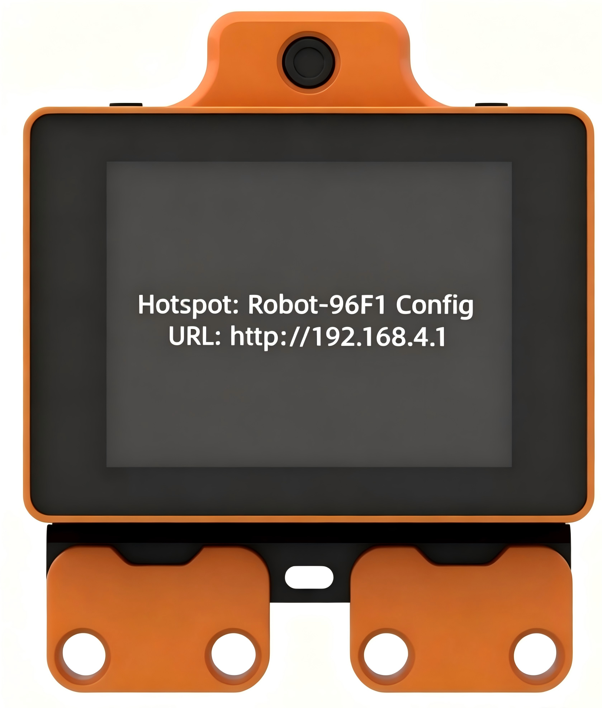

### 2.1.2 Module Network Configuration

After powering on, the module starts the network connection process. The screen displays the **device hotspot name** and the **access URL**, accompanied by a voice broadcast. The AI module will enable its own hotspot for connection and configuration. Hotspot names vary by device, following the format **Robot-xxxx**. This section uses the hotspot **Robot-B7B9** as an example.

1. Search for and connect to the corresponding hotspot using a computer or smartphone. Note that this hotspot does not require a password.

2. Open any browser and go to the following URL: [http://192.168.4.1](http://192.168.4.1). Alternatively, click the [<u>Network Configuration</u>](http://192.168.4.1/) hyperlink for direct access.

3. Enter the name of the hotspot to which the module should automatically connect upon power-on in field ①, and enter the hotspot password in field ②. Finally, click **Connect** in field ③. The module will attempt to search for and connect to a matching hotspot in the current environment using the provided network credentials.

4. The interface displays a list of available hotspots in the current environment scanned by the module. Click an item to automatically populate field ① with the corresponding hotspot name for a faster and more convenient setup.

5. If the following prompt appears on the interface, it indicates that the hotspot cannot be found in the current environment or the connection password is incorrect. Enter the credentials again.

6. If the following prompt appears, it indicates that the module has successfully found and connected to the corresponding hotspot. The module will automatically restart and connect to the hotspot.

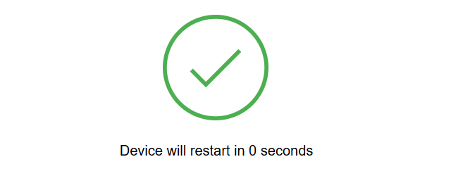

After the module completes network configuration, it must be bound to the platform agent. The screen displays the device ID and the binding URL while playing a voice broadcast of the verification code. Refer to the next section for detailed information to complete the device binding, noting that the **XXXXXX** at the end of the binding URL represents the device ID.

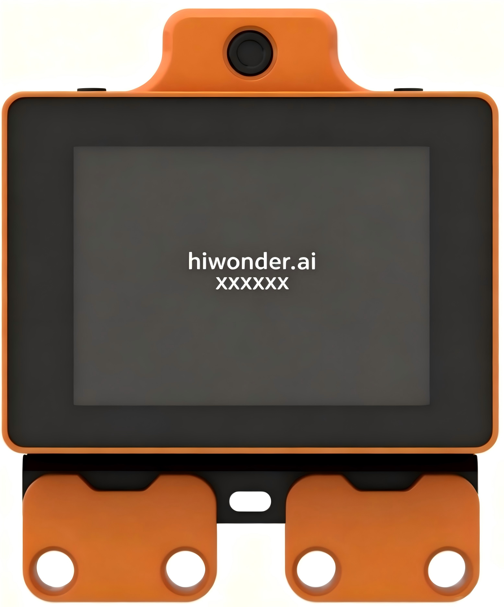

### 2.1.3 Device Binding

> [!NOTE]
>
> **An account on the WonderHUB AI platform is required before binding the device. If an account does not exist, follow the steps below to register.**

**1. WonderHUB AI Account Registration**

1. Open any browser and enter the following URL: **hiwonder.ai**. Alternatively, click the [<u>WonderHUB AI Chatbot</u>](https://hiwonder.ai/) hyperlink for direct access.

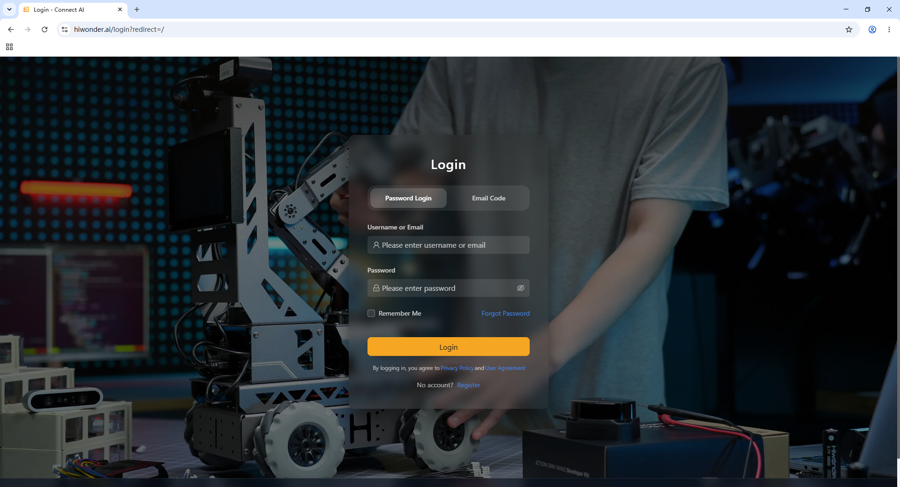

2. To register a WonderHUB AI account, click **Register** in the bottom right corner.

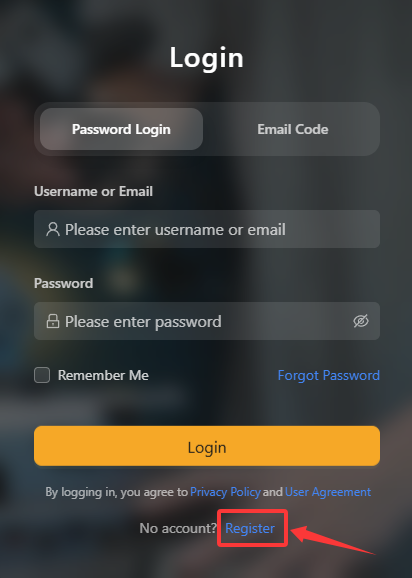

3. Fill in the required information and click **Send Verification Code** to obtain the registration verification code, then register the account.

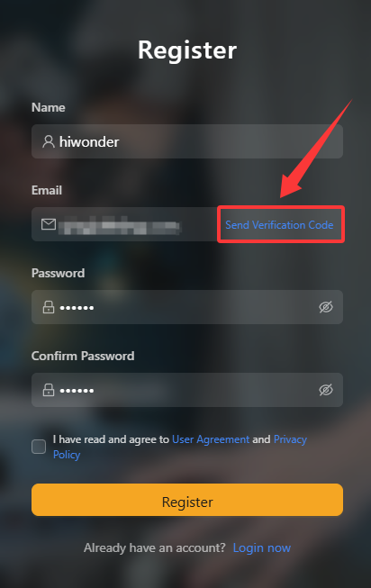

4. Check the box to agree to the user agreement and privacy policy, and then click **Register** to complete the registration.

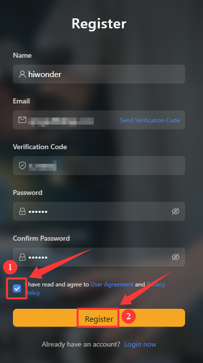

5. After logging into the newly registered account, a beginner's guide will appear. Follow this guide to quickly become familiar with the WonderHUB AI platform.

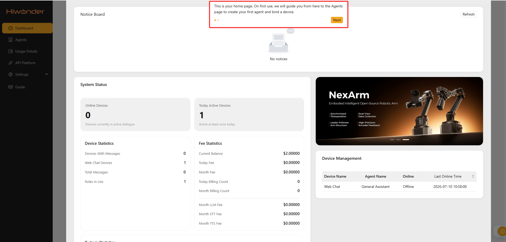

**2. Quick Binding**

1. Click **Agents** on the left menu to switch to the agents interface.

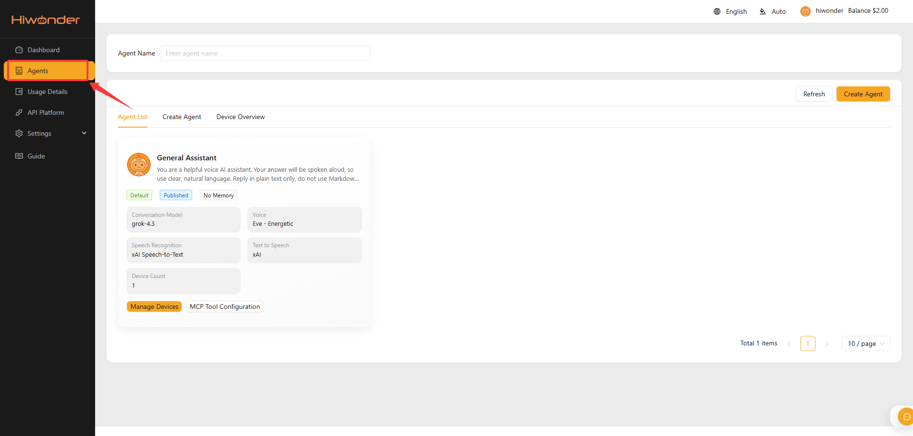

2. Click **Manage Devices** under the default agent **General Assistant**.

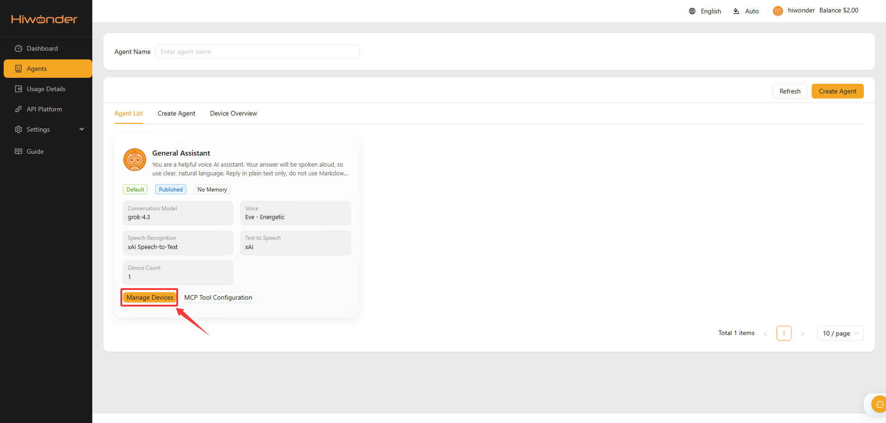

3. Enter the **6-digit device code** displayed on the module screen into the input field for the device binding code, and click **Add Device** to complete the binding.

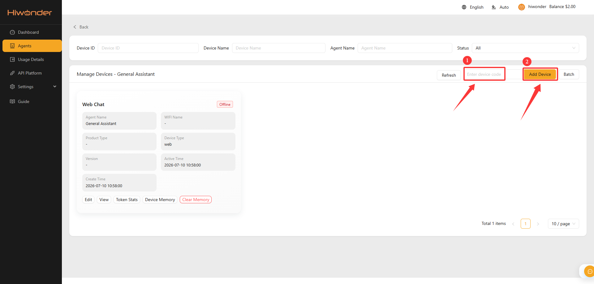

4. If a white circular loading bar appears on the module screen after binding, it indicates that the module is connecting to the network using the stored Wi-Fi credentials. If the network connection fails, the screen will display the device hotspot name and the access URL, accompanied by a voice broadcast. In this case, follow the instructions in [Section 2.1.2 Module Network Configuration](#anther2.1.2) to reconfigure the Wi-Fi settings for the current environment.

5. If the white circular loading bar finishes loading and the screen successfully switches to the module expression interface, it indicates that all configurations are correct. The module is ready to start human-robot interaction.

### 2.1.4 Smart Chat

After completing the preparation steps, awaken the module to enter chat mode by saying the wake word **Hello Hiwonder** or briefly pressing the **right button**.

The module features built-in special functions that can be triggered through spoken commands during human-robot interaction. Refer to the following command examples to query all currently supported special functions of the WonderLLM module: **① How can you help me?** or **② Could you give me an overview of your capabilities?**

Refer to the following command examples to trigger specific functions of the WonderLLM module:

1. Weather query function: **Check the weather in [Region].**

2. News broadcast function: **① Broadcast today's news.** or **② Introduce today's trending events.**

3. Outfit suggestions function: **Suggest outfit combinations for going out today.**

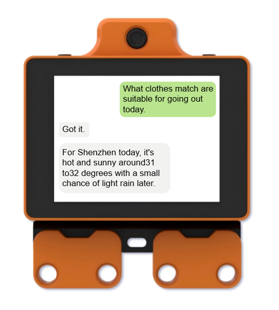

4. Joke-telling function: **① Tell a joke.** or **② Share a funny joke.**

5. Music playback function: **Play some music on shuffle.** 

> [!NOTE]
>
> **It is recommended to lower the volume of the module when using the music playback function.**

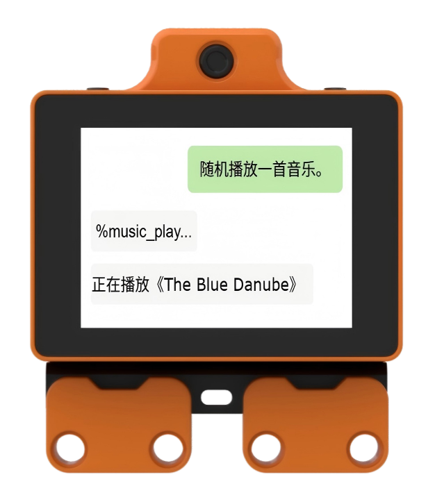

## 2.2 Hardware Preparation

### 2.2.1 Powering On

1. Insert the battery into the slot at the bottom of the controller.

> [!NOTE]
>
> **Do not reverse the positive and negative poles.**

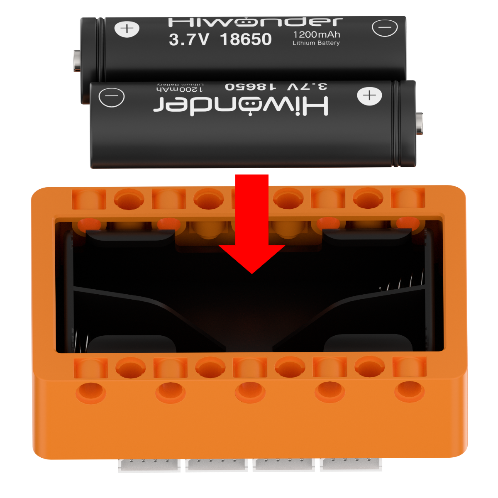

2. Turn on the power switch. The power indicator LED on the controller lights red, indicating a successful power-on.

> [!NOTE]
>
> **When powering on for the first time, follow the steps in [Section 2.2.2 Charging](#p2-2-2) to charge the controller for about 5 seconds to activate the built-in battery protection chip. Once activated, reactivation is not required unless the battery is unplugged.**

### 2.2.2 Charging

1. Ensure that the power switch of the controller is toggled to **OFF**. Connect one end of the USB cable to the charging port of the controller, and the other end to the charger.

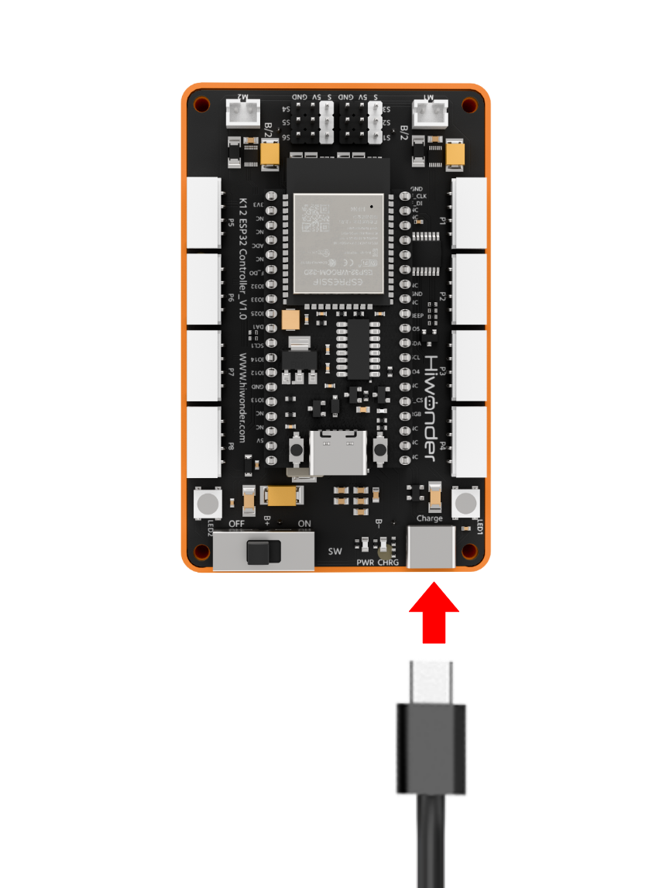

2. The indicator LED on the controller lights up in blue during charging and turns off when fully charged. Unplug the power cable promptly after charging is complete to avoid overcharging.

> [!NOTE]
>
> **The power switch must be turned off during charging. Otherwise, the battery cannot be fully charged. Unplug the charger and the power source promptly after charging is complete to prevent overcharging from damaging the battery. Do not leave the charging process unattended.**

## 2.3 Software Configuration

### 2.3.1 Installing WonderCode Programming Software

1. Open the [WonderCode setup.exe](https://www.hiwonder.net/pc-programming-software) software installation package.

2. Select the language, and then click **OK**.

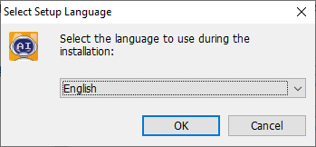

3. Select the installation directory, and then click **Next**.

4. Click **Next**.

5. Click **Install**.

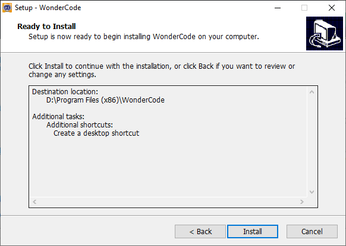

6. After a successful installation, click **Finish**.

## 2.4 Starter Project 1: Blinking Onboard RGB Lights

### 2.4.1 Programming

1. Create a file: Open the programming software, and click **File** -> **New**.

2. Add extensions:
- Click the extensions icon in the bottom left corner.

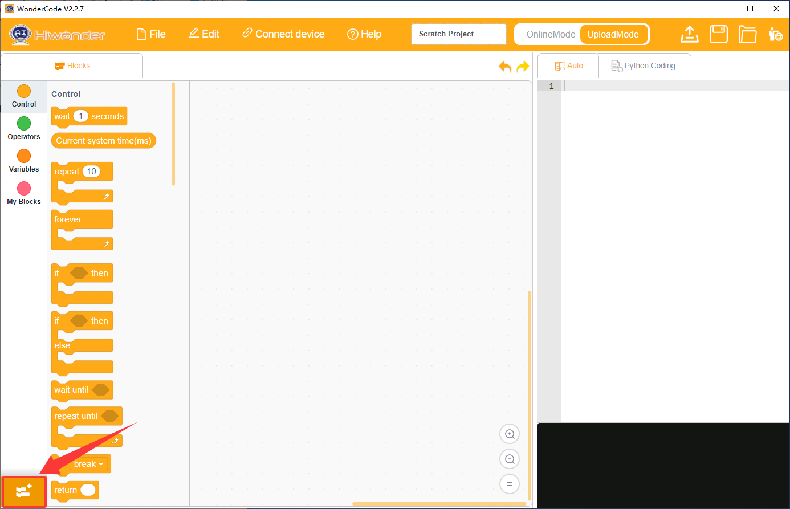

- In the **Choose an Extension** menu, select **Controller** and then add **K12 ESP32**.

- Once successfully added, the added extension package is visible on the WonderCode interface.

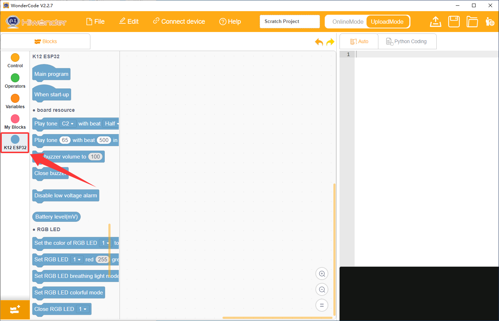

3. Write the program: Drag the corresponding blocks from the block palette to the scripting area for programming. Once completed, the translated Python code is visible in the code display and upload area.

The source files are available for download as a zip archive under [1. Source Code / 03 Program Files for Starter Projects](https://drive.google.com/drive/folders/1C_cT51H9adfUnSPw9l57vPrQQ2A_vUBa?usp=sharing).

### 2.4.2 Downloading the Program

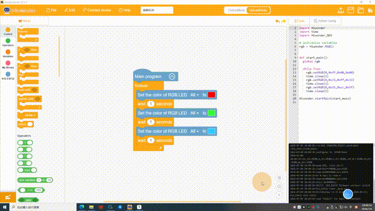

> [!NOTE]
>
> **The connection port number is not unique. The port connected in this section is "COM3". Do not connect to "COM1", which is typically used for system communication. If multiple COM ports are displayed and the correct one cannot be determined, right-click "This PC" on the computer, select "Properties", and then click "Device Manager" to find the port number corresponding to the controller. The port labeled with "CH340" is the correct one.**

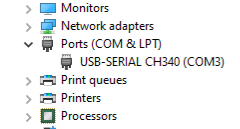

### 2.4.3 Program Outcome

Once the program starts running, the two onboard RGB LEDs of the controller switch colors every second in the order of red, green, and blue.

> [!NOTE]
>
> **The following starter projects introduce the electronic modules used in this kit for a quick start. For a detailed description of the modules, refer to [Section 4.3 Electronic Module Overview](https://wiki.hiwonder.com/projects/DaDablock-AI/en/ultimate-kit/docs/4_Software_and_Hardware_Guide.html#electronic-modules-overview) for detailed information.**

## 2.5 Starter Project 2: Dual Servos and Dot Matrix Display

### 2.5.1 Learning Objectives

1. Familiar with the dot matrix module and master the basic usage of displaying preset expression patterns.
2. Master the method of adjusting the angle of the 270° servo controlled by the ESP32 controller, and understand the logic of using variables to control servo motion.
3. Master the method of adjusting the speed and direction of the DC motor controlled by the ESP32 controller, and understand the control logic of forward rotation, reverse rotation, and stopping.

### 2.5.2 Wiring Diagram

1. Connect the dot matrix module cable to port 5 of the ESP32 controller.

2. Connect the 270° block servo cable to port S1 of the ESP32 controller, inserting the orange wire into the white pin of port S1.

3. Connect the 360° block motor cable to port S2 of the ESP32 controller, inserting the orange wire into the white pin of port S2.

As shown in the diagram:

### 2.5.3 Programming

#### (2) Add Extension Libraries

In the **Choose an Extension** menu, select **Output modules** and add the **Dot matrix module**.

#### (4) Complete Program

The source files are available for download as a zip archive under [1. Source Code / 03 Program Files for Starter Projects](https://drive.google.com/drive/folders/1C_cT51H9adfUnSPw9l57vPrQQ2A_vUBa?usp=sharing).

### 2.5.4 Downloading the Program

### 2.5.5 Program Outcome

Once the program starts running, initialize the dot matrix screen port and set the brightness. Rotate the 270° block servo connected to port **S1** to 135°. Then, execute the loop. First, the dot matrix screen displays pattern **S1** and waits for 2 seconds. The servo at **S1** then rotates to 270° and 0° sequentially, waiting for 2 seconds after each rotation. Next, the dot matrix screen displays pattern **S2** and waits for 2 seconds. The 360° block motor connected to port **S2** then rotates at speed 50, and the dot matrix screen displays the text **ON**. After waiting for 5 seconds, the motor at **S2** stops, and the dot matrix screen displays the number 0.

## 2.6 Starter Project 3: Fan Control

### 2.6.1 Learning Objectives

1. Understand the functions of the fan module and master the control methods for turning the fan on and off.

### 2.6.2 Wiring Diagram

Plug the fan module cable into port 5 of the ESP32 controller, as shown in the diagram:

### 2.6.3 Programming

#### (1) Add Extension Libraries

In the **Choose an Extension** menu, select **Output modules** and add the **Fan module (Black)**.

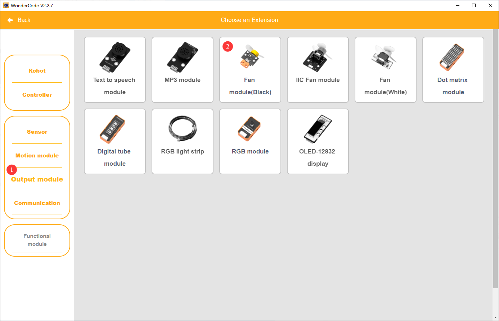

#### (2) Complete Program

The source files are available for download as a zip archive under [1. Source Code / 03 Program Files for Starter Projects](https://drive.google.com/drive/folders/1C_cT51H9adfUnSPw9l57vPrQQ2A_vUBa?usp=sharing).

### 2.6.4 Downloading the Program

### 2.6.5 Program Outcome

Once the program starts running, the fan rotates at a speed of 60 and stops after 10 seconds.

## 2.7 Starter Project 4: 4-Channel Line Follower, Temperature and Humidity, Glowing Ultrasonic, and Light Sensor Coordination

### 2.7.1 Learning Objectives

1. Understand the functions of the glowing ultrasonic sensor and master the concept of detecting obstacle distance.
2. Understand the functions of the light sensor and master the concept of sensing ambient light intensity.
3. Understand the functions of the temperature and humidity sensor, and learn to read temperature and humidity values.
4. Understand the functions of the 4-channel line follower sensor and learn to read the detection status of the line follower sensor.

### 2.7.2 Wiring Diagram

1. Plug the 4-channel line follower sensor cable into port 1 of the ESP32 controller.

2. Plug the glowing ultrasonic sensor cable into port 2 of the ESP32 controller.

3. Plug the temperature and humidity sensor cable into port 3 of the ESP32 controller.

4. Plug the light sensor cable into port 5 of the ESP32 controller.

As shown in the diagram:

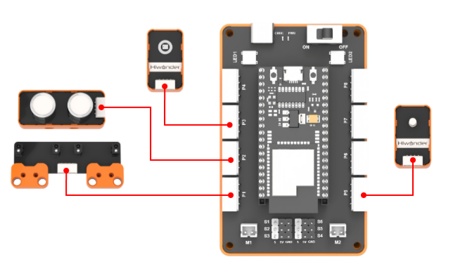

### 2.7.3 Programming

#### (1) Add Extension Libraries

Select **Sensor** in the **Choose an Extension** interface to add **Glowing ultrasonic sensor**, **Light sensor**, **Temperature and humidity sensor**, and **4-channel line follower sensor**.

#### (2) Complete Program

The source files are available for download as a zip archive under [1. Source Code / 03 Program Files for Starter Projects](https://drive.google.com/drive/folders/1C_cT51H9adfUnSPw9l57vPrQQ2A_vUBa?usp=sharing).

### 2.7.4 Downloading the Program

### 2.7.5 Program Outcome

Once the program starts running, initialize the 4-channel line follower sensor connected to port 1 and the glowing ultrasonic sensor connected to port 2. Then, execute the loop: if all four probes of the 4-channel line follower sensor detect black lines, the temperature value is printed to the serial port. If the 4-channel line follower sensor detects white ground, the humidity value is printed to the serial port. If the obstacle distance detected by the glowing ultrasonic sensor is less than 20 cm, the light intensity value is printed to the serial port.

